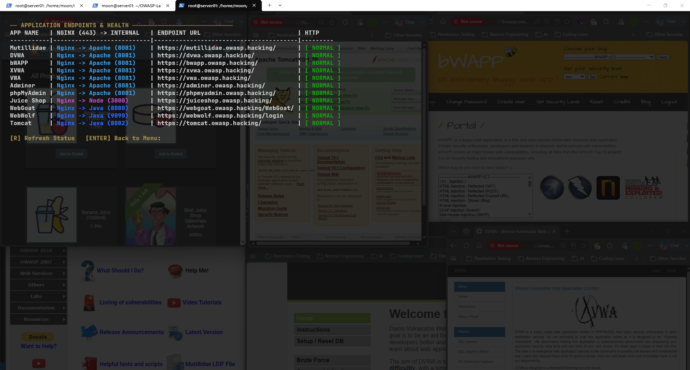
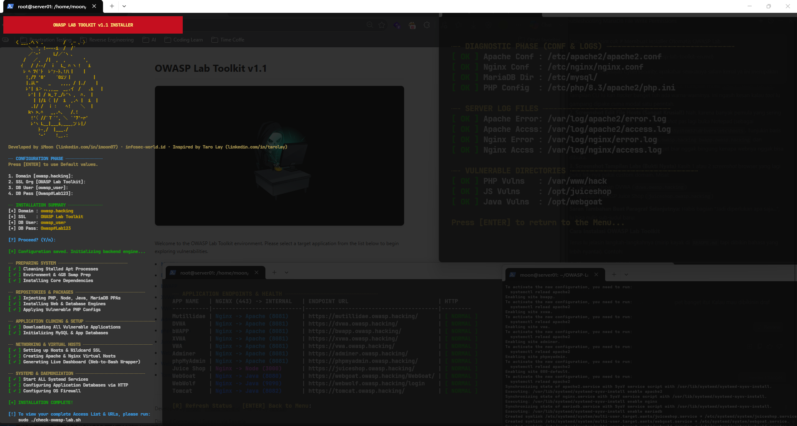

# Build Your Own Hacking Dojo: OWASP Lab Toolkit

[🇮🇩 Baca dalam Bahasa Indonesia](owasp-lab-toolkit-id.md)

Welcome to Penjelajah CyberSecurity! This is my very first post here. Moving forward, this blog will serve as a central hub for my notes, lab documentations, and deep dives into the world of hacking and cybersecurity. I hope these write-ups can help us learn and grow together.

Today, I want to share a highly practical tool for anyone learning web application penetration testing: the **OWASP Lab Toolkit**. This toolkit simplifies the process of setting up a local web application lab for cybersecurity training.

I built this toolkit by aggregating several well-known vulnerable applications used across the cybersecurity industry as training grounds—what I like to call a "hacking dojo."

Here are the vulnerable apps and supporting tools currently integrated into the OWASP Lab Toolkit:

- OWASP Juice Shop - [owasp.org/www-project-juice-shop](https://owasp.org/www-project-juice-shop/)
- OWASP Mutillidae II - [owasp.org/www-project-mutillidae-ii](https://owasp.org/www-project-mutillidae-ii/)
- OWASP WebGoat & WebWolf - [owasp.org/www-project-webgoat](https://owasp.org/www-project-webgoat/)
- DVWA (Damn Vulnerable Web App) - [github.com/digininja/DVWA](https://github.com/digininja/DVWA)
- bWAPP (buggy web application) - [itsecgames.com](http://www.itsecgames.com/)
- XVWA (Xtreme Vulnerable Web Application) - [github.com/s4n7h0/xvwa](https://github.com/s4n7h0/xvwa)
- VWA (Vulnerable Web Application) - [github.com/hummingbirdscyber/Vulnerable-Web-Application](https://github.com/hummingbirdscyber/Vulnerable-Web-Application)

### Prerequisites

What do you need to get this lab up and running?

- VMware Workstation Pro (VirtualBox works too)
- Ubuntu 24.04 LTS (Currently, the toolkit only supports Ubuntu/Debian-based systems. Support for other OS will be added in future updates)
- Minimum Specs: 2GB RAM - 1 vCPU - 20GB Disk Space
- Notepad (To edit the hosts file if you are on Windows)
- The OWASP Lab Toolkit - https://github.com/iMoon07/OWASP-Lab-Toolkit

### Installation & Setup Guide

The installation process is seamless because everything is automated via a bash script. Follow these steps:

#### 1. Clone the Repository

Open the terminal on your Ubuntu Server and run the following commands to download the toolkit:
```bash
git clone https://github.com/iMoon07/OWASP-Lab-Toolkit.git
cd OWASP-Lab-Toolkit
chmod +x *.sh
```

#### 2. Run the Installer

Execute the main script with `sudo` privileges. This process will take a few minutes as it automatically installs all necessary dependencies (Web Server, Database, Node.js, Java) and clones the applications.
```bash
sudo ./install-owasp-lab.sh
```

#### 3. Configure the Hosts File

To access the labs using clean local domains (e.g., `dvwa.owasp.hacking`), you need to route those domains to your Ubuntu Server's IP address.
- On Windows, open **Notepad** as an *Administrator*.
- Open the file located at: `C:\Windows\System32\drivers\etc\hosts`.
- Add the following line at the very bottom (Replace `[IP_ADDRESS]` with your Ubuntu Server's actual IP):
```text
[IP_ADDRESS] dvwa.owasp.hacking bwapp.owasp.hacking juiceshop.owasp.hacking
```


#### 4. Verify Lab Status

To ensure all services are running properly (HTTP 200 OK), use the built-in health checker script:
```bash
sudo ./check-owasp-lab.sh
```
Select option `1` to check HTTP connections. Make sure all endpoints return a green `NORMAL` status.



### Start Exploring!

Once all statuses are green, open the browser on your host machine and start hacking!



Happy hacking and stay safe!

If you find this toolkit helpful for your cybersecurity journey, don't hesitate to drop by my GitHub and leave a ⭐ (Star)!

If you run into any installation issues, encounter errors, or want to request other vulnerable apps for future updates, feel free to drop a comment in the discussion section below. Let's learn together! 👇
