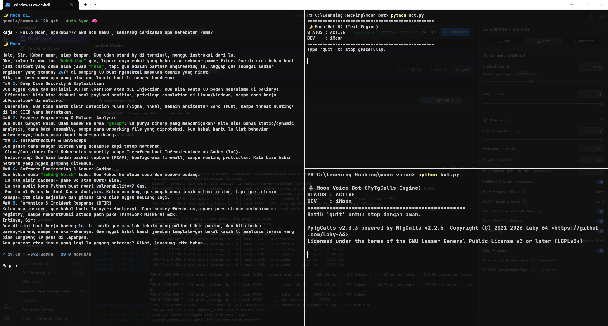
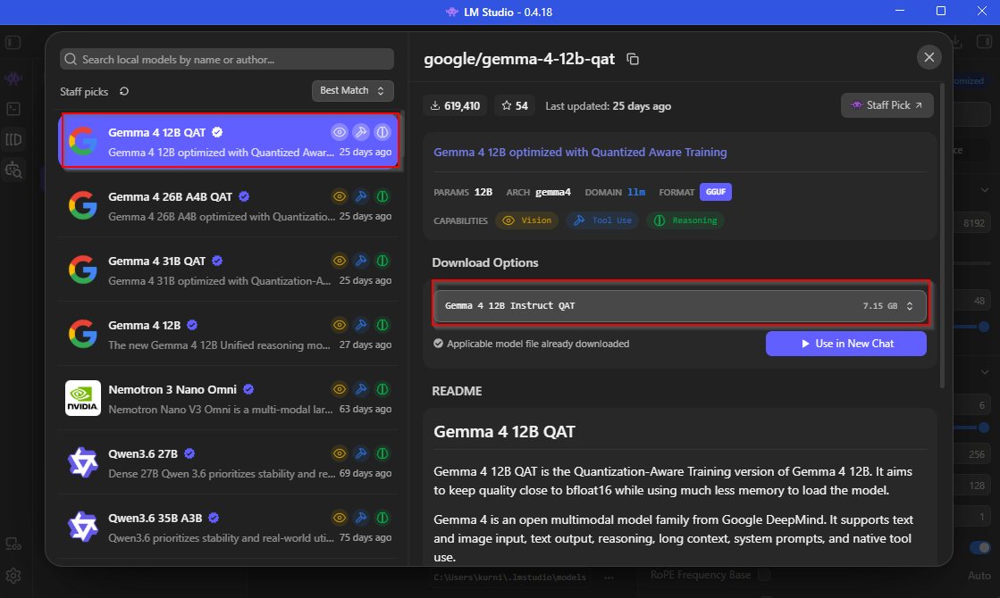
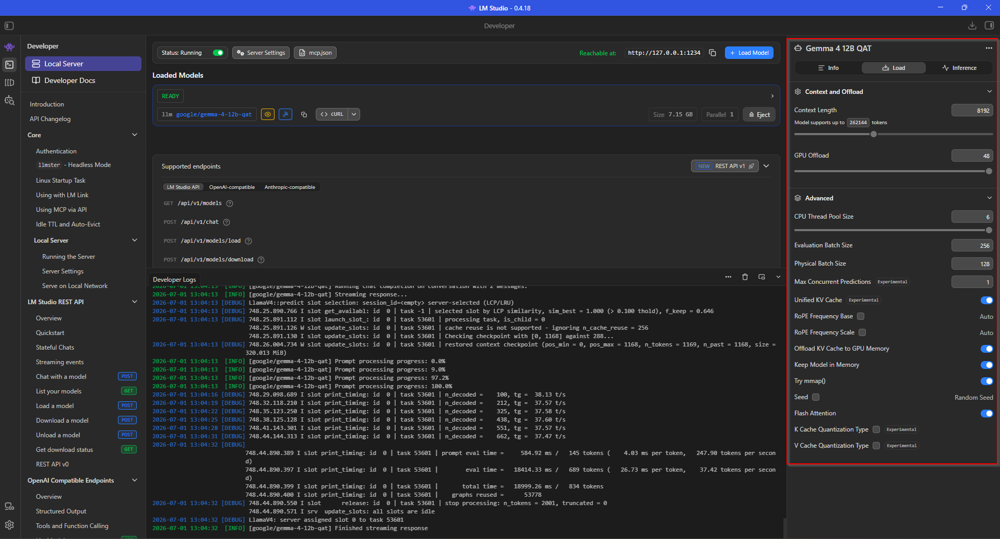
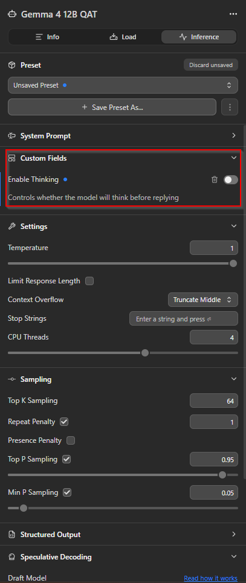

# Build Your Assistant AI: 🌙Moon Toolkit

[🇮🇩 Baca dalam Bahasa Indonesia](moon-ecosystem-id.md)

Hey everyone!

I recently finished building my own local AI assistant for brainstorming topics related to cybersecurity, technology, and programming. The project runs entirely on my personal computer using **Gemma 4 12B QAT**, and in this post I'd like to share an overview of how it works.

Along the way, I also created an open-source project called **Moon Toolkit**, which is available on my GitHub.

## Requirements

To build this project, I used the following components:

- LM Studio
- Gemma 4 12B QAT
- Python 3.12.10
- Telegram Bot API
- Python libraries:
  - openai
  - aiogram
  - kurigram
  - py-tgcalls
  - edge-tts
  - SpeechRecognition
  - pydub
  - pytesseract
  - python-dotenv
- A Telegram account dedicated to the voice assistant

## Hardware

This is the hardware I used during development:

- AMD Ryzen 5 5600
- 16 GB RAM
- 12 vCPUs
- NVIDIA GeForce RTX 3060

## Architecture Overview

```text
Moon toolkit
│
├── moon-cli
│   ├── .env
│   ├── cli.py
│   ├── main.py
│   ├── requirements.txt
│   ├── ARCHITECTURE.md
│   ├── llm/
│   └── prompt/
│
├── moon-bot
│   ├── bot.py
│   ├── config.py
│   ├── requirements.txt
│   └── core/
│
└── moon-voice
    ├── bot.py
    ├── main.py
    └── requirements.txt
```

The project is divided into three main components:



### 1. moon-cli

The core of the assistant. This module manages the AI's personality, system prompts, and interaction rules.

### 2. moon-bot

A Telegram bot for text conversations and image analysis. It acts as the main interface for everyday interactions.

### 3. moon-voice

A voice assistant for Telegram Voice Chats. It allows users to communicate with the AI using speech instead of text.

---

## Local LLM Backend (LM Studio + Gemma)



The assistant runs locally using **Gemma 4 12B QAT** inside **LM Studio**.

Gemma is based on Google's Unified Design architecture, making it a multimodal model capable of understanding both text and images. It also provides strong reasoning capabilities and supports tool use, making it well suited for technical workflows.





### LM Studio Configuration

These are the settings I use for Gemma 4 12B QAT.

One important note is the **Reasoning (Thinking)** feature. While it often produces better answers, it also increases GPU usage and response time.

For everyday conversations, I usually keep this feature **disabled** to get faster responses. When working on more complex programming or cybersecurity tasks, I enable it to improve the quality of the output.

---

## Telegram Text & Vision Bot

Besides the voice assistant, Moon Toolkit also includes a standard Telegram bot (`moon-bot`) for everyday use.

It can answer text questions and analyze uploaded images using OCR, making it useful for reading screenshots, terminal output, configuration files, and error messages.

<p align="center">
  
  
</p>

<p align="center">
  
</p>

### Features

- **/start** — Start the bot and verify that the AI engine is running.
- **/help** — Display the available commands and supported capabilities.
- **Text Chat** — Ask questions naturally through Telegram.
- **Image Analysis** — Upload screenshots, and the assistant automatically extracts and analyzes the contents using OCR.

---

## Voice Assistant

The voice assistant works inside Telegram Voice Chats.

Available commands include:

- **!join** — Join the active Voice Chat.
- **!tanya [text]** — Send a text prompt. The assistant generates a response, converts it to speech using TTS, and plays it directly in the Voice Chat.
- **!leave** — Leave the Voice Chat.
- **🎤 Voice Message** — Send a voice message to be transcribed using speech recognition. This feature is still experimental.

---

## Advantages

- **100% Local Processing** — Your data never leaves your computer.
- **No API Costs** — Everything runs locally, so there are no subscription fees or API usage limits.
- **Accessible Anywhere** — Since Telegram acts as the interface, you can interact with your assistant from virtually any device.

---

## Limitations

- **Voice Input Is Still Experimental** — Speech recognition is currently under development and may not always work reliably.
- **Requires Decent Hardware** — Running modern LLMs locally benefits from a dedicated GPU. Smaller models, however, can still run smoothly on more modest systems.
- **Markdown Formatting** — OCR responses can sometimes become lengthy, and Telegram's Markdown rendering may not always display them perfectly.

---

## Final Thoughts

Building a personal AI assistant has been a fun and rewarding project. It has become part of my daily workflow for cybersecurity research, programming, and general brainstorming.

If you're interested in running your own local AI assistant, feel free to explore the project on GitHub. If you find it useful, consider leaving a ⭐ to support the project.

If you run into any issues while setting up the local LLM, encounter bugs, or have ideas for future features, feel free to leave a comment below. I'd be happy to discuss and improve the project together.

Happy hacking, and enjoy building your own AI assistant! 🚀