# My Assistant AI-Local 🌙Moon Toolkit

[🇮🇩 Read in Indonesian](moon-ecosystem-id.md)

﷽

Yoo, Guys, a little back. I actually wrote this before, but I did improve it again. Sorry, I'm really not that good at writing hahaha.

Okay, here I want to talk about something interesting, which is my Local-LLM Assistant, which I named 🌙Moon Toolkit. In the context of this tool, I also imagined it as an experiment for my programming, but I did vibe code by just giving commands, and throughout the process, the code or system I built had many shortcomings. Because of that, I actually want to share the insights I got while exploring it.

Okay, we all know LLM - AI has become very popular. I also use it in my daily life for work and learning.

I usually use:

* ChatGPT website
* Antigravity, the model used is Claude Sonnet 4.6 (But this was the last one I used for coding 🌙Moon Toolkit)
* Grok Website
  
From here, I tried another version, which is a local LLM, because I had enough capacity to start trying it on my computer.

I installed several things that were needed, such as:

* LM Studio
* Gemma 4 12B QAT Model

The specifications I used:

* Microsoft Windows 11 Pro
* AMD Ryzen 5 5600
* RAM 16GB
* vCPU 12
* NVIDIA GEFORCE RTX 3060

What was my reason for using LM Studio? Actually, I tried it because of a suggestion from ChatGPT. I wanted to see the system structure from the operational side while using it and also understand a little about its direction and flow.

Okay, before discussing the direction and flow, here is why I chose the Gemma 4 12B QAT Model. Actually, it just appeared by default, and I didn't choose much. I directly used it.

The Gemma 4 model itself is the result of training by Google. They made this model focus on areas such as Programming, Coding, and Brainstorming. Google has many resources to train models like this, as we know Google's major LLM platform is Gemini.

Okay, I will also discuss the direction as I mentioned. I have explored quite a lot from the model side itself.

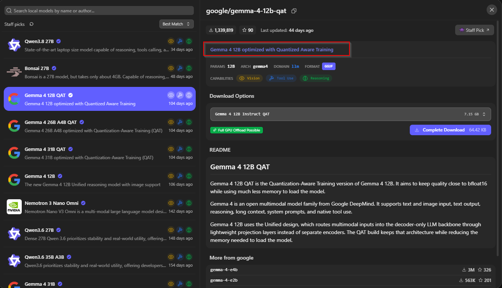

Okay, according to the README.

```text
Gemma 4 12B QAT is the Quantization-Aware Training version of Gemma 4 12B. Its purpose is to keep the quality close to bfloat16 while using much less memory to load the model.

Gemma 4 is a family of open multimodal models from Google DeepMind. The model supports text and image input, text output, reasoning, long context, system prompts, and built-in tool use.

Gemma 4 12B uses a Unified design, which directs multimodal input to a decoder-only LLM backbone through a lightweight projection layer instead of a separate encoder. The QAT version maintains that architecture while reducing the memory required to load the model.

```

At first, I didn't really read much about it. I mostly saw that this model was very strong in terms of context. I felt the difference when I used other versions, although it really depends on how we provide the input. It can take text-image input and produce text output, reasoning, long context, system prompts, and while exploring, I also became familiar with MCP servers.

Okay, this is a little funny, and I will bring up the 🌙Moon Toolkit tool in this article. Why? Because there were many things I got wrong in its implementation. On the code side, I added many unclear input limits. At first, because I didn't read the README documentation enough and didn't fully read the limits of what my GPU was capable of doing in terms of workload.

Then I started controlling things little by little, but I realized this when I was using VS Code and could also connect my local LLM there.

Now I will review my tool a little first, although if you want to try making innovations for testing, that's okay hahaha.

The idea of my tool is a little different because I made a lot of unnecessary things, basically just vibe coding by giving commands (what people call "Pecut AI").

The 🌙Moon Toolkit tool was built with the Python Language. I chose this language consciously because it has many needs for the development context and is strong operationally, such as the need to clarify images and take text from images that may not be very visible. Then there is also a voice system that uses tokens and a number through the Telegram API panel. This tool runs in three modes.

* Terminal / CLI
* Telegram
* Telegram with voice (this is quite funny because I made it with a voice system using a second account, which has to have a bot, and only then can it contribute voice, and it is very complicated.)

<a href="https://www.youtube.com/watch?v=nlhn60OoRW8">

  

</a>

I realize there are many shortcomings in this tool, but I also gained a lot of experience, such as the basics of Input-Context.

This is important for those who want to develop tools like this. What I mean is, whether externally without Telegram or using Telegram, you need to look at the limitations and strength of your Context resources.

I will show this because I use an RTX 3060 GPU. How much Context can this model handle?

Actually, it doesn't simply depend on the GPU. The GPU can maximize how much context it can absorb, but I haven't tested it up to the maximum yet. Maybe later I will improve this article as evidence.

I have a context size for this model of `262144` with maximum GPU offload of `48`. For that, I can increase or decrease the vCPU, but I estimate the minimum to be 3-(4 is better). By default, it is initially set to 6.

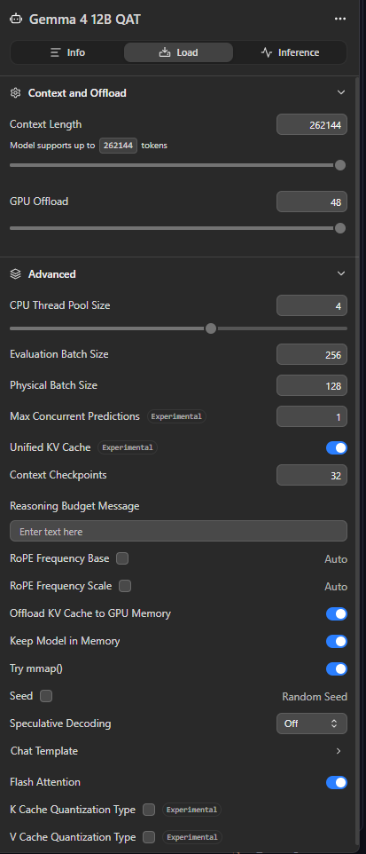

Okay, and initially my tool had a context of `8192`. I was not utilizing the full capability of the model, so I was wrong at that time.

Oh yeah, for the 🌙Moon Toolkit tool, I'll show you some pictures.


This is the terminal CLI image.

When testing image input from Telegram, this needed to be directed to its path again, so even though the model supports it by default, if we don't direct it because we are using external Telegram, we cannot send the image.

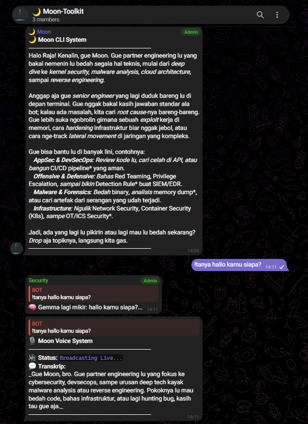

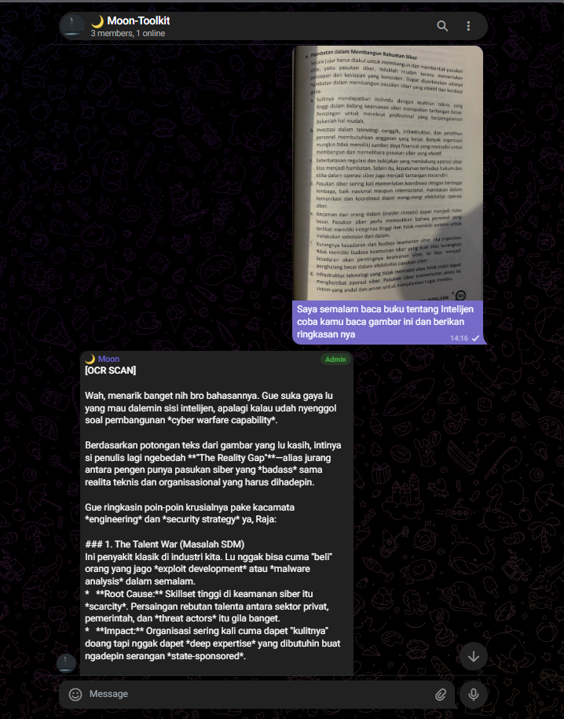

Then there is also the preview center when playing the bot. Oh yeah, the Telegram bot uses the `bot father` API.

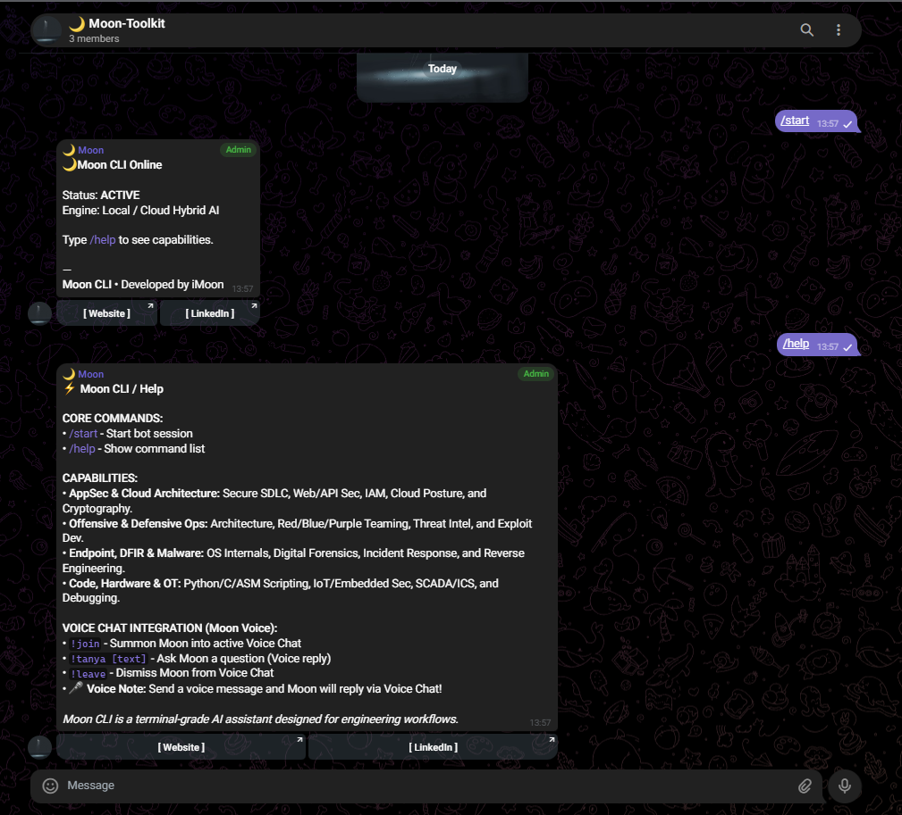

I learned a lot from there, although it is somewhat difficult for me to explain everything. I will edit this article again later for updates, because I also use it all the time, although not always.

Honestly, it is a little slow. I still have to solve that performance problem. My GPU should be strong enough to handle it.

But learning from the shortcomings of my tool, the program has unclear inputs, and the token management structure is still messy. This is also important, but I don't understand it very well yet.

Okay, now I am mainly playing around in VSCode, so VSCode is not always for programming and coding, but I use it sometimes just for brainstorming.

But what is interesting is that VSCode has many plugins, such as browsing tools (which are quite complete, like in the screenshot for reading JavaScript and others), fetch web tooling, and it can also read the contents of file categories/groups that we are organizing in group 1 - group 2, and it will send them to the model to try to obtain context.

But the good thing about VSCode is that it has its own control. For example, operationally, we don't always have to use all the tools I mentioned. We can turn them off.

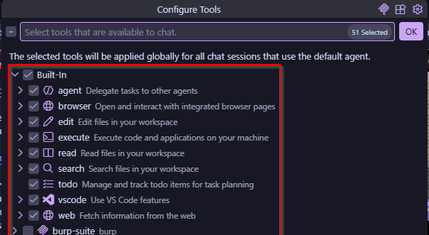

This is how to access it.

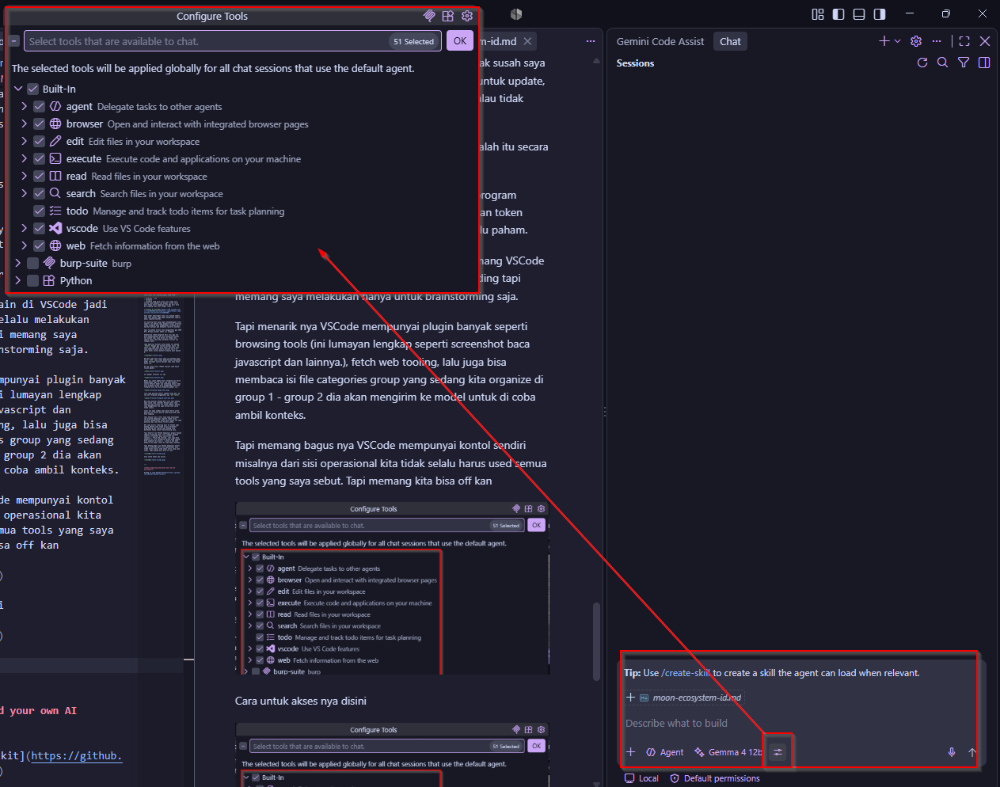

I won't explain much, but you should be able to try it yourself to see how it works for those who want to develop or use tools like this. It's pretty nice.

Oh yeah, there is also MCP there. I connected it with Burp Suite, which is a tool used by cybersecurity professionals for testing, searching, scanning, and validating security vulnerabilities.

The Burp Suite MCP needs to be able to connect, and behind the Burp Suite MCP that I used, it generated tools that I had just discovered.

There are quite a lot of tools.

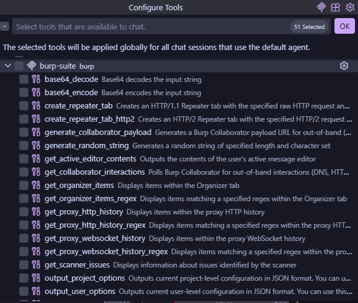

Now this is fun to explore. I still don't want to try it yet, but next I will try to dig deeper into it.

Because if we go deep, we can understand how Burp Suite tools work, but this context comes from the Burp Suite extension itself.

Okay, but first let me explain that MCP is kind of a tool for connecting to external applications.

[MCP (Model Context Protocol) is an open-source standard for connecting AI applications to external systems.](https://modelcontextprotocol.io/docs/2026-07-28/getting-started/intro)

Here is the extension I used on GitHub, or you can get it directly from the store: [portswigger/mcp-server](https://github.com/portswigger/mcp-server)

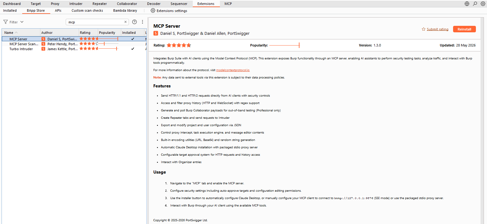

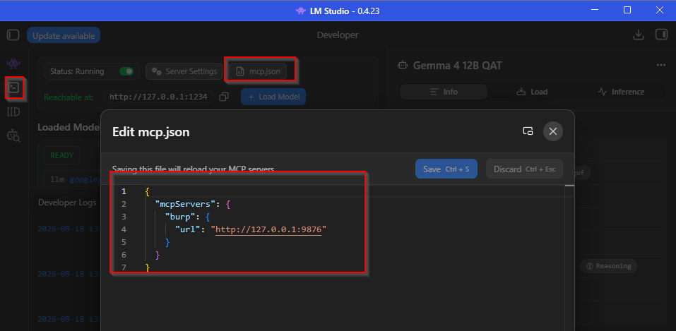

For the communication, this is interesting. VSCode itself and LM Studio both have logs, while the MCP server uses JSON as the communication path.

At first, it was quite complicated. I encountered problems such as connection issues and errors when setting up MCP.

Oh yeah, it seemed to clash with the LLM, so the connection couldn't handle it.

```bash
2026-09-18 13:27:05.136 [info] Starting server burp
2026-09-18 13:27:05.136 [info] Connection state: Starting
2026-09-18 13:27:05.136 [info] Starting server from LocalProcess extension host
2026-09-18 13:27:05.137 [info] Connection state: Running
2026-09-18 13:27:05.154 [info] 400 status sending message to [http://127.0.0.1:9876/](http://127.0.0.1:9876/), will attempt to fall back to legacy SSE
2026-09-18 13:27:05.197 [error] Failed to set MCP server log level: Error: MPC -32601: Server does not support logging/setLevel
2026-09-18 13:27:05.199 [info] Discovered 27 tools
```

But actually, it discovered 27 tools, including in LM Studio.

Okay, quite interesting. I'll show the input in VSCode.

I asked = Are you ready for Burp Suite MCP?

VSCode AI answered = Optimized tool selection. Yes, I am ready to help you with Burp Suite MCP. I have access to various tools that allow me to interact with Burp Suite, such as:

* **Proxy History:** Viewing HTTP/WebSocket request history.
* **Repeater:** Creating and sending HTTP requests manually.
* **Intruder:** Sending requests with varying payloads.
* **Scanner:** Viewing issues found by the scanner.
* **Collaborator:** Managing payloads for **out-of-band** (OOB) testing.
* **Organizer & Options:** Managing project configuration and user options.

Please let me know what you want to do, for example:

1. "Show the last 10 requests from proxy history."
2. "Create a new Repeater tab for this request [insert request]."
3. "Check whether there are any interactions from Burp Collaborator."
4. "Show issues found by the scanner."

What can I help you with first?

If LM Studio:

I asked = Okay, check the 27 Burp Suite tools already boss? MCP plugin, now try reporting to me if it's ready.

LM Studio answered = To check the number and list of tools available in the Burp Suite environment currently, I can run a command to see the configured options.

However, it should be noted that in this context, "tools" can refer to two things: **Extensions/Plugins** that are installed or **Functions/Tabs** built into Burp Suite itself.

Let's start by looking at the project configuration to see what is currently active.

Based on the system configuration I have access to, here is the status of the main "tools" detected as ready to use in your Burp Suite environment:

### 1. Readiness Status

All core functions (Core Tools) are already **Ready** and active. The system detects configuration for:

* **Proxy:** Active (with a listener on port 8080).
* **Repeater:** Ready for request manipulation.
* **Scanner:** Ready for vulnerability scanning.
* **Sequencer:** Ready for token analysis.
* **Target:** Ready for site mapping.
* **Logger:** Active for recording request/response activity.
* **Organizer:** Ready for item management.

### 2. Detected Tools List

Here is a list of the main functions available in this session:

| Tool Name        | Main Function                                                                 |
| :--------------- | :---------------------------------------------------------------------------- |
| **Proxy**        | Intercepting, modifying, and forwarding HTTP/HTTPS/WebSockets traffic.        |
| **Repeater**     | Sending requests repeatedly and manually with payload modifications.          |
| **Intruder**     | Performing fuzzing attacks, brute force, and request automation.              |
| **Scanner**      | Performing automated scans to find security vulnerabilities.                  |
| **Sequencer**    | Analyzing the randomness of tokens or data for cryptography/session purposes. |
| **Target**       | Displaying site structure, discovered URLs, and sitemap.                      |
| **Logger**       | Tracking all request and response activity across tools.                      |
| **Organizer**    | Grouping and managing items from various tools.                               |
| **Collaborator** | (Integrated) For detecting out-of-band (OOB) server interactions.             |
| **Extender**     | A place to load third-party extensions or plugins.                            |

**Note:** If you mean the **27 specific extensions**, I need access to the manually installed "Extensions" list. If you want me to check a specific extension, please let me know!

In terms of context, they are the same, but VSCode is indeed shorter and more concise.

The images showing what happens behind the scenes and the error logs can be explored to trace the logs and see how the tokens move.

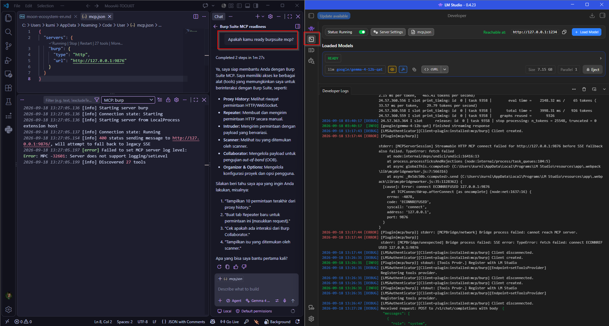

During the LM Studio chat section as well.

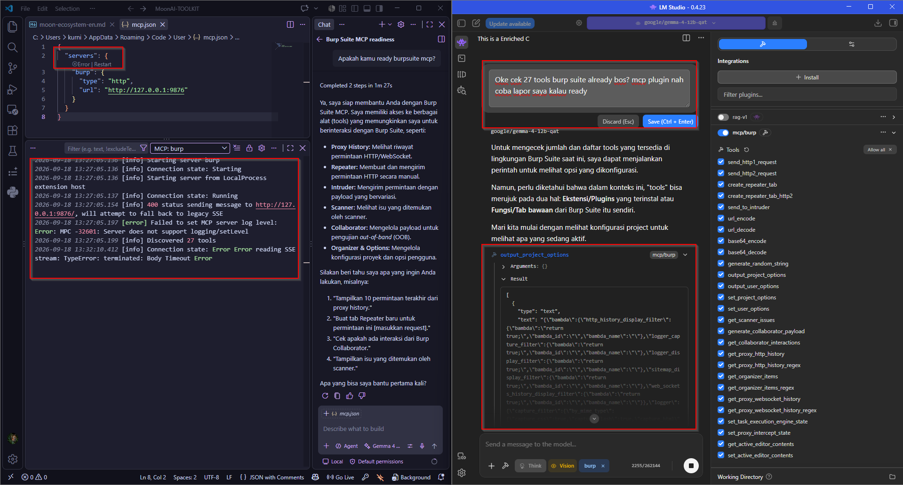

It's also fun, but for something like this, it requires a lot of effort. I already tried performing a scan with Burp Suite, which required 30K, but that alone overwhelmed it and caused the LM Studio control panel to crash.

I also once tried connecting it with WSL, so I had Linux in VSCode reading my Linux environment, and in Linux I had Man. There I used mansplain to explain Linux commands.

It was effective enough, but it wasn't really that good and consumed a lot of tokens.

So I am still practicing and learning how to utilize this Local-LLM properly and also with good management according to the resources I currently have. I also explored other models. There were several things I explored, such as strict and non-strict models.

I tried these two models with different contexts. For the non-strict model, I used 100K, but I thought my GPU could handle it, and in the end it crashed hahaha.

But I also learned something from it. The strict version, in terms of context, was better at managing the output and input process, while the non-strict one could make output and input process errors that were not managed properly, basically it could hallucinate.

Yeah, actually the trade-off is that for doing a deep exploit, for example, I might need to study first, put in effort, and understand the flow so that I can use LM-Studio effectively to do the work in terms of keeping things organized. Actually, this is my Bad habit when using AI (Pecut AI). Choosing the wrong model can also make things confusing, and the execution might not run perfectly or could break in the middle.

But my reflection when using AI is understanding what I want to process. At the time, I thought these LLM tools were like magic for me and could make me go kaboom, but yeah, actually there is more to it. I am only an operator, so I cannot ask for much unless I understand the ins and outs well enough to build it myself. Only then can it work according to what I want.

From there, I also realized that LM Studio, if used by someone who understands it, can be quite useful and good and can also be dangerous in the context of hacking. We always live with hacking, whether technical or non-technical, but in the context of LLM, it is probably excessive for me to explain it and use words like that. But basically, if I can understand and know how to use an LLM optimally - maximally, it is very beneficial for me. I am still trying to figure out what the future flow will be, whether I will build the tool myself. But if I only become an operator, I can only wait, and this is the Bad habit I want to work on to fix this problem.

Why was it funny that time when I used mansplain with MCP just to explain the usage of a command? The context was quite strange and funny, even though I could have simply browsed or just gone directly to `man man`, so at that time many things were quite confusing hahaha.

As a result, I became lazy to read lol, like the LLM output seemed more convincing than the source itself hahaha.

But regarding the Agentic AI context, I haven't explored it very much yet, although there are a few things I can try later. Yeah, MCP itself is the connection context of Agentic AI, but I was thinking about how my system could work optimally, for example, doing scanning 24 hours a day. I had an idea like that hahaha.

But again, AI like that, if the right and optimal tooling is in place and maximized, is ready for battle. (As long as the resources are there hahahah)

Even though I have already tried it, at least I know that this requires effort and hours of experience, so I am trying to study it a lot first. Right now, I don't need to create an advanced system. I'll just study it first, like, "ohh, so this is what happens behind the scenes," so that I can know how it works. It seems good enough for a beginning.

---

**Enjoy exploring and build your own AI assistant!**

Github 🌙 [The MoonAI-Toolkit](https://github.com/iMoon07/MoonAI-Toolkit)
YouTube 🎥 [Watch on YouTube](https://www.youtube.com/watch?v=nlhn60OoRW8)
