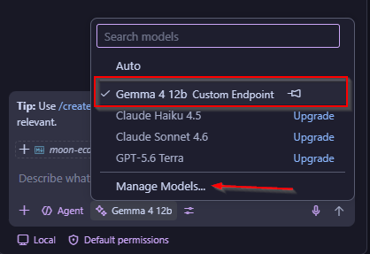
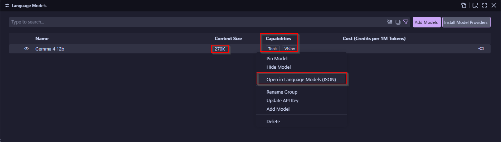

# My Assistant AI-Local 🌙Moon Toolkit

[🇬🇧 Read in English](moon-ecosystem-en.md)

﷽

Yoo, Guys sedikit kembali saya sempat menulis ini tapi memang saya perbaiki lagi maaf lah saya tak terlalu jago sangat menulis hehehe.

Okey disini saya nak bahas something menarik yaitu adalah Assistant LLM-Local saya kasih namanya ialah 🌙Moon Toolkit. Dalam konteks tools tersebut saya sempat juga berimajinasi untuk experiment saya dalam programming, tapi memang saya vibe code hanya memerintah saja tapi memang sepanjang jalan code atau pun sistem yang saya buat punya banyak kekurangan. Oleh sebab tuh saya sebenarnya ingin share insight apa yang saya dapat sewaktu explorasi.

Oke kita semua tau LLM - AI sudah sangat populer saya pun menggunakan-nya dalam kehidupan sehari-hari untuk kerja, maupun belajar. 

Saya biasa menggunakan: 

- ChatGPT website
- Antigravity model yang di gunakan adalah Claude Sonnet 4.6 (Tapi last terakhir untuk pakai buat kode 🌙Moon Toolkit)
- Grok Website

Nah dari sini saya coba-coba lah versi yang lain pula yaitu LLM-local karena saya mempunyai kapasitas yang cukup untuk memulai saya coba di komputer.

Saya menginstall beberapa hal yang di butuhkan seperti:

- LM Studio
- Model Gemma 4 12B QAT

Spesifikasi yang saya gunakan:

- Microsoft Windows 11 Pro
- AMD Ryzen 5 5600
- RAM 16GB
- vCPU 12
- NVIDIA GEFORCE RTX 3060

Apa alasan saya menggunakan LM Studio? sebenarnya saya mencoba karena saran dari ChatGPT saya mencoba untuk melihat struktur sistem dari sisi operational selama pemakaian dan sedikit paham juga bahwa untuk menjalankan model saya bisa tau arah dan alur nya.

Oke sebelum bahas arah dan alur-nya disini kenapa saya memilih Model Gemma 4 12B QAT sebenarnya ini memang by default langsung saya muncul dan saya tak banyak pilih langsung menggunakan ini.

Model Gemma 4 ini sendiri merupakan hasil latihan dari Google. Mereka membuat model ini fokus pada cakupan Programming, Coding, Brainstroming. Google memiliki banyak resource untuk melatih model-model semacam ini seperti kita tau platform besar Google pada operasi LLM ialah Gemini.

Oke saya akan bahas arah pula seperti yang saya bilang saya memang lumayan banyak explore dari sisi model itu sendiri.


Oke secara Readme.

```text
Gemma 4 12B QAT adalah versi Quantization-Aware Training dari Gemma 4 12B. Tujuannya adalah untuk menjaga kualitas tetap dekat dengan bfloat16 sambil menggunakan memori jauh lebih sedikit untuk memuat model.

Gemma 4 adalah keluarga model multimodal terbuka dari Google DeepMind. Model ini mendukung input teks dan gambar, output teks, penalaran, konteks panjang, sistem prompt, dan penggunaan alat bawaan.

Gemma 4 12B menggunakan desain Unified, yang mengarahkan input multimodal ke backbone LLM decoder-only melalui lapisan proyeksi ringan alih-alih encoder terpisah. Versi QAT mempertahankan arsitektur itu sambil mengurangi memori yang dibutuhkan untuk memuat model.
```

Saya awal tidak terlalu baca waktu itu, saya banyak melihat kekuatan model ini sangat kuat dalam hal konteks saya merasakan perbedaan waktu saya pakai versi lain memang tergantung bagaimana kita melakukan input. Bisa input text-gambar-output teks, penalaran, konteks panjang, sistem prompt, termasuk waktu saya explore saya juga mengenal dengan MCP server.

Oke ini sedikit lucu dan tools 🌙Moon Toolkit ini akan saya mantik di tulisan ini kenapa? sebab banyak hal yang saya salah dalam penerapan nya, disisi kode saya banyak masuk bikin batas inputan yang tidak jelas, saya awal karena kurang membaca dokumentasi untuk Readme dan batas yang GPU saya mampu lakukan work saya tak baca habis. 

Lalu saya coba lah kontrol demi sedikit tapi sadar nya waktu saya menggunakan VS Code dan bisa pula llm-local saya connect disitu.

Nah saya akan review dulu tools saya sedikit tapi memang kalau kalian ingin coba buat inovasi testing okelah hahahah.

Ide tools saya agak laen karena saya buat banyak tele-tele vibe je hanya memerintah (kalau orang cakap pecut AI).

Tools 🌙Moon Toolkit ini dibangun dengan Python Languange, saya memilih bahasa ini memang sadar karena memiliki banyak kebutuhan untuk konteks pengembangan dan kuat operational seperti kebutuhan memperjelas gambar lalu take tulisan yang mungkin gambar tersebut tidak terlalu tampak. Lalu sistem suara yang menggunakan token lalu nomor melalui API telegram panel. Lalu tools ini running dengan tiga mode.

- Terminal / CLI
- Telegram
- Telegram yang bisa voice (ini cukup lucu karena saya membuat-nya dengan sistem voice akun kedua harus mempunyai bot dan baru bisa dia sumbang suara dan sangat ribet.)

<a href="https://www.youtube.com/watch?v=nlhn60OoRW8">
  
</a>

Saya sadar kekurangan tools ini banyak sekali tapi saya banyak juga dapat pengalaman seperti dasar inputan-Conteks.

Ini penting buat yang ingin mengembangkan tools seperti ini maksud saya mungkin diluar external tanpa telegram atau menggunakan telegram perlu melihat batasan dan kekuatan resource Conteks.

Saya tunjukkan karena saya menggunakan gpu 3060 RTX, Berapa Conteks model ini sanggup?

Sebenarnya tidak pengaruh dari sisi gpu itu bisa memaksimalkan dia bisa menyerap konteks nya banyak tapi saya belum uji sampai max, sekira nanti saya akan perbaiki tulisan ini sebagai bukti.

saya memiliki konteks untuk model ini adalah `262144` dengan gpu onload maximal yaitu `48` untuk itu vCPU saya bisa besar kecilkan tapi saya memperkirakan secara minimal nya 3-(4 lebih baik) secara default dikasih awal adalah 6.


Oke dan juga awal tools saya itu konteks saya kasih `8192` saya tidak memanfaatkan kehebatan model tersebut secara maximal jadi saya salah waktu itu.

Oh iya untuk tools 🌙Moon Toolkit saya kasih tunjuk gambar.


Ini gambar terminal cli nya

Waktu uji input gambar dari telegram ini perlu mengarahkan lagi ke jalur nya jadi memang secara default model nya mendukung kalau tidak kita arahkan karena kita menggunakan external Telegram kita tak bisa mengirim gambar ini.


Lalu juga preview center sewaktu play bot, oh iya bot telegram menggunakan api `bot father`.


Nah saya belajar banyak dari situ tapi memang agak susah saya jelaskan banyak nanti saya sunting lagi tulisan ini untuk update, karena saya menggunakan nya juga setiap saat walau tidak selalu. 

Jujur nya agak lambat saya masih harus solve masalah itu secara peform seharusnya GPU saya kuat nampung.

Tapi belajar dari tools saya yang kekurangan nya program mempunyai inputan tidak jelas, struktur pengelolaan token masih kacau ini juga penting tapi saya belum terlalu paham. 

Oke saya disini sekarang main di VSCode jadi memang VSCode saya tidak selalu melakukan programming dan coding tapi memang saya melakukan hanya untuk brainstorming saja.

Tapi menarik nya VSCode mempunyai plugin banyak seperti browsing tools (ini lumayan lengkap seperti screenshot baca javascript dan lainnya.), fetch web tooling, lalu juga bisa membaca isi file categories group yang sedang kita organize di group 1 - group 2 dia akan mengirim ke model untuk di coba ambil konteks.

Tapi memang bagus nya VSCode mempunyai kontol sendiri misalnya dari sisi operasional kita tidak selalu harus used semua tools yang saya sebut. Tapi memang kita bisa off kan


Cara untuk akses nya disini.


Saya tidak banyak jelaskan tapi seharusnya kalian bisa coba sendiri seperti apa cara kerja nya untuk yang ingin develop atau ingin menggunakan tools yang seperti ini juga enak sih.

Oh iya disitu ada MCP saya connect dengan burp suite itu tools yang digunakan professional keamanan siber dalam menguji mencari, scanning, validation celah keamanan.

MCP burpsuite perlu mereka bisa berkoneksi dan di balik mcp burpsuite yang saya gunakan menghasilkan tools yang baru saya tau.

Lumayan panjang toolsnya.


Nah disini buat ngulik seru saya masih belum mau coba tapi next akan coba bongkar.

Karena buat deep kita bisa paham tools burp suite gimana cara dia bekerja tapi memang konteks ini dari si extension-nya burpsuite 

Oke tapi saya jelaskan dulu MCP itu semacam tooling untuk connection ke aplikasi external

[MCP (Model Context Protocol) is an open-source standard for connecting AI applications to external systems.](https://modelcontextprotocol.io/docs/2026-07-28/getting-started/intro)

Disini extension yang saya gunakan di github atau bisa dari store langsung [portswigger/mcp-server](https://github.com/portswigger/mcp-server)


Untuk komunikasi nya nah ini menarik vscode sendiri dan juga lm-studio sama sama mempunyai log, mcp-server dengan format json untuk jalur komunikasi nya. 

Untuk awal lumayan ribet saya dapat masalah seperti koneksi dan error set MCP nya.

Oh iya sepertinya nabrak dengan llm jadi koneksi nya tidak bisa menampung. 

```bash
2026-09-18 13:27:05.136 [info] Starting server burp
2026-09-18 13:27:05.136 [info] Connection state: Starting
2026-09-18 13:27:05.136 [info] Starting server from LocalProcess extension host
2026-09-18 13:27:05.137 [info] Connection state: Running
2026-09-18 13:27:05.154 [info] 400 status sending message to http://127.0.0.1:9876/, will attempt to fall back to legacy SSE
2026-09-18 13:27:05.197 [error] Failed to set MCP server log level: Error: MPC -32601: Server does not support logging/setLevel
2026-09-18 13:27:05.199 [info] Discovered 27 tools
```

Tapi sebenarnya discovered 27 tools nya, termasuk di LM studio.


Okay cukup menarik saya show inputan di vscode

Saya bertanya = Apakah kamu ready burpsuite mcp?

VSCode AI menjawab = Optimized tool selectionYa, saya siap membantu Anda dengan Burp Suite MCP. Saya memiliki akses ke berbagai alat (tools) yang memungkinkan saya untuk berinteraksi dengan Burp Suite, seperti:

*   **Proxy History:** Melihat riwayat permintaan HTTP/WebSocket.
*   **Repeater:** Membuat dan mengirim permintaan HTTP secara manual.
*   **Intruder:** Mengirim permintaan dengan payload yang bervariasi.
*   **Scanner:** Melihat isu yang ditemukan oleh scanner.
*   **Collaborator:** Mengelola payload untuk pengujian *out-of-band* (OOB).
*   **Organizer & Options:** Mengelola konfigurasi proyek dan opsi pengguna.

Silakan beri tahu saya apa yang ingin Anda lakukan, misalnya:
1.  "Tampilkan 10 permintaan terakhir dari proxy history."
2.  "Buat tab Repeater baru untuk permintaan ini [masukkan request]."
3.  "Cek apakah ada interaksi dari Burp Collaborator."
4.  "Tampilkan isu yang ditemukan oleh scanner."

Apa yang bisa saya bantu pertama kali?

Kalau LM Studio

Saya bertanya = Oke cek 27 tools burp suite already bos? mcp plugin nah coba lapor saya kalau ready

LM Studi menjawab = Untuk mengecek jumlah dan daftar tools yang tersedia di lingkungan Burp Suite saat ini, saya dapat menjalankan perintah untuk melihat opsi yang dikonfigurasi.

Namun, perlu diketahui bahwa dalam konteks ini, "tools" bisa merujuk pada dua hal: **Ekstensi/Plugins** yang terinstal atau **Fungsi/Tab bawaan** dari Burp Suite itu sendiri.

Mari kita mulai dengan melihat konfigurasi project untuk melihat apa yang sedang aktif.

Berdasarkan konfigurasi sistem yang saya akses, berikut adalah status "tools" utama yang terdeteksi siap digunakan dalam lingkungan Burp Suite Anda:

### 1. Status Kesiapan
Semua fungsi inti (Core Tools) sudah **Ready** dan aktif. Sistem mendeteksi adanya konfigurasi untuk:
*   **Proxy:** Aktif (dengan listener pada port 8080).
*   **Repeater:** Siap digunakan untuk manipulasi request.
*   **Scanner:** Siap untuk pemindaian kerentanan.
*   **Sequencer:** Siap untuk analisis token.
*   **Target:** Siap untuk pemetaan situs.
*   **Logger:** Aktif untuk mencatat aktivitas request/response.
*   **Organizer:** Siap untuk manajemen item.

### 2. Daftar Tools yang Terdeteksi
Berikut adalah daftar fungsi utama yang tersedia dalam sesi ini:

| Nama Tool | Fungsi Utama |
| :--- | :--- |
| **Proxy** | Intercept, modify, dan meneruskan traffic HTTP/HTTPS/WebSockets. |
| **Repeater** | Mengirim request berulang kali secara manual dengan modifikasi payload. |
| **Intruder** | Melakukan serangan fuzzing, brute force, dan otomatisasi request. |
| **Scanner** | Melakukan pemindaian otomatis untuk mencari celah keamanan (vulnerability). |
| **Sequencer** | Menganalisis keacakan token atau data untuk keperluan kriptografi/session. |
| **Target** | Menampilkan struktur situs, URL yang ditemukan, dan sitemap. |
| **Logger** | Melacak semua aktivitas request dan response di seluruh tool. |
| **Organizer** | Mengelompokkan dan mengelola item dari berbagai tool. |
| **Collaborator** | (Terintegrasi) Untuk deteksi out-of-band (OOB) interaksi server. |
| **Extender** | Tempat untuk memuat ekstensi atau plugin pihak ketiga. |

**Catatan:** Jika yang Anda maksud adalah **27 ekstensi spesifik**, saya memerlukan akses ke daftar "Extensions" yang terinstal secara manual. Jika Anda ingin saya mengecek ekstensi tertentu, silakan beri tahu saya!


Secara konteks sama tapi memang lebih singkat padat jelas yang VScode.

Gambar sewaktu di balik layar dan error log bisa kalian explorasi untuk trace log, bagaimana token nya bergerak.


Sewaktu bagian LM Studio chat juga.


Oke ini confing untuk konteks di setingan VSCode



Secara capability untuk awal memang model menyediakan 2 untuk perform seperti tools dan vision.



Dibawah ini code untuk json model dari input max yang kita dapat masuk, dan output yang kita inginkan untuk keluar.

Ini dapat di atur sesuai kebutuhan jika mau ngoding maka konteks lebih baik banyak jika bener bener mau LLM replace code atau untuk menulis juga bisa seperti merapikan dan lain-nya ini cukup memakan waktu untuk GPU bekerja dan thinking.

```json
[
	{
		"name": "Custom Endpoint",
		"vendor": "customendpoint",
		"apiKey": "${input:chat.lm.secret.4d800258}",
		"apiType": "chat-completions",
		"models": [
			{
				"id": "ID_MODEL_LM_STUDIO",
				"name": "Gemma 4 12b",
				"url": "http://127.0.0.1:1234",
				"toolCalling": true,
				"vision": true,
				"maxInputTokens": 262144, // 16384 jika ingin cepat - fokus deep 262144
				"maxOutputTokens": 8192 // 8192
			}
		]
	}
]
```

Oke ini Seru juga tapi memang kalau untuk hal seperti ini perlu banyak tenaga saya sudah coba perform ke Burpsuite untuk scanning butuh 30K tapi itu saja membuat kewalahan dan panel kontrol LM Studio Crash.

Nah saya juga pernah nyoba untuk menghubungkan dengan WSL jadi saya ada linux VSCode membaca linux saya dan di linux saya ada Man disitu saya menggunakan mansplain untuk menjelaskan perintah linux.

Secara efektif oke juga tapi memang tak terlalu bagus dan menguras tokens.

Jadi saya masih berlatih dan belajar memanfaatkan LLM-Local ini dengan baik dan juga dengan management yang bagus sesuai resource saat ini yang saya miliki, saya juga sempat explore model lain ada beberapa hal yang saya explore seperti Model yang ketat dan tidak ketat.

Saya mencoba 2 model ini berbeda konteks yang saya gunakan untuk model tidak ketat mempunyai 100K tapi saya pikir GPU saya sanggup al hasil crash lah hahaha.

Tapi saya dapat pembelajaran juga versi ketat secara konteks memiliki kebagusan dalam mengelola management proses output dan input sedangkan yang tidak ketat bisa melakukan kesalahan proses output dan input yang tidak terkelola dengan baik alias bisa halu.

Ya sebenarnya trade off nya adalah untuk melakukan deep exploit misal saya mungkin harus belajar dulu effort dan paham flow agar saya dapat menggunakan LM-Studio secara perform untuk dia yang ngerjain dalam konteks kerapian-nya ya sebenarnya ini Bad habit saya waktu menggunakan AI (Pecut AI) memilih model yang salah juga bisa saja rancu dan mungkin eksekusi tidak berjalan sempurna maupun rusak ditengah.

Tapi reflektif saya saat menggunakan AI adalah memahami apa yang ingin saya olah saya waktu mikir bahwa tools LLM ini seperti sihir untuk saya bisa kaboom, tapi ya memang sebenarnya ada tapi saya hanyalah operator jadi tidak bisa minta banyak lah kecuali saya paham seluk beluk untuk buat sendiri baru bisa sesuai kemauan saya.

Lalu juga dari situ saya sadar banyak kalau LM Studio ini jika dipakai oleh orang yang paham ini cukup baik dan bagus dan bisa berbahaya juga dalam konteks hacking. Kita selalu hidup dengan hacking mau yang  teknis dan non teknis tapi dalam konteks llm memang cukup berlebihan saya menjelaskan dan membuat kata seperti itu tapi pada intinya kalau saya bisa paham dan ngerti bagaimana menggunakan llm dengan optimal - maximal ini sangat bermanfaat untuk saya coba bongkar saya masih bingung untuk flow kedepan nya apakah saya akan membuat tools itu sendiri. Tapi kalau saya hanya menjadi operator saya hanya bisa menunggu dan ini Bad habit saya yang ingin saya kerjakan untuk fix masalah ini. 

Kenapa waktu itu lucunya saya menggunakan mansplain dengan mcp hanya untuk menjelaskan penggunaan command doang konteks itu cukup aneh dan lucu padahal saya bisa aja browsing maupun tinggal datang sendiri `man man` jadi waktu itu banyak hal cukup rancu hahahah.

Al hasil saya jadi males baca kwkwkw, kek output di LLM lebih menyakinkan dari pada sumber itu sendiri hahaha.

Tapi kalau konteks Agentic AI saya belum terlalu explore tapi sedikit yang saya bisa coba nanti. Ya MCP ini sendiri adalah konteks koneksi nya Agentic AI tapi saya berpikir gimana system saya bisa bekerja optimal misal melakukan scanning 24 jam sempat ada ide gitu hahaha.

Tapi kembali lagi AI seperti itu kalau sudah tooling yang tepat dan optimal juga maximal maka siap tempur. (Asalkan resource nya ada hahahah)

Walaupun saya sudah coba tapi setidak nya saya tau ini membutuhkan effort dan jam terbang, jadi saya mencoba banyak mempelajari nya dulu sekarang saya gak perlu untuk membuat sistem canggih tapi saya pelajarin aja dulu ohh gini dibalik layar untuk saya tau cara kerja nya seperti nya sudah oke untuk permulaan.

---

**Enjoy exploring and build your own AI assistant!**

Github 🌙 [The MoonAI-Toolkit](https://github.com/iMoon07/MoonAI-Toolkit)
Youtube [Record](https://www.youtube.com/watch?v=nlhn60OoRW8)