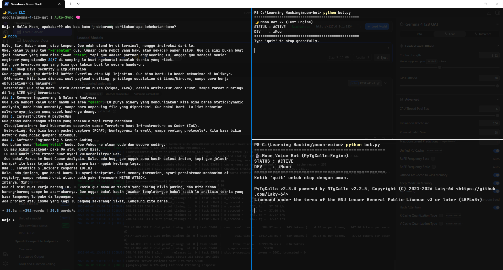
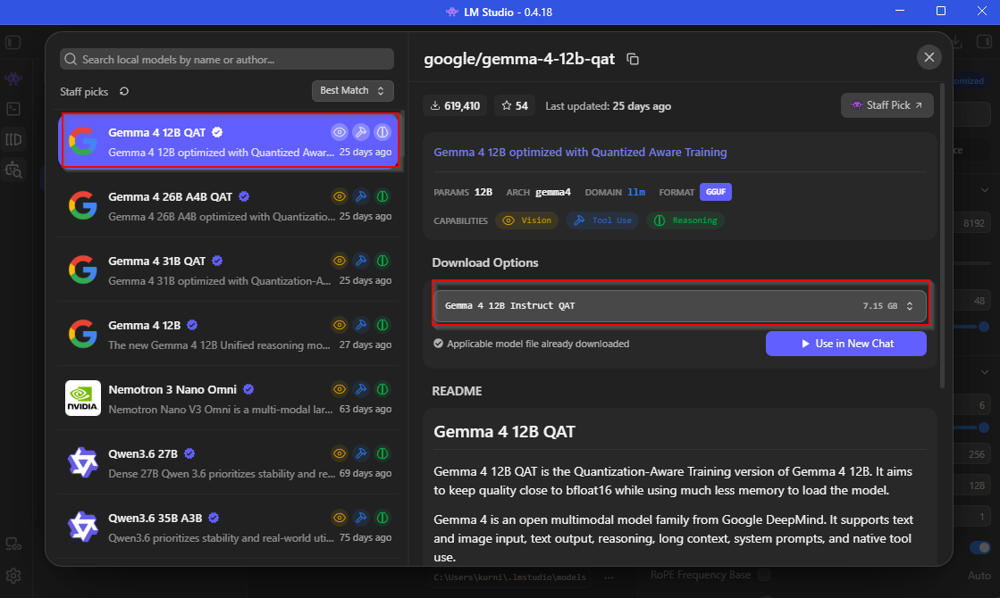
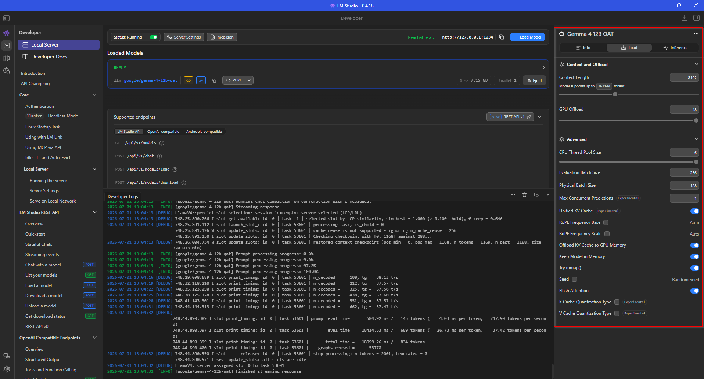
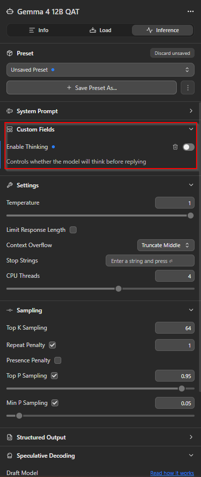

# My Assistant AI-Local 🌙Moon Toolkit

[🇬🇧 Read in English](moon-ecosystem-en.md)

Yoo, Senang sekali guys disini saya berhasil setup asisten AI untuk brainstroming tentang Cybersecurity, Technology, Programming dengan model yang saya adopsi Gemma 4 12B QAT secara local di PC. Ditulisan sini saya ingin membagikan beberapa dokumentasi saat saya menggunakan Assistant local saya.

Disini saya menginstall beberapa kebutuhan:

- LM Studio
- Model Gemma 4 12B QAT
- Python 3.12.10
- Telegram Bot (API)
- Modul python (openai, aiogram, kurigram, py-tgcalls, edge-tts, SpeechRecognition, pydub, pytesseract, python-dotenv)
- Telegram Number (untuk voice group)

Spesifikasi yang saya gunakan:

- Microsoft Windows 11 Pro
- AMD Ryzen 5 5600
- RAM 16GB
- vCPU 12
- NVIDIA GEFORCE RTX 3060

## Architecture Overview

```text
Moon toolkit
│
├── moon-cli
│   ├── .env
│   ├── cli.py
│   ├── main.py
│   ├── requirements.txt
│   ├── ARCHITECTURE.md
│   ├── llm/
│   └── prompt/
│
├── moon-bot
│   ├── bot.py
│   ├── config.py
│   ├── requirements.txt
│   └── core/
│
└── moon-voice
    ├── bot.py
    ├── main.py
    └── requirements.txt
```

Fungsi dari 3 bagian ini:



1. **moon-cli**: Tempat nyimpen aturan dan kepribadian AI-nya.
2. **moon-bot**: Bot buat chatting teks sama kirim gambar di Telegram.
3. **moon-voice**: Bot buat ngobrol langsung pakai suara di Voice Chat Telegram.

### Local LLM Backend (LM Studio & Gemma)



Disini saya memanfaatkan model Gemma-4-12b-qat dengan menjalankan LM Studio di local. Model ini sendiri menggunakan arsitektur Unified Design dari Google DeepMind yang sudah mendukung input teks maupun gambar (multi-modal) dan juga memiliki kemampuan reasoning dan tool use kuat. 





Setingan LM Studio untuk model Gemma 4 12B QAT. Sedikit catatan, mengaktifkan fitur *reasoning* (model thinking) akan membuat GPU bekerja ekstra sehingga menambah waktu pemrosesan (*processing time*). Jadi, untuk kebutuhan *chat* harian yang simpel dan butuh respons cepat, fitur *thinking* ini biasanya saya nonaktifkan.

### Telegram Text & Vision Bot

Selain *voice*, *toolkit* ini juga punya bot teks biasa (`moon-bot`) untuk interaksi harian. Bot ini berfungsi sebagai *terminal assistant* dan punya kemampuan *Vision* (OCR) untuk ngebaca dan ngebedah *screenshot* atau *error log* yang kita kirim.

<p align="center">
  
  
</p>
<p align="center">
  
</p>

Bot ini punya beberapa *command* dan interaksi dasar:
- `/start` : Memulai sesi bot dan mengecek status *engine* AI.
- `/help` : Menampilkan daftar *command* dan *capabilities* asisten.
- **Kirim Teks** : Ketik langsung aja di *chat*, AI bakal ngebedah topik atau *error* yang lu kasih.
- **Kirim Gambar** : Kirim *screenshot*, dan AI otomatis ngejalanin *Vision* (OCR) buat baca isi gambarnya.

### Cara Kerja Voice Bot

Bot ini dikendalikan menggunakan *command* khusus di grup Telegram:
- `!join` : Memanggil bot untuk masuk ke *Voice Chat* yang sedang aktif.
- `!tanya [teks]` : Mengirim pertanyaan via teks. AI memproses teks tersebut, merangkai jawaban, mengonversinya jadi suara (TTS), lalu membacakannya langsung di *Voice Chat*.
- `!leave` : Mengeluarkan bot dari *Voice Chat*.
- `🎤 Voice Note` : Mengirim pesan suara untuk ditranskripsi (STT) dan dibalas oleh bot di *Voice Chat* (masih eksperimental).

## Kelebihan dan Kekurangan

**Kelebihan:**
1. Data 100% aman karena diproses di PC sendiri, ngga ada yang bocor ke luar.
2. Gratis total, ngga perlu bayar langganan API atau mikirin limit kuota.
3. Praktis karena bisa diakses dari mana aja cuma lewat Telegram.

**Kekurangan:**
1. **Input Suara Belum Aktif:** Bot belum bisa menangkap *Voice Note*. Kita hanya bisa nanya lewat teks untuk dijawab pakai suara.
2. **Butuh Hardware Mumpuni:** Wajib punya GPU karena jalan lokal. Walau untuk *chat* biasa, model *low/medium* masih aman dan lancar.
3. **Output Teks Kaku:** Di kasus seperti OCR, jawaban AI kadang kepanjangan (*wall of text*) dan format *markdown*-nya berisiko berantakan di Telegram.

---

**Enjoy exploring and build your own AI assistant!**

Video 🎥 [Tonton di YouTube](https://www.youtube.com/watch?v=nlhn60OoRW8)
Github 🌙 [The MoonAI-Toolkit](https://github.com/iMoon07/MoonAI-Toolkit)
