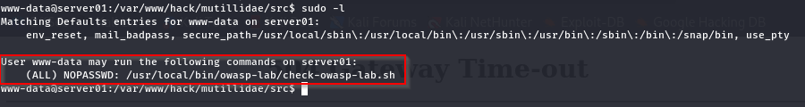
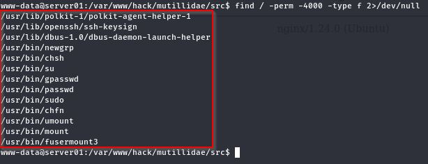
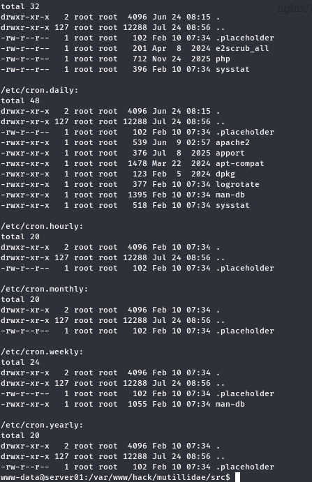
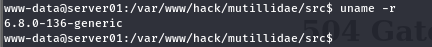

# Linux Post-Exploitation: Privilege Enumeration

[🇮🇩 Read in Indonesian](post-exploitation-priv-enum-id.md)

**Linux Post-Exploitation: File System Exploration**, which is the process of understanding the application structure, finding important files, identifying sensitive information, and evaluating permissions after gaining initial access through a reverse shell.

The next stage is **Privilege Enumeration**.

The main focus of this stage is **finding privilege escalation opportunities**, by gathering information about user privileges, system configurations, and various potential escalation paths before attempting a

---

# What is Privilege Enumeration?

Privilege Enumeration is the process of identifying system configurations that may allow a low-privileged user to obtain elevated privileges.

Rather than exploiting vulnerabilities immediately, this phase focuses on collecting information that helps determine whether privilege escalation is possible and which technique is the most appropriate.

---

# Why is This Important?

Many privilege escalation opportunities originate from system misconfigurations rather than software vulnerabilities.

Common areas worth investigating include:

- User and group memberships
- Sudo permissions
- SUID / SGID binaries
- Linux Capabilities
- Scheduled tasks
- Running services
- Writable files and directories
- Environment variables
- Kernel version

Understanding these components allows privilege escalation to be performed based on evidence instead of guesswork.

---

# Prerequisites

Before following this guide, ensure that:

- A Reverse Shell has already been established.
- Basic Linux Enumeration has been completed.
- File System Exploration has been performed.

The shell used throughout this demonstration is:

```text
www-data@server01:/var/www/hack/mutillidae/src$
```

---

# Enumeration Workflow

```text
Reverse Shell
      │
      ▼
Upgrade Interactive TTY
      │
      ▼
Basic Linux Enumeration
      │
      ▼
File System Exploration
      │
      ▼
Privilege Enumeration
      ├── User & Group
      ├── Sudo Configuration
      ├── SUID / SGID
      ├── Linux Capabilities
      ├── Scheduled Tasks (Cron)
      ├── Running Services
      ├── Writable Files & Directories
      ├── Environment Variables
      └── Kernel Information
```

Following a structured workflow helps ensure that important privilege escalation vectors are not overlooked during the assessment.

---

# Demonstration

## 1. Current User Information


The first step is identifying the privileges associated with the current shell.

```bash
id
```

### Purpose

Identify the current user and group memberships.

### What We Learn

This command reveals:

- Current user ID (UID)
- Primary group
- Supplementary groups
- Potential privileged group memberships

Group membership often determines which resources or services can be accessed.

---

## 2. Sudo Configuration



Next, determine whether the current user has permission to execute commands via **sudo**.

```bash
sudo -l
```

### Purpose

Check for delegated administrative privileges.

### What We Learn

Possible findings include:

- Passwordless sudo access
- Restricted sudo commands
- Full administrative privileges
- Misconfigured sudo policies

Sudo configuration is one of the most common privilege escalation vectors.

---

## 3. SUID / SGID Binaries



Search for binaries that execute with the privileges of their owner.

```bash
find / -perm -4000 -type f 2>/dev/null
```

### Purpose

Identify privileged executables.

### What We Learn

Common findings include:

- Standard system binaries
- Third-party binaries
- Custom applications
- Unexpected privileged executables

Unusual SUID binaries often deserve closer inspection.

---

## 4. Linux Capabilities


Linux Capabilities provide specific privileges without granting full root access.

```bash
getcap -r / 2>/dev/null
```

### Purpose

Identify binaries with elevated capabilities.

### What We Learn

Capabilities may allow operations such as:

- Network administration
- Raw socket access
- File ownership modification
- Process manipulation

Improperly assigned capabilities can introduce privilege escalation opportunities.

---

## 5. Scheduled Tasks (Cron)




Review scheduled jobs configured on the system.

```bash
cat /etc/crontab && ls -la /etc/cron.*
```

### Purpose

Identify automated tasks executed by privileged users.

### What We Learn

Review:

- Scheduled scripts
- Executed binaries
- Writable scripts
- Root-owned cron jobs

Misconfigured scheduled tasks are a common source of privilege escalation.

---

## 6. Running Services


List currently running services.

```bash
systemctl list-units --type=service
```

### Purpose

Identify services running with elevated privileges.

### What We Learn

Interesting targets include:

- Custom services
- Third-party applications
- Misconfigured services
- Services running as root

These services may expose additional attack surfaces.

---

## 7. Environment Variables


Inspect the current environment.

```bash
env
```

### Purpose

Review environment variables available to the current session.

### What We Learn

Environment variables may reveal:

- Application paths
- User-specific configuration
- Tokens or credentials
- Execution paths

Although often overlooked, they occasionally expose valuable information.

---

## 8. Writable Files & Directories


Identify locations where the current user has write permissions.

```bash
find / -writable -type d 2>/dev/null
```

### Purpose

Locate writable directories.

### What We Learn

Writable locations may include:

- Temporary directories
- Application folders
- Shared directories
- Misconfigured system paths

These locations may become useful during later assessment stages.

---

## 9. Home Directories


Review user home directories.

```bash
ls -lah /home
```

### Purpose

Identify accessible user accounts.

### What We Learn

This helps determine:

- Existing users
- Accessible home directories
- Shared files
- User-specific configuration

Additional user data may provide valuable context during the assessment.

---

## 10. Kernel Information



Finally, identify the Linux kernel version.

```bash
uname -r
```

### Purpose

Determine the running kernel version.

### What We Learn

The kernel version helps determine whether the system is affected by known privilege escalation vulnerabilities or whether it has already been patched.

Kernel information alone does not indicate a vulnerability but serves as an important reference during later analysis.

---

# Summary

Privilege Enumeration is the process of identifying potential privilege escalation paths before attempting exploitation.

Throughout this stage, we examined:

1. Current user and groups
2. Sudo configuration
3. SUID / SGID binaries
4. Linux Capabilities
5. Scheduled tasks
6. Running services
7. Environment variables
8. Writable directories
9. Home directories
10. Kernel information

A systematic approach helps reduce guesswork and ensures that important escalation vectors are not overlooked.

---

# Next Stage

With privilege enumeration complete, the next phase is **Linux Privilege Escalation**.

Using the information collected during enumeration, we can begin validating potential privilege escalation paths based on actual system findings instead of relying on blind exploitation attempts.

---

# Conclusion

Privilege Enumeration is one of the most critical stages of Linux post-exploitation.

Rather than immediately attempting privilege escalation, it focuses on understanding how the operating system is configured and identifying realistic paths that may lead to elevated privileges.

The quality of privilege escalation often depends on the quality of the enumeration performed beforehand.

---

# References

- Linux man-pages Project  
  https://www.kernel.org/doc/man-pages/

- GTFOBins  
  https://gtfobins.github.io/

- MITRE ATT&CK – T1068: Exploitation for Privilege Escalation  
  https://attack.mitre.org/techniques/T1068/

- MITRE ATT&CK – T1548: Abuse Elevation Control Mechanism  
  https://attack.mitre.org/techniques/T1548/

---

Thank you.