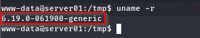
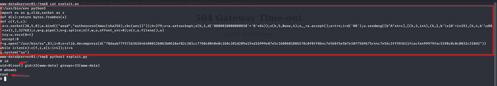

# Linux Kernel Privilege Escalation: Copy.Fail (CVE-2026-31431)

[🇬🇧 Read in English](post-exploitation-priv-esca-copyfail-en.md)

Saya ingin berbagi pengalaman saat mempelajari **Privilege Escalation** pada Linux, khususnya melalui eksploitasi kerentanan pada Linux Kernel yang dikenal sebagai **Copy.Fail (CVE-2026-31431)**.

Secara singkat, kerentanan ini berkaitan dengan kemampuan proses tertentu untuk memengaruhi **page cache** kernel. Pada sistem yang memenuhi kondisi rentan, kondisi tersebut dapat dimanfaatkan untuk meningkatkan hak akses dari user biasa menjadi **root**.

Karena penasaran dengan cara kerja kerentanan ini, saya mencoba mereproduksi dan mengujinya pada lab pribadi. Seluruh file yang digunakan untuk pengujian tersedia pada folder [OWASP-Lab-Toolkit/CVE-2026-31431](https://github.com/iMoon07/OWASP-Lab-Toolkit/tree/main/CVE-2026-31431) di repository GitHub saya.

Fokus kali ini adalah memahami bagaimana **kernel exploit** dapat digunakan sebagai jalur **Privilege Escalation** setelah memperoleh foothold pada sistem.

---

# Apa itu Privilege Escalation?

**Privilege Escalation** adalah teknik untuk memperoleh hak akses yang lebih tinggi dari hak akses yang sebelumnya dimiliki.

Dalam konteks Linux, salah satu skenario yang umum adalah ketika attacker telah memperoleh shell dengan hak akses rendah seperti **www-data**, kemudian mencari jalur untuk memperoleh akses **root**.

Salah satu jalur yang dapat digunakan adalah eksploitasi kerentanan pada komponen sistem, termasuk Linux Kernel.

---

# Root Cause

Privilege Escalation pada kasus ini terjadi karena adanya kerentanan **Copy.Fail (CVE-2026-31431)** pada Linux Kernel.

Kerentanan tersebut dapat memungkinkan proses tertentu memodifikasi data pada **page cache** dalam kondisi tertentu. Pada kernel yang rentan dan memenuhi precondition yang diperlukan, kondisi tersebut dapat digunakan untuk meningkatkan privilege proses.

Namun, keberadaan kerentanan kernel saja tidak langsung berarti sistem dapat dieksploitasi. Attacker tetap perlu melakukan enumeration dan memastikan bahwa target memenuhi kondisi yang dibutuhkan oleh exploit.

Alur serangan secara sederhana dapat digambarkan sebagai berikut.

```text
Command Injection
        │
        ▼
Command Execution
        │
        ▼
Reverse Shell
(www-data)
        │
        ▼
Privilege Enumeration
        │
        ▼
Kernel Version Check
        │
        ▼
Copy.Fail Preconditions
        │
        ▼
Kernel Exploitation
        │
        ▼
Root Shell
```

---

# Mengapa Menggunakan Kernel Exploit?

Privilege Escalation pada Linux dapat dilakukan melalui berbagai jalur, tergantung kondisi sistem yang ditemukan.

Beberapa jalur yang umum antara lain:

* Misconfigured `sudo`
* SUID/SGID binaries
* Writable files atau directories
* Cron jobs
* Linux capabilities
* Credential exposure
* Service misconfiguration
* Kernel vulnerabilities

Pada kasus ini, jalur yang digunakan adalah **Kernel Exploit**.

Pendekatan ini dipilih setelah melakukan privilege enumeration dan menemukan bahwa versi kernel pada lab memenuhi kondisi yang sesuai untuk pengujian **Copy.Fail (CVE-2026-31431)**.

---

# Topologi Lab

Eksperimen dilakukan pada environment Linux yang sengaja dibuat rentan untuk kebutuhan pembelajaran.

Pada awal skenario, attacker memperoleh foothold melalui **Command Injection** dan mendapatkan **Reverse Shell** dengan privilege `www-data`.

```text
+----------------------+        +----------------------+
|     Kali Linux       |        |    Ubuntu Server     |
|      ATTACKER        | <----- |       TARGET         |
|                      |        |                      |
|  Reverse Shell       |        |  www-data            |
|  10.10.10.149        |        |  Linux Kernel        |
+----------------------+        +----------------------+
                                      │
                                      ▼
                              Copy.Fail
                              CVE-2026-31431
                                      │
                                      ▼
                                    root
```

---

# Verifikasi Kernel

Sebelum mencoba kernel exploit, langkah pertama adalah memeriksa versi kernel yang sedang digunakan.



```bash
uname -r
```

Perintah tersebut digunakan untuk melihat informasi versi Linux Kernel pada target.

Informasi ini menjadi salah satu dasar untuk menentukan apakah sistem layak untuk diuji menggunakan Copy.Fail.

---

# Memverifikasi Preconditions


Setelah mengetahui versi kernel, tahap berikutnya adalah memeriksa apakah target memenuhi **precondition** yang dibutuhkan oleh Copy.Fail.

```bash
python3 test.py
```

Script tersebut digunakan untuk melakukan pemeriksaan terhadap kondisi yang diperlukan sebelum exploit dijalankan.

Output menunjukkan bahwa environment lab memenuhi kondisi yang diperlukan untuk melanjutkan pengujian.

Tahap ini penting karena pemilihan kernel exploit tidak cukup hanya berdasarkan versi kernel. Kondisi sistem lainnya juga harus sesuai dengan requirement exploit.

---

# Menjalankan Proof-of-Concept



Setelah precondition terpenuhi, saya menjalankan proof-of-concept Copy.Fail.

```bash
python3 exploit.py
```

Proof-of-concept digunakan untuk menguji apakah kondisi rentan pada kernel dapat dimanfaatkan untuk melakukan privilege escalation.

Pada environment lab ini, proses berhasil meningkatkan privilege dari:

```text
www-data
    │
    ▼
  root
```

Hasil tersebut menunjukkan bahwa Copy.Fail dapat digunakan sebagai jalur privilege escalation pada environment yang memenuhi kondisi rentan.

---

# Hasil

Setelah proof-of-concept berhasil dijalankan, shell yang sebelumnya berjalan sebagai **www-data** berhasil memperoleh privilege **root**.

Hal ini membuktikan rangkaian attack chain:

```text
Command Injection
        │
        ▼
Reverse Shell
        │
        ▼
www-data
        │
        ▼
Kernel Exploit
        │
        ▼
root
```

Dengan demikian, privilege escalation tidak berdiri sendiri, tetapi menjadi tahap lanjutan setelah attacker berhasil memperoleh foothold pada sistem.

---

# Detection

Aktivitas privilege escalation melalui kernel exploit dapat menjadi indikator kompromi apabila dikombinasikan dengan aktivitas mencurigakan lainnya.

Beberapa hal yang dapat dimonitor antara lain:

* Proses tidak biasa yang dijalankan oleh user dengan privilege rendah.
* Eksekusi binary atau script dari lokasi yang tidak lazim.
* Perubahan privilege proses secara tiba-tiba.
* Aktivitas eksploitasi kernel yang tidak sesuai dengan aktivitas administrator.
* Crash atau anomali pada kernel.
* Perubahan file atau proses yang terjadi sebelum privilege berubah menjadi `root`.

Monitoring proses, audit log, dan aktivitas privilege dapat membantu mendeteksi indikasi privilege escalation.

---

# Mitigasi

Karena kasus ini memanfaatkan kerentanan pada Linux Kernel, mitigasi utama adalah memastikan sistem menggunakan **kernel yang telah diperbaiki** dan tidak berada pada kondisi rentan.

Beberapa langkah yang dapat diterapkan antara lain:

* Update Linux Kernel ke versi yang telah mendapatkan security fix.
* Terapkan security patch secara berkala.
* Gunakan prinsip **Least Privilege**.
* Batasi kemampuan user dan service yang tidak membutuhkan privilege tinggi.
* Monitor aktivitas privilege escalation.
* Gunakan EDR atau Linux security monitoring untuk mendeteksi aktivitas abnormal.
* Lakukan vulnerability assessment secara berkala terhadap host Linux.

Patch management menjadi salah satu pertahanan utama terhadap kernel vulnerability karena eksploitasi dapat memberikan dampak langsung terhadap seluruh sistem.

---

# Kesimpulan

Privilege Escalation tidak selalu berasal dari kesalahan konfigurasi seperti `sudo`, SUID, atau file permission. Kerentanan pada komponen inti sistem seperti **Linux Kernel** juga dapat menjadi jalur untuk memperoleh privilege yang lebih tinggi.

Pada demonstrasi ini, **Copy.Fail (CVE-2026-31431)** digunakan setelah memperoleh foothold sebagai **www-data** melalui Reverse Shell.

Sebelum menjalankan exploit, saya melakukan **kernel version check** dan **precondition verification** untuk memastikan environment sesuai dengan kondisi yang dibutuhkan.

Setelah seluruh kondisi terpenuhi, proof-of-concept berhasil meningkatkan privilege dari **www-data** menjadi **root** pada lab yang memang sengaja dibuat rentan.

Eksperimen ini menunjukkan pentingnya melakukan enumeration terlebih dahulu sebelum memilih metode privilege escalation. Informasi mengenai kernel dan kondisi sistem dapat membantu menentukan apakah suatu kernel exploit relevan untuk digunakan.

Catatan: Pada kematangan sisi attacker ini adalah bom pertama dalam melakukan escalation sebelum lanjut ke tingkat berikutnya seperti tujuan persistence.

---

# Referensi

### Tools & Utilities

* `uname` — Linux kernel version information
* Python 3 — Proof-of-concept execution environment

### Official Documentation

* Linux Kernel Documentation
* Linux Kernel Source Code

### Security Research

* Copy.Fail (CVE-2026-31431) — Vulnerability Research / Technical Analysis
* MITRE ATT&CK — T1068: Exploitation for Privilege Escalation

---

Terima kasih.
