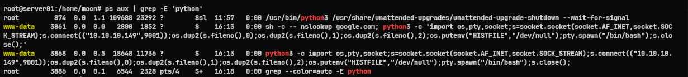
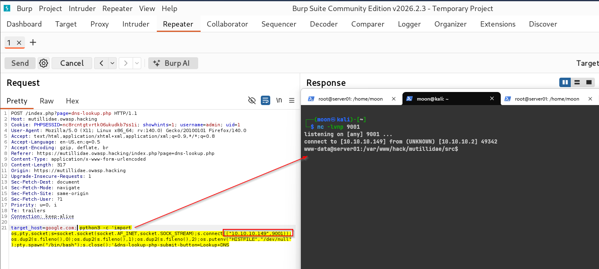
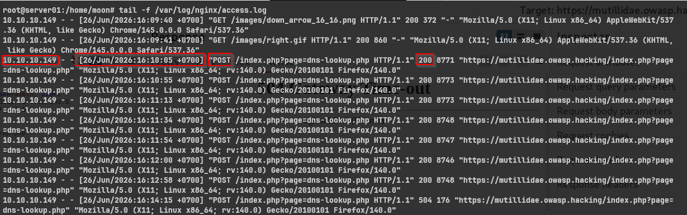

# Reverse Shell: Process, Log, and Network Analysis

[🇮🇩 Baca dalam Bahasa Indonesia](reverse-shell-server-side.md)

This time, we will look at what happens to the system after a **Reverse Shell** is successfully executed.

The focus is on three main artifacts that can be observed from the system:

* Process
* Log
* Network

---

# What is Reverse Shell Analysis?

Reverse Shell Analysis is the process of identifying Reverse Shell activity from the server side after the payload has been executed.

Instead of discussing how to create the payload, this article focuses on **what happens in the system** when a Reverse Shell is successfully running.

By understanding the processes, logs, and network connections that are formed, we can observe how Reverse Shell activity appears on the target system.

---

# Why is it Important?

When a Reverse Shell is successfully executed, the server will leave various observable artifacts, such as:

* A new process executed by the web application.
* Application access logs recording requests from the attacker.
* An outbound network connection to the attacker's machine.

These three artifacts complement each other and can be used to understand the activity that occurred after the Reverse Shell was successfully executed.

---

# Prerequisites

This article is a continuation of the previous Reverse Shell demonstration.

Make sure the Reverse Shell has already been obtained through a **Command Injection** vulnerability.

```text
Command Injection
        │
        ▼
Command Execution
        │
        ▼
Reverse Shell
```

---

# Analysis Flow

```text
            Reverse Shell
                  │
                  ▼
        Process Analysis
                  │
                  ▼
          Log Analysis
                  │
                  ▼
       Network Analysis
```

---

# Lab Topology

| Role         | Description                   | IP Address     |
| :----------- | :---------------------------- | :------------- |
| **Attacker** | Kali Linux                    | `10.10.10.149` |
| **Target**   | Ubuntu Server (Mutillidae II) | `10.10.10.2`   |

---

# Demonstration

## 1. Process Analysis

The first step is to look at the processes currently running on the server.

```bash
ps aux | grep python
```



### What was found?

We can see that the `python3` process is being executed by the **www-data** user, an account commonly used by web servers such as Apache or Nginx.

We can also see the following payload:

```text
nslookup google.com;
python3 -c ...
```

### What does the output mean?

Normally, the `www-data` account is used to run web applications.

If this account executes an interpreter such as **Python**, **Bash**, **Perl**, or another language that opens an outbound connection, this condition can be an indicator of **Command Injection** or **Remote Code Execution (RCE)**.

In this demonstration, the Python process becomes the first artifact indicating Reverse Shell activity.

---

## 2. Log Analysis

The next step is to look at the requests received by the web server.

```bash
tail -f /var/log/nginx/access.log
```




### Output

```text
10.10.10.149 - - [26/Jun/2026:16:10:05 +0700] "POST /index.php?page=dns-lookup.php HTTP/1.1" 200 8771
10.10.10.149 - - [26/Jun/2026:16:10:55 +0700] "POST /index.php?page=dns-lookup.php HTTP/1.1" 200 8773
10.10.10.149 - - [26/Jun/2026:16:14:15 +0700] "POST /index.php?page=dns-lookup.php HTTP/1.1" 504 176
```

### What was found?

We can see several **HTTP POST** requests to the endpoint:

```text
/index.php?page=dns-lookup.php
```

originating from the attacker's IP address.

### What does the output mean?

The requests show that the attacker repeatedly accessed the **DNS Lookup** feature, which contains a **Command Injection** vulnerability.

Although the access log does not display the complete payload, information such as the IP address, endpoint, HTTP method, and access time is sufficient to correlate it with the Python process found earlier.

---

## 3. Network Analysis

A key characteristic of a Reverse Shell is the formation of an outbound connection from the server to the attacker's machine.

Check it using the following command:

```bash
ss -tnp
```


### Output

```text
State      Recv-Q Send-Q Local Address:Port    Peer Address:Port
ESTAB      0      0      10.10.10.2:49342      10.10.10.149:9001
users:(("python3",pid=3868,fd=3))
```

### What was found?

We can see a connection with the **ESTABLISHED** status to the attacker's IP address on port **9001**.

The connection was created by the **python3** process with PID **3868**.

### What does the output mean?

This information confirms that the Python process found earlier is indeed opening an outbound connection to the attacker's machine.

The correlation between the **PID**, **process**, and **network connection** provides strong evidence that the Reverse Shell is active.

---

If we want to observe the network communication directly, use:

```bash
sudo tcpdump -i any port 9001 -nn -A
```


### Output

```text
16:13:15.687717 ens33 Out IP 10.10.10.2.49342 > 10.10.10.149.9001
www-data@server01:/var/www/hack/mutillidae/src$
```

### What was found?

We can see TCP communication to the attacker's machine along with the shell prompt:

```text
www-data@server01:/var/www/hack/mutillidae/src$
```

### What does the output mean?

Because the Reverse Shell in this demonstration uses an unencrypted TCP connection, the communication can still be read as **plaintext**.

The appearance of the shell prompt shows that the attacker has successfully obtained an interactive shell on the target server.

---

# Findings Summary

| Artifact    | Finding                                                 |
| :---------- | :------------------------------------------------------ |
| **Process** | `python3` is executed by the `www-data` user            |
| **Log**     | HTTP POST request to the `dns-lookup.php` endpoint      |
| **Network** | Outbound connection to the attacker's IP on port `9001` |

These three artifacts complement each other and provide a clear picture of the Reverse Shell activity without requiring complex forensic tools.

---

# What is the Next Step?

After understanding the artifacts left behind by the Reverse Shell, the next step is to perform **Linux Enumeration** to examine the condition of the system that has been accessed.

This stage includes:

* Identifying active users.
* Information about the operating system and kernel.
* Application directory structure.
* Network configuration.
* Running services and processes.

---

# Conclusion

A Reverse Shell does not only provide access to the attacker, but also leaves various traces on the target system.

By examining **processes**, **application logs**, and **network connections**, we can see how the payload was executed and how the Reverse Shell connection was established.

Although this demonstration was performed in a simple lab environment, this analysis approach can serve as a basis for understanding activity occurring on Linux systems after a Reverse Shell has been successfully executed.

---

# References

* MITRE ATT&CK – T1059: Command and Scripting Interpreter
  https://attack.mitre.org/techniques/T1059/

* NGINX Documentation – Access Log
  https://nginx.org/en/docs/http/ngx_http_log_module.html

* Linux Manual Pages Project
  https://man7.org/linux/man-pages/

* tcpdump Documentation
  https://www.tcpdump.org/

---

Thank you.
