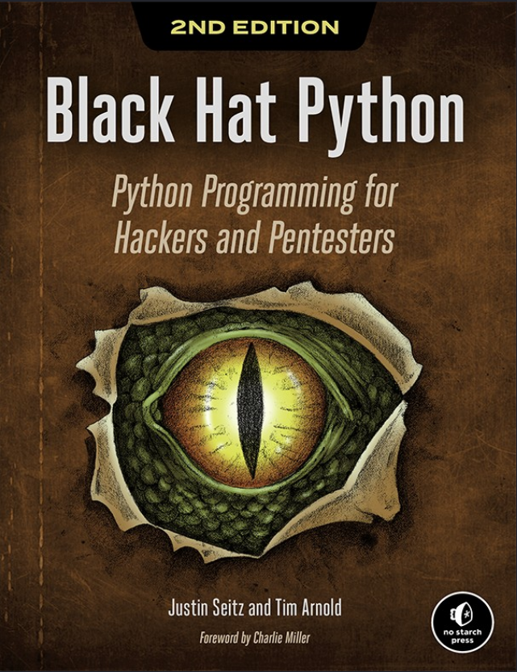
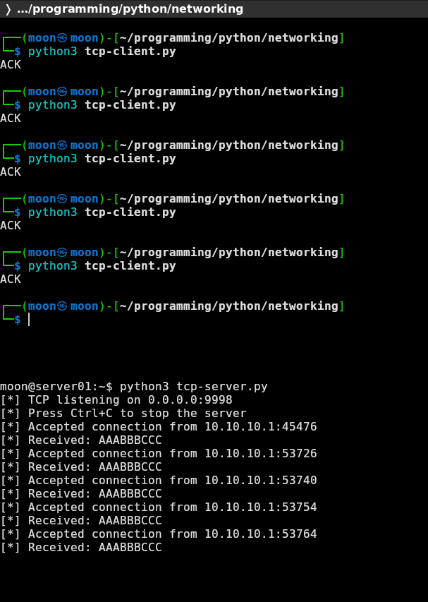
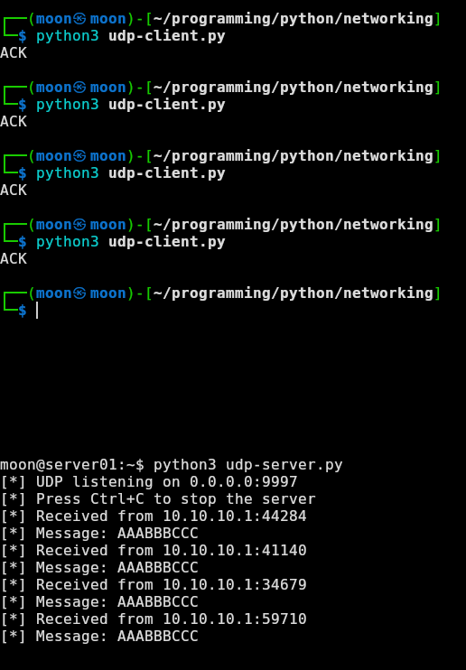
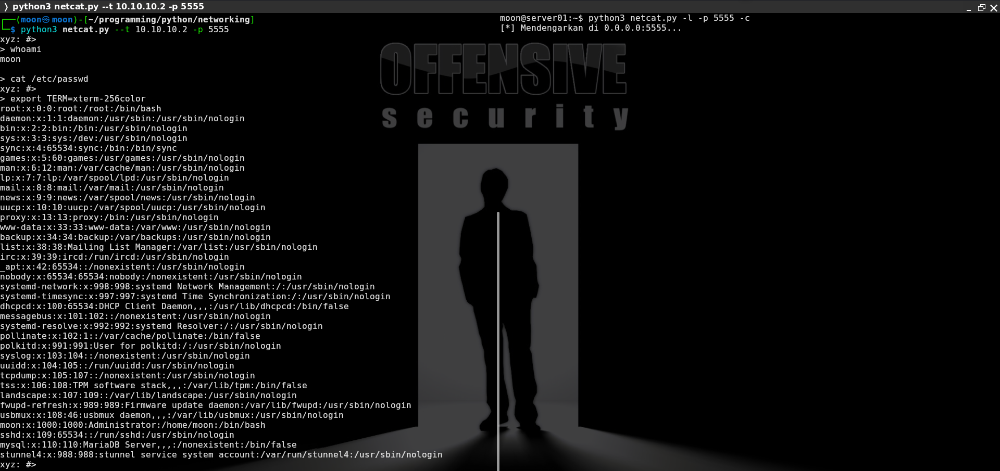

# Socket Programming Experiments with Python

[🇬🇧 Read in English](network-hacking-basic-en.md)

Semalam saya membaca **Black Hat Python, 2nd Edition** karya Justin Seitz dan Tim Arnold. Pada bagian awal buku, saya menemukan pembahasan tentang network programming: TCP, UDP, socket, dan Netcat sederhana menggunakan Python.



Saya sedang mencoba masuk ke programming. Network programming terasa menarik untuk memulai saya berlatih yang di buku dengan menulis satu program menjadi server, program menjadi client, lalu keduanya dapat saling mengirim data melalui IP address dan port.

Saya memakai bahasa Python sebagai langkah awal untuk memahami socket dan komunikasi jaringan. Setelah lebih paham dasarnya, saya ingin mencoba konsep yang sama menggunakan C.

## Lab

| Mesin | IP | Peran |
| :-- | :-- | :-- |
| Kali Linux | `10.10.10.1` | Client |
| Ubuntu Server01 | `10.10.10.2` | Server |

```text
Kali Linux  →  TCP / UDP  →  Ubuntu Server01
10.10.10.1                   10.10.10.2
```

## Eksperimen

| File | Fungsi |
| :-- | :-- |
| `tcp-client.py` | TCP client |
| `tcp-server.py` | TCP server |
| `udp-client.py` | UDP client |
| `udp-server.py` | UDP server |
| `netcat.py` | Netcat dari source buku |

## Yang Dipelajari

| Bagian | TCP | UDP |
| :-- | :-- | :-- |
| Socket type | `socket.SOCK_STREAM` | `socket.SOCK_DGRAM` |
| Client flow | `connect() → send() → recv()` | `sendto() → recvfrom()` |
| Server flow | `bind() → listen() → accept() → recv()` | `bind() → recvfrom() → sendto()` |
| Connection | Harus membuat koneksi terlebih dahulu | Tidak perlu membuat koneksi tetap |
| Data | Stream bytes | Datagram / packet data |

---

Di buku tersebut menyarankan kenapa berlatih hacking dasar jaringan penting agar membantu saya perform saat melakukan pengujian pentesting untuk memahami flow cara program - server bekerja. Mengetahui request dan respone server dan program saat ini masih belum terlalu banyak saya explorasi.

Dan juga beberapa explorasi sintaks penting dalam python network untuk socket seperti perbedaan antara tcp-udp protokol ini juga saya dapat tau dari sisi code nya seperti:





- untuk UDP `server = socket.socket(socket.AF_INET, socket.SOCK_DGRAM)`
- untuk TCP `server = socket.socket(socket.AF_INET, socket.SOCK_STREAM)`

- TCP membangun koneksi terlebih dahulu, lalu mengirim dan menerima data.
- UDP mengirim data langsung ke tujuan tanpa membangun koneksi terlebih dahulu.

Saat ini saya belum melihat sisi packet yang sedang berjalan.

Oke

Lalu program netcat belum sepenuhnya perform saya baru mencoba explore sisi network dan membuat space seperti:



- Koneksi TCP antara client dan server.
- Pengiriman dan penerimaan data dengan send() dan recv().
- Mode server menggunakan bind(), listen(), dan accept().
- Command shell sederhana serta pengaturan opsi program menggunakan argparse.

Next saya ingin menjalankan source code ini sambil menangkap traffic dengan `tcpdump` atau Wireshark, agar bisa melihat hubungan antara:

```text
Python source
→ socket
→ TCP / UDP packet
→ traffic di jaringan
```

Semua percobaan dilakukan pada lab lokal.
