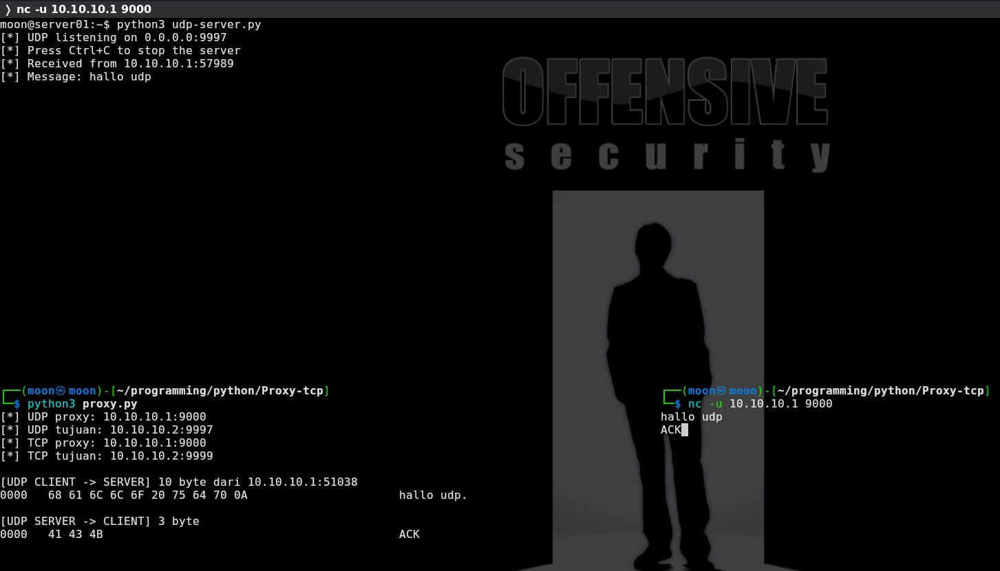
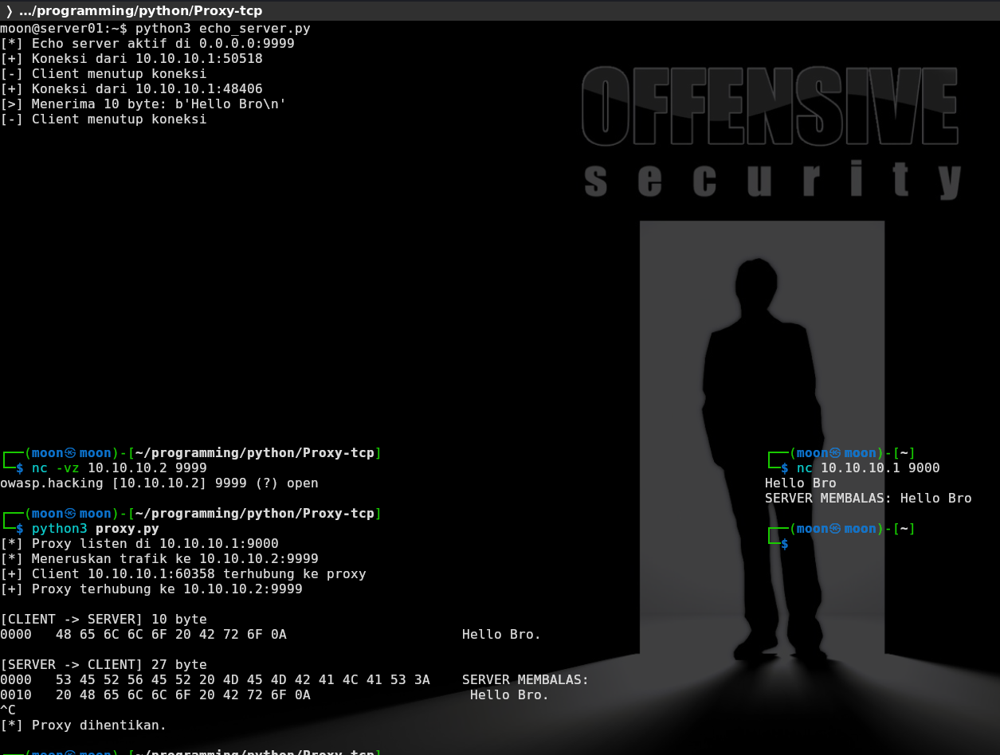
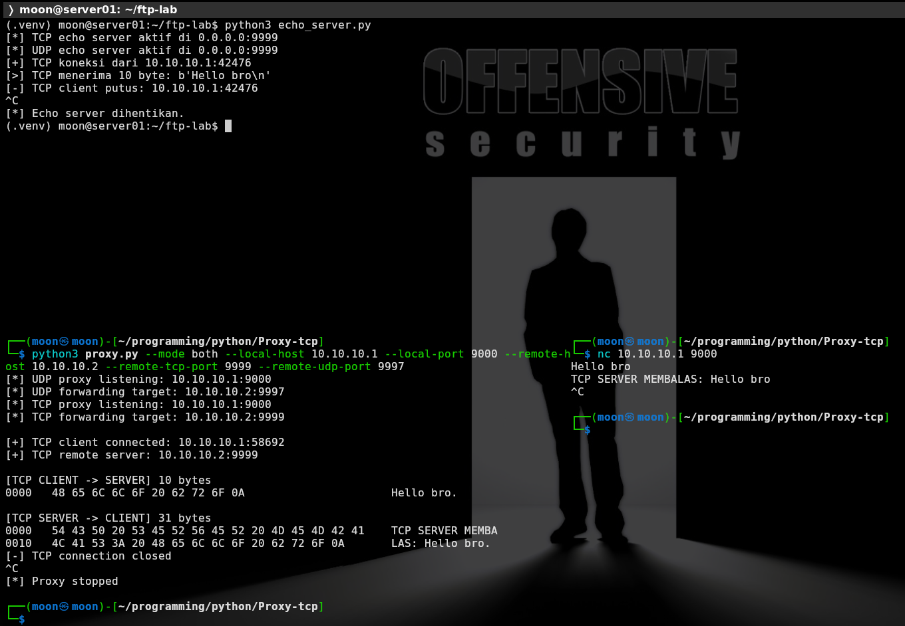
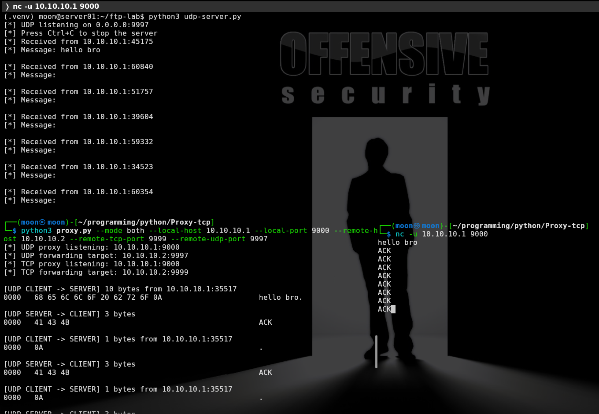
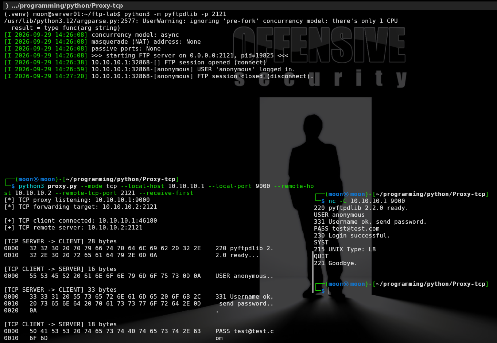
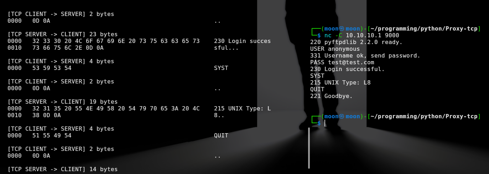

# TCP & UDP Proxy Lab — FTP Traffic Analysis

[🇮🇩 Baca dalam Bahasa Indonesia](build-tcp-udp-proxy-lab-id.md)

This lab builds a simple proxy using Python to forward traffic between a client and a server.

The proxy is placed in the middle of the communication:

```text
Client → Proxy → Server
```

The goal is not only to ensure that data reaches the server, but also to make the traffic contents visible in hexadecimal and ASCII format.

This lab performs three tasks:

```text
1. Forward TCP traffic.
2. Forward UDP traffic.
3. Use the TCP proxy to view FTP communication.
```

FTP was selected for testing because its commands and responses are clearly visible, such as `USER`, `PASS`, `SYST`, and `QUIT`.

## Topology

```text
TCP Client → Kali Proxy (10.10.10.1:9000) → TCP Server (10.10.10.2:9999)

UDP Client → Kali Proxy (10.10.10.1:9000) → UDP Server (10.10.10.2:9997)

FTP Client → Kali Proxy (10.10.10.1:9000) → FTP Server (10.10.10.2:2121)
```

Kali acts as the proxy.  
`server01` acts as the destination server.

## Files

| Machine | File | Function |
|---|---|---|
| `server01` / `10.10.10.2` | `echo_server.py` | TCP server for TCP forwarding tests |
| `server01` / `10.10.10.2` | `udp-server.py` | UDP server for UDP forwarding tests |
| Kali / `10.10.10.1` | `proxy.py` | TCP and UDP proxy with hex dump output |

## TCP and UDP Testing

TCP and UDP testing is performed first to ensure that the proxy can receive data from the client, forward it to the server, receive the server response, and return it to the client.

### Start the UDP server

On `server01`:



```bash
python3 udp-server.py
```

The UDP server runs on:

```text
0.0.0.0:9997
```

### Start the TCP server



On `server01`:

```bash
python3 echo_server.py
```

The TCP server runs on:

```text
0.0.0.0:9999
```

### Start the TCP and UDP proxy

On Kali:

```bash
python3 proxy.py --mode both --local-host 10.10.10.1 --local-port 9000 --remote-host 10.10.10.2 --remote-tcp-port 9999 --remote-udp-port 9997
```

The proxy accepts connections on:

```text
TCP Proxy: 10.10.10.1:9000
UDP Proxy: 10.10.10.1:9000
```

It then forwards data to:

```text
TCP Destination: 10.10.10.2:9999
UDP Destination: 10.10.10.2:9997
```

### Test TCP

In another Kali terminal:

```bash
nc 10.10.10.1 9000
```

Type:

```text
Hallo TCP
```

The traffic flow:



```text
netcat → TCP proxy → TCP echo_server
TCP echo_server → TCP proxy → netcat
```

### Test UDP

In another Kali terminal:

```bash
nc -u 10.10.10.1 9000
```

Type:

```text
Hallo UDP
```

The traffic flow:



```text
UDP netcat → UDP proxy → udp-server
udp-server → UDP proxy → UDP netcat
```

### Output displayed by the proxy

The proxy displays data from both directions:

```text
[TCP CLIENT -> SERVER]
[TCP SERVER -> CLIENT]

[UDP CLIENT -> SERVER]
[UDP SERVER -> CLIENT]
```

Data is displayed in hexadecimal and ASCII:

```text
48 61 6C 6C 6F = Hallo
0A = Enter / newline
```

This section proves that the proxy can read data passing between the client and the server.

## FTP Testing Through the Proxy

After TCP forwarding works, the TCP proxy is used to view FTP communication.

In FTP testing, the client does not connect directly to the FTP server. The client connects to the Kali proxy, and the proxy forwards that connection to the FTP server on `server01`.

```text
FTP Client → Kali Proxy → FTP Server
```

The purpose of FTP testing is to view login commands and server responses directly through the proxy hex dump output.

### Start the FTP server

On `server01`:

```bash
python3 -m pyftpdlib -p 2121
```

The FTP server runs on:

```text
0.0.0.0:2121
```

### Start the proxy for FTP

On Kali:

```bash
python3 proxy.py --mode tcp --local-host 10.10.10.1 --local-port 9000 --remote-host 10.10.10.2 --remote-tcp-port 2121 --receive-first
```

The configuration means:

```text
The proxy accepts FTP connections on Kali: 10.10.10.1:9000
The proxy forwards connections to the FTP server: 10.10.10.2:2121
--receive-first is used so the FTP banner from the server is received first
```

### Connect to FTP through the proxy

In another Kali terminal:

```bash
nc -C 10.10.10.1 9000
```

The `-C` option is used so that `nc` sends line endings as `CRLF`:

```text
CRLF = 0D 0A
```

FTP requires `CRLF`, not only `LF`:

```text
LF only: 0A
FTP CRLF: 0D 0A
```

Type the following commands one at a time:

```text
USER anonymous
PASS test@test.com
SYST
QUIT
```

## FTP Testing Results





The client receives responses from the FTP server:

```text
220 pyftpdlib 2.2.0 ready.
331 Username ok, send password.
230 Login successful.
215 UNIX Type: L8
221 Goodbye.
```

The proxy displays bidirectional FTP communication:

```text
[TCP SERVER -> CLIENT]
220 pyftpdlib 2.2.0 ready.

[TCP CLIENT -> SERVER]
USER anonymous

[TCP SERVER -> CLIENT]
331 Username ok, send password.

[TCP CLIENT -> SERVER]
PASS test@test.com

[TCP SERVER -> CLIENT]
230 Login successful.
```

Example of FTP data in hexadecimal:

```text
USER anonymous
55 53 45 52 20 61 6E 6F 6E 79 6D 6F 75 73 0D 0A

PASS test@test.com
50 41 53 53 20 74 65 73 74 40 74 65 73 74 2E 63 6F 6D 0D 0A
```
## What Was Learned from the Source Code

The proxy is built with Python to receive data from a client, display the data in a hex dump, and forward it to the server.

```text
TCP:
client → proxy → server
server → proxy → client

UDP:
client → proxy → server
server → proxy → client
```

## Source Code Components

### `echo_server.py`

| Component | Function |
|---|---|
| `socket.AF_INET` | Uses IPv4 addresses |
| `socket.SOCK_STREAM` | Creates the TCP echo server |
| `socket.SOCK_DGRAM` | Creates the UDP echo server |
| `bind()` | Binds the server to `0.0.0.0:9999` |
| `listen()` | Waits for TCP connections |
| `accept()` | Accepts TCP connections from clients |
| `recv()` | Receives TCP data |
| `sendall()` | Sends TCP responses |
| `recvfrom()` | Receives UDP data and the client address |
| `sendto()` | Sends UDP responses |
| `threading.Thread()` | Runs the UDP server and TCP handlers separately |

### `proxy.py`

| Component | Function |
|---|---|
| `argparse` | Reads proxy mode, host, port, and timeout from command-line arguments |
| `socket.AF_INET` | Uses IPv4 addresses |
| `socket.SOCK_STREAM` | Creates the TCP proxy |
| `socket.SOCK_DGRAM` | Creates the UDP proxy |
| `create_connection()` | Connects the TCP proxy to the remote server |
| `bind()` | Binds the proxy to the local IP address and port |
| `listen()` | Waits for TCP client connections |
| `accept()` | Accepts TCP client connections |
| `recv()` | Receives TCP data from the client or server |
| `sendall()` | Forwards TCP data |
| `recvfrom()` | Receives UDP data from the client |
| `send()` | Sends UDP data to the remote server |
| `sendto()` | Sends UDP responses back to the client |
| `select.select()` | Waits for TCP data from the client or server |
| `threading.Thread()` | Handles TCP connections and UDP requests separately |
| `hexdump()` | Displays payload data in hexadecimal and ASCII |
| `--receive-first` | Receives the FTP banner before the client sends a command |

## Conclusion

This lab demonstrates how a network proxy works: accepting connections from a client, forwarding data to a server, receiving the server response, and sending that response back to the client.

TCP and UDP testing proves that the proxy supports two transport protocols.

FTP testing is used to view actual TCP communication contents. The proxy successfully captures the FTP banner, the `USER`, `PASS`, `SYST`, and `QUIT` commands, as well as the server responses.

An important finding during FTP testing is that FTP commands must end with `CRLF` (`0D 0A`). Therefore, `nc -C` is used instead of regular `nc`.

## References

- [From aw-junaid Black Hat Python Explain & Practice](https://github.com/aw-junaid/Black-Hat-Python/tree/main)
- [My source code network basic](https://github.com/iMoon07/OWASP-Lab-Toolkit/tree/main/network-hacking-basic-code)

---

Thank you.
