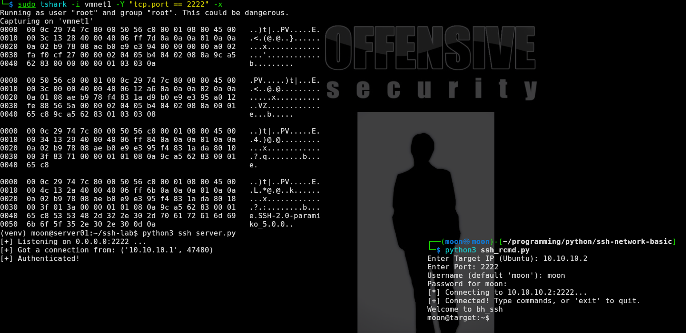
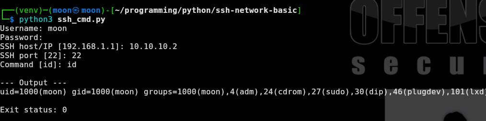

# SSH Client-Server Experiments with Python Paramiko

[🇬🇧 Read in English](ssh-client-server-python-en.md)

Just share tentang eksperimen kali ini, saya mencoba membuat dan menguji SSH client serta SSH server sederhana menggunakan Python dan Paramiko.

Paramiko adalah library Python yang mengimplementasikan protokol SSHv2. Library ini dapat digunakan untuk membuat SSH client maupun SSH server langsung di dalam program Python.

Dalam koneksi SSH, Paramiko menangani proses komunikasi antara client dan server, termasuk autentikasi, pertukaran data melalui SSH channel, serta penggunaan host key untuk identitas server. Paramiko juga menggunakan library `cryptography` untuk menjalankan fungsi kriptografi yang dibutuhkan oleh SSH.

Kekurangan kode ini tidak terlalu stable, dan masih harcoded kredensial.

## Lab Topology

Pengujian dilakukan menggunakan dua mesin dalam jaringan lab. Client menjalankan script Python dengan Paramiko untuk membuat koneksi SSH ke server Ubuntu.

```text
Client: Kali Linux
IP: 10.10.10.1
Role: SSH Client
       |
       | 1. SSH handshake dan verifikasi host key
       | 2. Negosiasi algoritma serta pembuatan sesi terenkripsi
       | 3. Autentikasi username dan password
       | 4. SSH channel: command dan output
       |
       | SSH encrypted connection
       | Port 2222
       |
Server: Ubuntu
IP: 10.10.10.2
Role: SSH Server
```

Sebelum command dikirim, SSH membuat sesi terenkripsi antara client dan server. Server menggunakan host key sebagai identitas, sedangkan Paramiko menggunakan library `cryptography` untuk menjalankan fungsi kriptografi yang diperlukan oleh SSH.



Hal ini terlihat pada hasil packet capture. Traffic SSH yang ditangkap tidak menampilkan password, command, maupun output server dalam bentuk plaintext. Data tersebut terlihat sebagai encrypted traffic karena komunikasi antara client dan server sudah dilindungi oleh sesi SSH.

Setelah koneksi terenkripsi dan autentikasi berhasil, client dapat membuka SSH channel untuk mengirim command dan menerima output dari server.

Pengujian terdiri dari tiga bagian:

- Menjalankan satu command melalui SSH client.
- Membuat sesi SSH shell interaktif.
- Menjalankan SSH server sederhana pada port `2222`.

## Single Command Execution

Pengujian pertama menggunakan `ssh_cmd.py` untuk menghubungkan client ke server dan menjalankan satu command.



Client berhasil terhubung ke `10.10.10.2` pada port `22`, menjalankan command `id`, lalu menerima output dari server.

## Interactive SSH Shell

Pengujian kedua menggunakan `ssh_rcmd.py`. Berbeda dengan script sebelumnya, koneksi tetap terbuka sehingga command dapat dijalankan beberapa kali dalam satu sesi dengan syarat mempunyai rsa key.

![ssh])(testing-interactive-ssh.png)

Setelah berhasil terhubung, command dapat dikirim melalui shell. Sisi server dijalankan menggunakan `ssh_server.py` pada port `2222`.

Saat client melakukan koneksi, server menerima koneksi dari IP client dan melakukan autentikasi.

Hasil ini menunjukkan bahwa client dapat membuat sesi SSH ke server pada port `2222`, melewati autentikasi, mengirim command, lalu menerima output command melalui SSH channel.

## Code komponen

| File | Module / Paramiko | Digunakan untuk |
|---|---|---|
| `ssh_cmd.py` | `getpass` | Meminta password tanpa menampilkan input di terminal |
| `ssh_cmd.py` | `paramiko.SSHClient()` | Membuat SSH client |
| `ssh_cmd.py` | `AutoAddPolicy()` | Menerima host key server pada lab |
| `ssh_cmd.py` | `client.connect()` | Membuat koneksi ke SSH server |
| `ssh_cmd.py` | `client.exec_command()` | Menjalankan satu command pada server |
| `ssh_cmd.py` | `stdout.read()` | Membaca output command dari server |
| `ssh_cmd.py` | `recv_exit_status()` | Membaca status hasil command |
| `ssh_rcmd.py` | `getpass` | Meminta password tanpa menampilkan input di terminal |
| `ssh_rcmd.py` | `threading` | Menerima output server sambil menunggu input command |
| `ssh_rcmd.py` | `paramiko.SSHClient()` | Membuat SSH client |
| `ssh_rcmd.py` | `client.connect()` | Membuat koneksi ke SSH server |
| `ssh_rcmd.py` | `client.invoke_shell()` | Membuka shell SSH interaktif |
| `ssh_rcmd.py` | `chan.send()` | Mengirim command ke server |
| `ssh_rcmd.py` | `chan.recv()` | Menerima output dari server |
| `ssh_server.py` | `socket` | Membuat TCP server pada port `2222` |
| `ssh_server.py` | `paramiko.RSAKey()` | Memuat host key SSH server |
| `ssh_server.py` | `paramiko.ServerInterface` | Membuat class untuk menangani SSH server |
| `ssh_server.py` | `check_auth_password()` | Memeriksa username dan password client |
| `ssh_server.py` | `paramiko.Transport()` | Menangani koneksi SSH dari client |
| `ssh_server.py` | `transport.start_server()` | Memulai layanan SSH pada koneksi client |
| `ssh_server.py` | `transport.accept()` | Menerima SSH channel dari client |
| `ssh_server.py` | `chan.recv()` | Menerima command dari client |
| `ssh_server.py` | `subprocess.run()` | Menjalankan command pada server |
| `ssh_server.py` | `chan.send()` | Mengirim output command kembali ke client |
| `ssh_server.py` | `threading` | Menangani sesi client pada thread terpisah |

## Kesimpulan

Sebelumnya, saya mencoba komunikasi client-server menggunakan Netcat untuk memahami socket, koneksi TCP, pengiriman data, dan remote command. Namun, command serta output pada koneksi Netcat biasa dapat terlihat sebagai plaintext ketika traffic ditangkap di jaringan.

Eksperimen ini mengikuti pembahasan **SSH with Paramiko** dari buku *Black Hat Python*. Paramiko digunakan untuk membuat SSH client dan server: `ssh_cmd.py` menjalankan satu command, `ssh_rcmd.py` membuat shell interaktif, dan `ssh_server.py` menerima koneksi, melakukan autentikasi, serta menangani command dari client.

Paramiko mengimplementasikan SSHv2 dan menggunakan library `cryptography`. Hasil capture TShark menunjukkan bahwa setelah sesi SSH dibuat, command, password, dan output tidak terlihat sebagai plaintext, tetapi tampil sebagai `Encrypted packet`.

Pengujian ini berfokus pada koneksi SSH dan packet capture, bukan pengujian firewall, IDS, atau network monitoring. Namun, pada lingkungan tersebut, informasi berikut masih dapat terlihat:

- IP address client dan server
- Source dan destination port
- TCP handshake
- SSH banner
- Arah, ukuran, jumlah, dan durasi packet
- Traffic yang tampil sebagai `Encrypted packet`

SSH dapat melindungi isi komunikasi, tetapi tidak menyembunyikan keberadaan koneksi di jaringan. Eksperimen ini menjadi dasar untuk memahami SSH tunneling dan pivoting pada tahap berikutnya.

## Referensi

- [Paramiko Documentation](https://docs.paramiko.org/en/stable/)
- [Source Code](https://github.com/iMoon07/OWASP-Lab-Toolkit/tree/main/network-hacking-basic-code)
