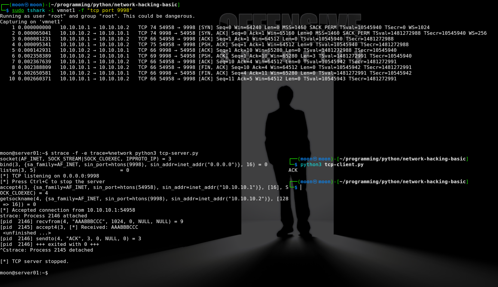
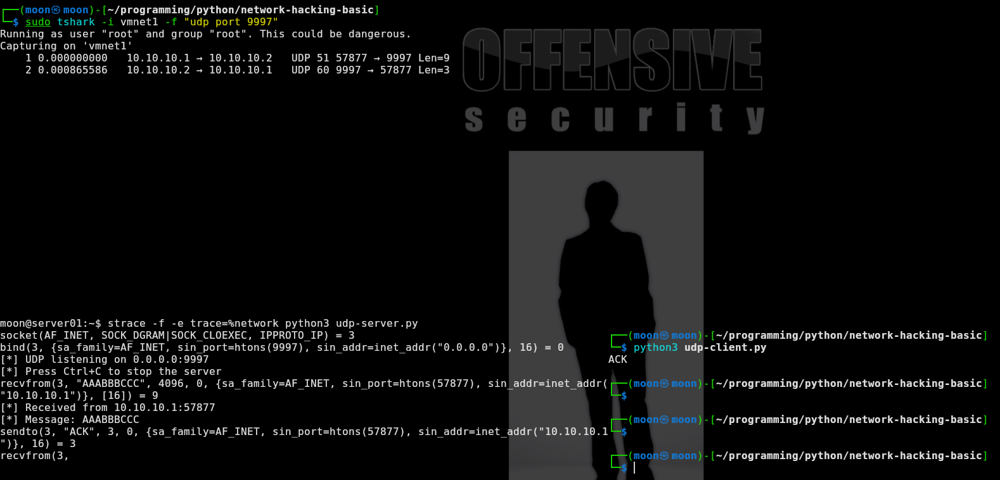
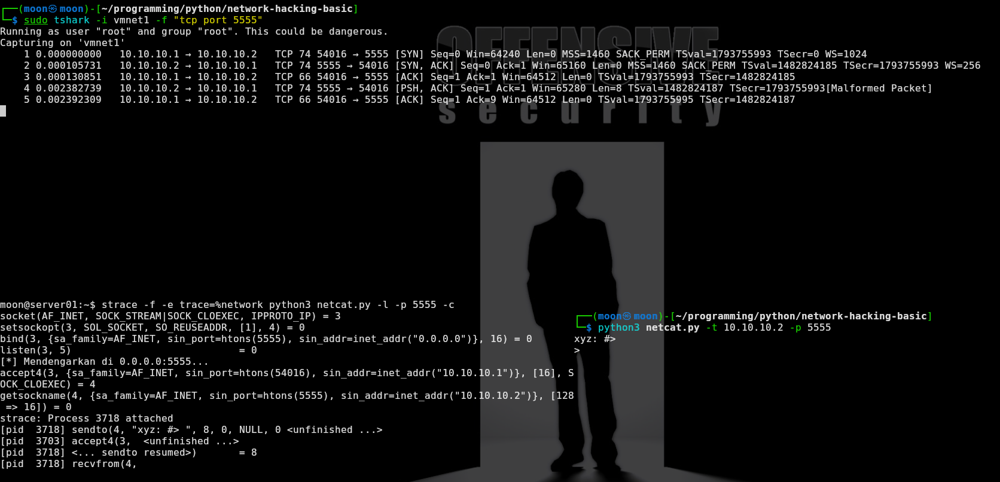
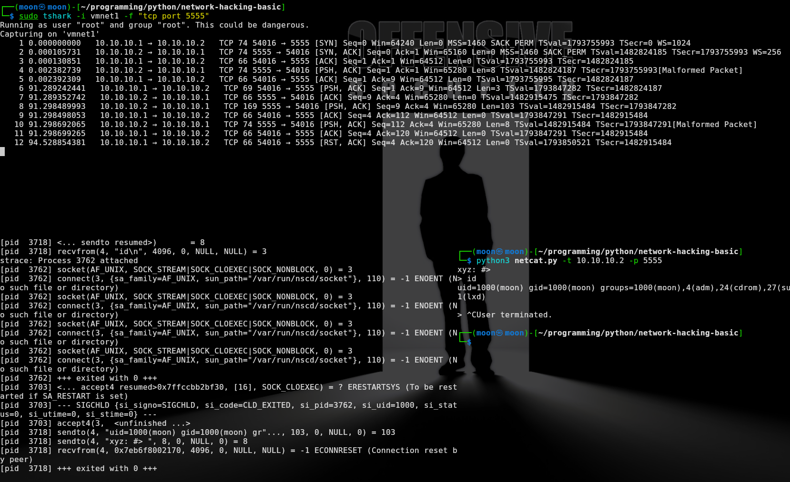

# Basic Network Tracing: TCP and UDP

[🇮🇩 Baca dalam Bahasa Indonesia](trace-network-basic-id.md)

In this exercise, I practice tracing TCP and UDP communication between Kali (`10.10.10.1`) as the client and Ubuntu (`10.10.10.2`) as the server.

This is a continuation of my previous post on [`Socket Programming Experiments with Python`](https://imoon07.github.io/read.html?post=network-hacking-basic).

- `strace` is used on Ubuntu to view network system calls made by the server process.
- `tshark` is used on Kali to inspect packets sent and received over the network.
- `tcp-client.py` and `udp-client.py` are used as clients to test the TCP and UDP servers.
- `netcat.py` is used in the lab to test an interactive TCP connection to the server.

Tracing helps me observe the relationship between program execution, system calls, and network packets while the client and server communicate. This makes it possible to confirm that the server opens a port, receives data, and sends a response.

This exercise also develops a troubleshooting workflow for determining whether an issue is located in the client, network, socket/kernel layer, or server logic. It can also help analyze abnormal connections, resets, and failed responses.

---

## Tracing TCP Server–Client

Ubuntu:

```bash
strace -f -e trace=%network python3 tcp-server.py
```

Kali:

```bash
sudo tshark -i vmnet1 -f "tcp port 9998"
python3 tcp-client.py
```



```text
strace server:
socket()                         creates a TCP socket
bind(0.0.0.0:9998)               binds to TCP port 9998
listen()                         waits for incoming connections
accept4(10.10.10.1:54958)        accepts a connection from Kali
recvfrom("AAABBBCCC") = 9        receives a 9-byte payload
sendto("ACK") = 3                sends a 3-byte response
```

| Frame | Direction | Flag / Data | Description |
|---:|---|---|---|
| 1 | Kali → Ubuntu | `SYN` | The client requests a TCP connection |
| 2 | Ubuntu → Kali | `SYN, ACK` | The server accepts the connection |
| 3 | Kali → Ubuntu | `ACK` | The TCP handshake is complete |
| 4 | Kali → Ubuntu | `PSH, ACK`, `Len=9` | The client sends `AAABBBCCC` |
| 5 | Ubuntu → Kali | `ACK` | The server acknowledges the client data |
| 6 | Ubuntu → Kali | `PSH, ACK`, `Len=3` | The server sends `ACK` |
| 7 | Kali → Ubuntu | `ACK` | The client acknowledges the server response |
| 8 | Kali → Ubuntu | `FIN, ACK` | The client starts closing the connection |
| 9 | Ubuntu → Kali | `FIN, ACK` | The server closes its side of the connection |
| 10 | Kali → Ubuntu | `ACK` | The connection closes normally |

```text
TCP:
SYN → SYN, ACK → ACK → AAABBBCCC → ACK → FIN → FIN → ACK
```

The TCP connection succeeds: the client sends `AAABBBCCC`, the server replies with `ACK`, and the connection is closed normally.

---

## Tracing UDP Server–Client

Ubuntu (`10.10.10.2`) runs the UDP server with `strace`. Kali (`10.10.10.1`) runs `tshark` and `udp-client.py`.

Ubuntu:

```bash
strace -f -e trace=%network python3 udp-server.py
```

Kali:

```bash
sudo tshark -i vmnet1 -f "udp port 9997"
python3 udp-client.py
```



```text
strace server:
socket(AF_INET, SOCK_DGRAM, ...)                  creates a UDP socket
bind(0.0.0.0:9997)                                binds to UDP port 9997
recvfrom(... "AAABBBCCC" ..., 10.10.10.1:57877) = 9
                                                   receives a 9-byte payload from Kali
sendto(... "ACK" ..., 10.10.10.1:57877) = 3       sends a 3-byte response to Kali
```

| Frame | Direction | Port | Protocol / Data | Description |
|---:|---|---|---|---|
| 1 | Kali `10.10.10.1` → Ubuntu `10.10.10.2` | `57877 → 9997` | UDP, `Len=9`, `AAABBBCCC` | The client sends a 9-byte UDP datagram to the server |
| 2 | Ubuntu `10.10.10.2` → Kali `10.10.10.1` | `9997 → 57877` | UDP, `Len=3`, `ACK` | The server sends a 3-byte UDP response to the client |

```text
UDP:
AAABBBCCC → ACK
```

UDP does not use `listen()`, `accept()`, a handshake, or a connection-closing process like TCP. The client sends the `AAABBBCCC` datagram directly, the server receives it with `recvfrom()`, and replies with `ACK` through `sendto()`.

---

## Tracing Netcat TCP Interactive Command

Ubuntu (`10.10.10.2`) runs the `netcat.py` listener with `strace`. Kali (`10.10.10.1`) runs the client and `tshark`.

Ubuntu:

```bash
strace -f -e trace=%network python3 netcat.py -l -p 5555 -c
```

Kali:

```bash
sudo tshark -i vmnet1 -f "tcp port 5555"
python3 netcat.py -t 10.10.10.2 -p 5555
```



### When the Client Connects

```text
strace server:
socket(AF_INET, SOCK_STREAM, ...) = 3
setsockopt(... SO_REUSEADDR ...) = 0
bind(0.0.0.0:5555) = 0
listen(3, 5) = 0
accept4(... 10.10.10.1:54016 ...) = 4
sendto(4, "xyz: #> ", 8, ...) = 8
recvfrom(4, ...
```

| Frame | Direction | Flag / Data | Description |
|---:|---|---|---|
| 1 | Kali `10.10.10.1:54016` → Ubuntu `10.10.10.2:5555` | `SYN` | The client requests a connection |
| 2 | Ubuntu → Kali | `SYN, ACK` | The server accepts the connection |
| 3 | Kali → Ubuntu | `ACK` | The TCP handshake is complete |
| 4 | Ubuntu → Kali | `PSH, ACK`, `Len=8` | The server sends the `xyz: #> ` prompt |
| 5 | Kali → Ubuntu | `ACK` | The client acknowledges the server prompt |

### When the Client Runs `id`

```text
Client:
xyz: #> 
> id
```



```text
Server strace:
recvfrom(4, "id\n", 4096, 0, NULL, NULL) = 3
sendto(4, "uid=1000(moon) gid=1000(moon) ...", 103, ...) = 103
sendto(4, "xyz: #> ", 8, ...) = 8
```

| Frame | Direction | Flag / Data | Description |
|---:|---|---|---|
| 6 | Kali → Ubuntu | `PSH, ACK`, `Len=3` | The client sends the `id\n` command |
| 7 | Ubuntu → Kali | `ACK` | The server acknowledges the 3-byte command |
| 8 | Ubuntu → Kali | `PSH, ACK`, `Len=103` | The server sends the output of the `id` command |
| 9 | Kali → Ubuntu | `ACK` | The client acknowledges the command output |
| 10 | Ubuntu → Kali | `PSH, ACK`, `Len=8` | The server sends the `xyz: #> ` prompt again |
| 11 | Kali → Ubuntu | `ACK` | The client acknowledges the new prompt |
| 12 | Kali → Ubuntu | `RST, ACK` | The client is stopped with `Ctrl+C`; the connection is reset |

```text
Flow:
TCP handshake → server prompt → id\n → id output → new prompt → Ctrl+C → RST
```

The `id` command runs on Ubuntu as the `moon` user, as shown by the output:

```text
uid=1000(moon) gid=1000(moon)
```

`ECONNRESET` appears on the server because the Kali client is stopped with `Ctrl+C`, which resets the TCP connection.

---

Thank you.