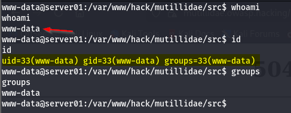
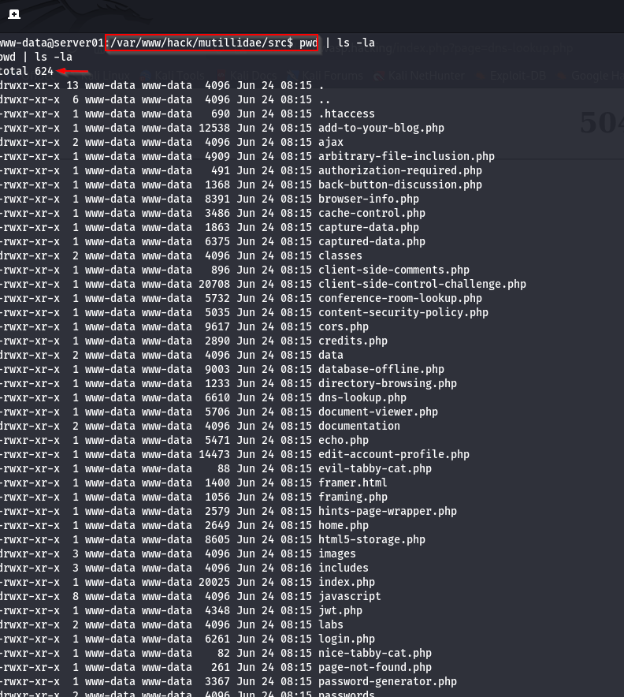

# Linux Enumeration: Basic System Information

[🇮🇩 Read in Indonesian](post-exploitation-enum-id.md)

In the previous article, I demonstrated how to obtain a **Reverse Shell** using **One-Lin3r** through a **Command Injection** vulnerability.

👉 Previous article:
https://imoon07.github.io/read.html?post=command-injection-reverse-shell&lang=en

After gaining initial access to the target server, the next step is **not** to immediately attempt privilege escalation. Instead, it is important to perform **Enumeration** to understand the environment and collect as much information as possible before making further decisions.

In this article, I will perform **Basic System Information Enumeration** using built-in Linux utilities to identify the current user, operating system, working directory, network configuration, and running processes.

---

# What is Linux Enumeration?

Linux Enumeration is the process of collecting information from a Linux system after initial access has been obtained. The goal is to understand the target environment, identify system configurations, and discover information that may assist during later stages of a penetration test.

The more information collected during this phase, the easier it becomes to determine the next course of action.

---

# Why is it Important?

Enumeration is one of the most important stages of **Post-Exploitation**.

During this phase we can identify:

- The current user.
- Operating system and version.
- Application directory structure.
- Network configuration.
- Running services.

This information provides the foundation for later activities such as **File System Exploration**, **Privilege Enumeration**, and **Privilege Escalation**.

---

# Prerequisites

This article continues from the previous lab where a **Reverse Shell** was successfully established through a **Command Injection** vulnerability.

The initial shell is running as:

```text
www-data@server01:/var/www/hack/mutillidae/src$
```

The `www-data` account is the default web server user and typically has limited privileges.

---

# Enumeration Flow

```text
[ Reverse Shell ]
        │
        ▼
www-data
        │
        ▼
Basic Enumeration
    ├── Current User
    ├── Host Information
    ├── Current Directory
    ├── Network Configuration
    └── Running Processes
```

---

# Demonstration

## 1. Preparing the Shell


The initial reverse shell is usually very limited.

If the following message appears:

```text
TERM environment variable not set
```

configure the `TERM` environment variable before using terminal features such as `clear` or terminal-based editors.

---

## 2. Current User



Commands:

```bash
whoami
id
groups
```

### Output

The current user is:

```text
www-data
```

### What does this mean?

`www-data` is the default service account used by Apache and Nginx to run web applications.

Every command executed through the reverse shell inherits the permissions assigned to this user. Understanding the current privilege level is essential before attempting further actions.

---

## 3. Host Information


Commands:

```bash
hostname
uname -a
cat /etc/os-release
```

### Output

These commands reveal information such as:

- Hostname
- Linux distribution
- Kernel version
- CPU architecture

In this lab, the target system is running:

- Ubuntu 24.04.4 LTS
- Linux Kernel 6.8
- x86_64

### What does this mean?

Operating system information helps determine:

- payload compatibility
- privilege escalation techniques
- known vulnerabilities that match the installed version

---

## 4. Current Directory



Commands:

```bash
pwd
ls -la
```

### Output

The reverse shell starts inside the Mutillidae II web application directory.

The directory listing reveals PHP source files, application folders, and configuration files.

### What does this mean?

The initial working directory is often one of the most valuable locations to begin further exploration because it may contain:

- application source code
- configuration files
- database credentials
- backup files
- secrets or API tokens

---

## 5. Network Configuration


Commands:

```bash
ip addr
ip route
```

### Output

These commands display:

- IP addresses
- network interfaces
- default gateway
- routing table

### What does this mean?

Network information provides a better understanding of the target's position within the infrastructure.

This information becomes useful during later stages such as:

- Internal Network Discovery
- Pivoting
- Lateral Movement

---

## 6. Running Processes


Command:

```bash
ps aux
```

### Output

Several services observed in this lab include:

- Apache HTTP Server
- Nginx
- MariaDB
- Java
- Node.js
- OpenSSH
- Cron

### What does this mean?

The process list provides an overview of the software currently running on the system.

Running services may become targets for further investigation if weak configurations, exposed credentials, or vulnerable software versions are identified.

---

# What Comes Next?

Basic System Information Enumeration only provides an initial understanding of the compromised host.

The next step is **File System Exploration**, where the goal is to search for:

- configuration files
- credentials
- SSH keys
- backup files
- source code
- secrets or API tokens

These findings often become the starting point for **Privilege Escalation**.

---

# Conclusion

Basic System Information Enumeration is one of the fundamental stages of **Post-Exploitation**.

Using only built-in Linux utilities, we can quickly identify the current user, operating system, directory structure, network configuration, and running services.

Although these commands are simple, the information they provide is invaluable for planning the next steps of a security assessment.

---

## Learning Path

- ✅ [Reverse Shell with One-Lin3r](https://imoon07.github.io/read.html?post=command-injection-reverse-shell&lang=en)
- ➡️ **Linux Enumeration: Basic System Information** *(current article)*
- ⏳ Linux Enumeration: File System Exploration *(coming soon)*
- ⏳ Linux Enumeration: Privilege Enumeration *(coming soon)*
- ⏳ Linux Privilege Escalation *(coming soon)*
- ⏳ Linux Persistence *(coming soon)*
- ⏳ Linux Pivoting *(coming soon)*
- ⏳ Linux Lateral Movement *(coming soon)*

---

# References

- MITRE ATT&CK – T1082: System Information Discovery  
  https://attack.mitre.org/techniques/T1082/

- MITRE ATT&CK – T1016: System Network Configuration Discovery  
  https://attack.mitre.org/techniques/T1016/

- MITRE ATT&CK – T1057: Process Discovery  
  https://attack.mitre.org/techniques/T1057/

- Linux Manual Pages Project  
  https://man7.org/linux/man-pages/

---

Thank you for reading.

I hope this article provides a solid introduction to **Linux Enumeration** before moving on to file system exploration, privilege escalation, and other post-exploitation techniques.
