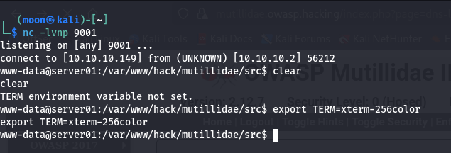
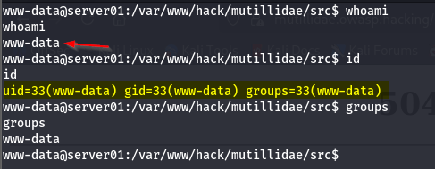
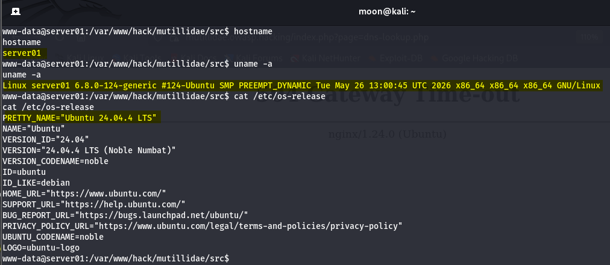
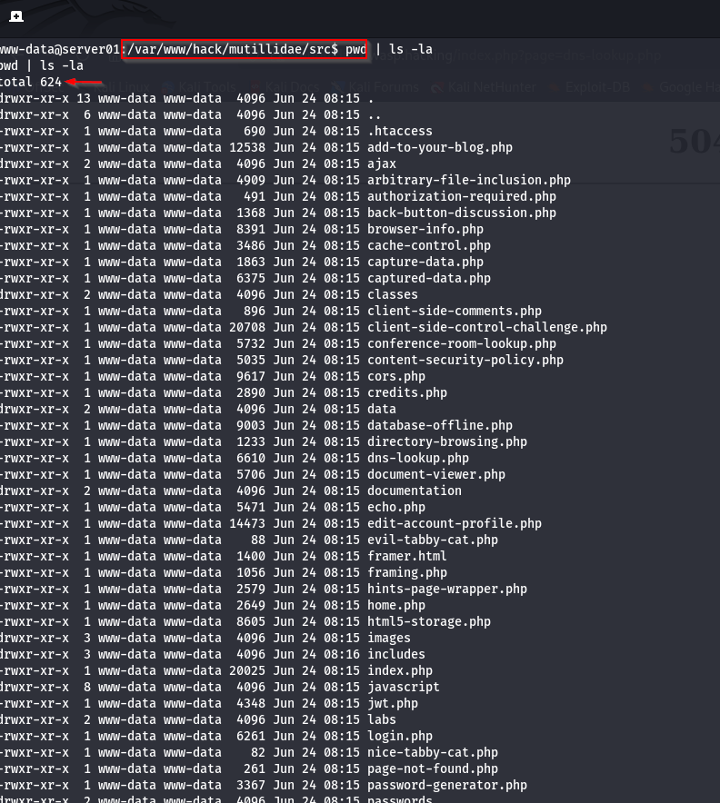
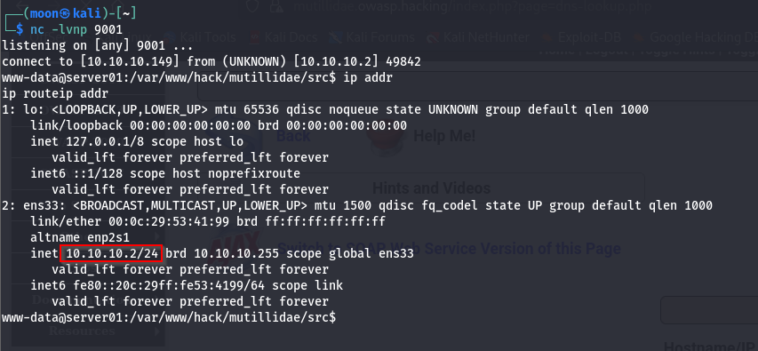
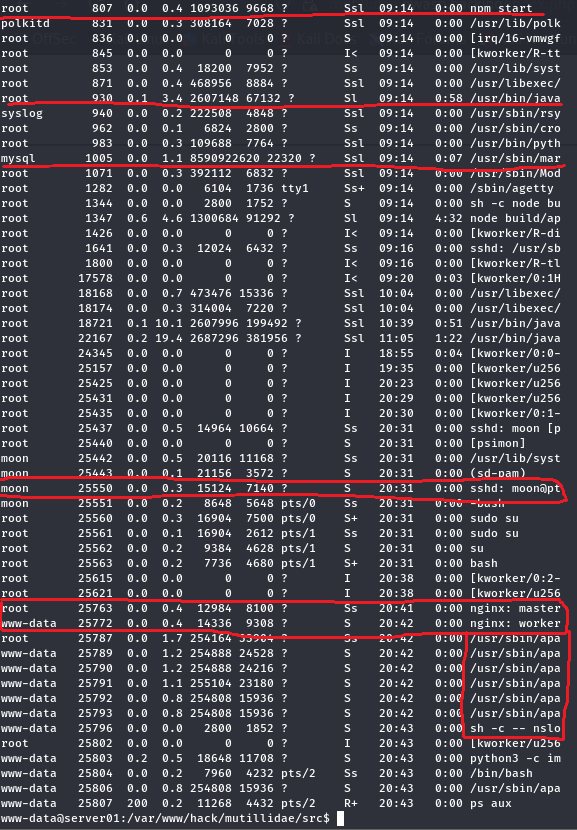

# Reverse Shell: Enumerasi Dasar Linux

[🇬🇧 Read in English](post-exploitation-enum-en.md)

Halo semuanya,

Setelah berhasil mendapatkan reverse shell dari aplikasi Mutillidae II, saya mulai explorasi lagi dengan melakukan enumerasi dasar Linux untuk memahami kondisi sistem target.

---

## Alur: Enumerasi Linux

```text
[ Reverse Shell Berhasil ]
             │
             ▼
www-data@server01
             │
             ▼
Enumerasi Dasar Linux
    ├── Pengguna Saat Ini
    ├── Informasi Host
    ├── Lokasi Saat Ini
    ├── Informasi Jaringan
    └── Proses yang Berjalan
```

---

## Titik Awal



Setelah mendapatkan reverse shell, shell yang diperoleh masih memiliki keterbatasan.

```bash
www-data@server01:/var/www/hack/mutillidae/src$
```

Apabila muncul pesan `TERM environment variable not set`, lakukan export variabel lingkungan `TERM` terlebih dahulu sebelum menggunakan fitur terminal seperti `clear`.

---

## 1. Pengguna Saat Ini



```bash
whoami
id
groups
```

Pengguna yang sedang digunakan adalah `www-data`, yaitu akun bawaan yang umumnya dipakai oleh Apache atau Nginx untuk menjalankan aplikasi web.

---

## 2. Informasi Host



```bash
hostname
uname -a
cat /etc/os-release
```

Hasil enumerasi menunjukkan bahwa sistem target menggunakan Ubuntu 24.04.4 LTS (Noble Numbat) dengan kernel Linux `6.8.0-124-generic` pada arsitektur `x86_64`.

---

## 3. Lokasi Saat Ini



```bash
ls -la
```

Reverse shell dimulai dari direktori sumber aplikasi web. Dari hasil listing direktori terlihat berbagai file PHP, file konfigurasi, dan direktori aplikasi yang dapat menjadi titik awal untuk proses enumerasi berikutnya.

---

## 4. Informasi Jaringan



```bash
ip addr
ip route
```

Informasi jaringan menampilkan alamat IP yang dimiliki sistem beserta tabel routing yang digunakan oleh host.

---

## 5. Proses yang Berjalan



```bash
ps aux
```

Beberapa layanan yang terlihat sedang berjalan antara lain:

* [Apache HTTP Server](https://httpd.apache.org/)
* [Nginx](https://nginx.org/)
* [MariaDB](https://mariadb.org/)
* [Java](https://www.java.com/)
* [Node.js](https://nodejs.org/)
* [OpenSSH](https://www.openssh.com/)
* [Cron](https://man7.org/linux/man-pages/man8/cron.8.html)

## Kesimpulan

Enumerasi dasar Linux memberikan saya gambaran awal mengenai host yang telah berhasil diakses melalui reverse shell. Informasi seperti pengguna aktif, sistem operasi, struktur direktori, konfigurasi jaringan, hingga proses yang sedang berjalan dapat membantu menentukan langkah selanjutnya dalam proses pengujian keamanan.

## Referensi

* [MITRE ATT&CK – T1082: System Information Discovery](https://attack.mitre.org/techniques/T1082/)
* [MITRE ATT&CK – T1016: System Network Configuration Discovery](https://attack.mitre.org/techniques/T1016/)
* [MITRE ATT&CK – T1057: Process Discovery](https://attack.mitre.org/techniques/T1057/)
* [Linux man-pages Project](https://man7.org/linux/man-pages/)
* [ps(1) — Linux Manual Page](https://man7.org/linux/man-pages/man1/ps.1.html)
* [ip(8) — Linux Manual Page](https://man7.org/linux/man-pages/man8/ip.8.html)
* [TERM Environment Variable Not Set – Solution](https://www.dotlinux.net/blog/term-environment-variable-not-set-solution/)

Apabila ada pertanyaan, masukan, atau ingin berdiskusi mengenai topik ini, silakan tinggalkan komentar di bawah. Senang bisa berdiskusi bersama. 🔥
