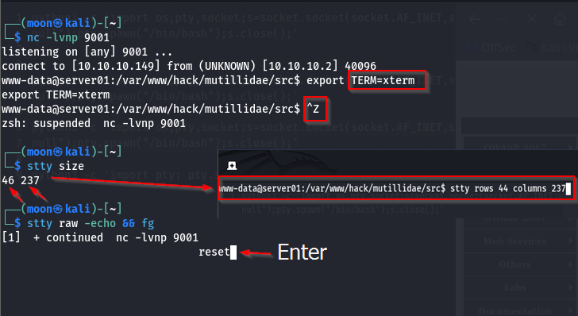
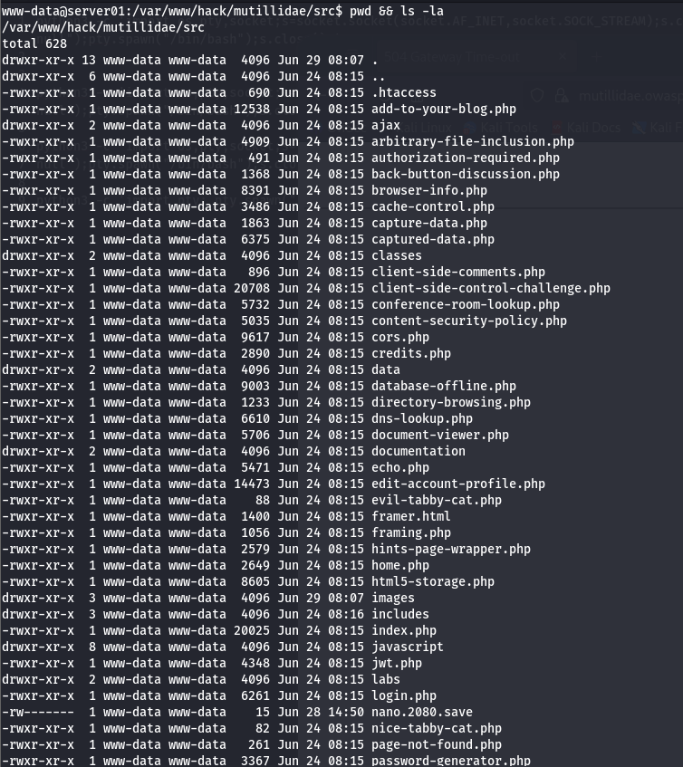
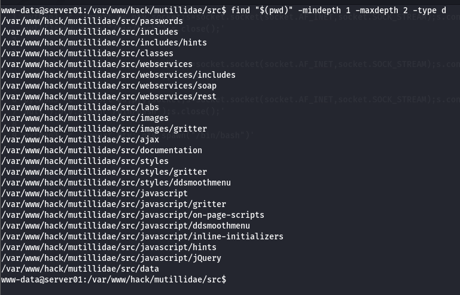
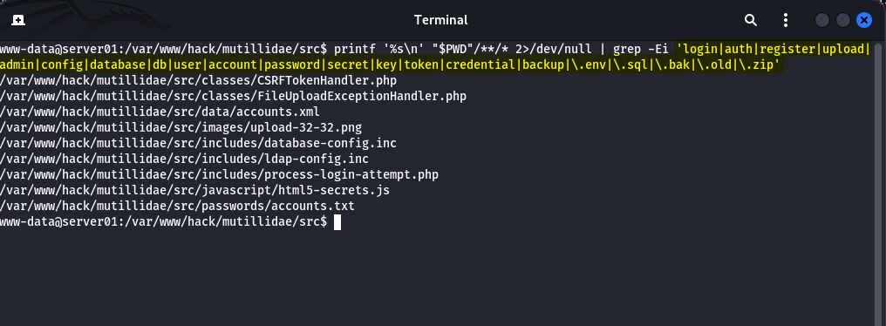
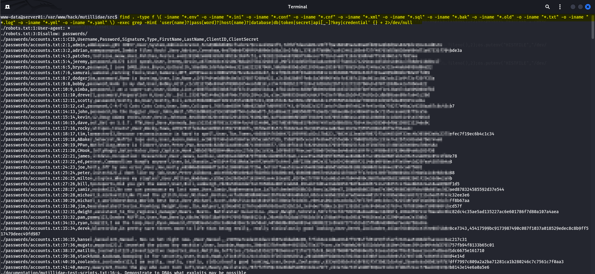
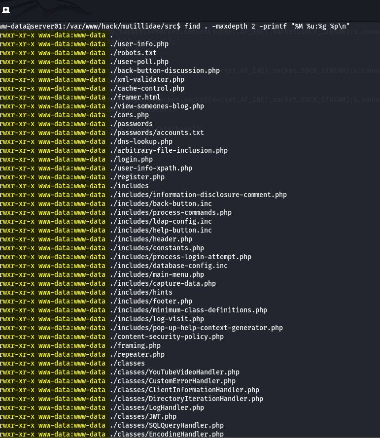

# Reverse Shell: Basic File System Exploration

[🇮🇩 Read in Indonesian](post-exploitation-filesystemexplore-id.md)

Hello everyone,

In the previous [article](https://imoon07.github.io/read.html?post=post-exploitation-enum&lang=en), I performed basic Linux enumeration after successfully obtaining a reverse shell on the target system.

With the initial host information collected, I continued by manually exploring the application's file system. Rather than relying on automated enumeration tools, I wanted to understand how the project was organized, identify important application files, locate sensitive information, and review file permissions.

The goal is to practice manual file system enumeration and better understand the target environment before continuing with the next phase of the assessment.

---

## Flow: File System Exploration

```text
[ Reverse Shell Established ]
             │
             ▼
www-data@server01
             │
             ▼
Upgrade Interactive TTY
             │
             ▼
Basic Linux Enumeration
             │
             ▼
File System Exploration
    ├── Current Directory
    ├── Directory Structure
    ├── Application Files
    ├── Sensitive Information Discovery
    └── File Permissions
```
---

## Starting Point



The reverse shell initially provided only a basic terminal, making interactive work inconvenient. Before continuing with the exploration, I upgraded the shell into a fully interactive TTY to improve terminal usability.

```bash
python3 -c 'import pty; pty.spawn("/bin/bash")'

export TERM=xterm-256color

# Press Ctrl + Z

stty raw -echo && fg

reset

# On the local terminal
stty size

# Back to the reverse shell
stty rows 44 columns 237
```

---

# 1. Current Directory



The first step was identifying the current working directory and reviewing its contents.

```bash
pwd

ls -lah
```

This provides a quick overview of where the reverse shell starts, along with the files, directories, ownership, and permissions available from the current location.

---

# 2. Directory Structure



After identifying the current location, I explored the surrounding directory structure.

```bash
find "$(pwd)" -mindepth 1 -maxdepth 2 -type d
```

Reviewing the directory layout helps identify the main components of the application and provides a better understanding of how the project is organized before inspecting individual files.

---

# 3. Application Files




Next, I searched for files related to authentication, administration, configuration, uploads, and databases.

```bash
printf '%s\n' "$PWD"/**/* 2>/dev/null | grep -Ei 'login|auth|register|upload|admin|config|database|db|user|account|password|secret|key|token|credential|backup|\.env|\.sql|\.bak|\.old|\.zip'
```

Rather than opening every file manually, filtering filenames first makes it easier to identify files that deserve closer inspection.

These files often provide insight into how the application is structured and where important functionality is implemented.

---

# 4. Sensitive Information Discovery




After locating interesting files, I searched common configuration and data files for potentially sensitive information.

```bash
find . -type f \( -iname "*.env" -o -iname "*.ini" -o -iname "*.conf" -o -iname "*.cnf" -o -iname "*.xml" -o -iname "*.sql" -o -iname "*.bak" -o -iname "*.old" -o -iname "*.txt" -o -iname "*.log" -o -iname "*.yml" -o -iname "*.yaml" \) -exec grep -HinE 'user(name)?|pass(word)?|host(name)?|database|db|token|secret|api[_-]?key|credential' {} + 2>/dev/null
```

This command helps identify useful information such as database connection details, usernames, passwords, API keys, tokens, and other sensitive values stored in configuration or data files.

---

# 5. File Permissions



Finally, I reviewed the ownership and permissions of files within the application directory.

```bash
find . -maxdepth 2 -printf "%M %u:%g %p\n"
```

Reviewing file permissions helps identify writable files, shared directories, and other locations that may become relevant during later stages of the assessment.

---

## Conclusion

Manual file system exploration helped me understand how the target application is organized without relying on automated enumeration tools.

By examining the directory structure, identifying important application files, reviewing configuration data, and checking file permissions, I gained a better understanding of the environment before continuing with further post-exploitation activities.

In the next article, I will continue exploring privilege escalation opportunities based on the information collected during this enumeration.

---

## References

### Linux Documentation

- Linux man-pages Project  
  https://www.kernel.org/doc/man-pages/

- GNU Coreutils Documentation (pwd, ls)  
  https://www.gnu.org/software/coreutils/manual/

- GNU Findutils Manual (find)  
  https://www.gnu.org/software/findutils/manual/

- GNU Grep Manual (grep)  
  https://www.gnu.org/software/grep/manual/

### Shell Upgrade

- Ropnop — Upgrading Simple Shells to Fully Interactive TTYs  
  https://blog.ropnop.com/upgrading-simple-shells-to-fully-interactive-ttys/

### Linux Enumeration

- Initial Linux Enumeration Practices & Techniques  
  https://unclesp1d3r.github.io/posts/initial-linux-enumeration-practices-techniques-gathering-information-linux-system/

### MITRE ATT&CK

- T1083 – File and Directory Discovery  
  https://attack.mitre.org/techniques/T1083/

- T1005 – Data from Local System  
  https://attack.mitre.org/techniques/T1005/


If you have any questions, suggestions, or would like to discuss this topic, feel free to leave a comment below. I'd be happy to hear your thoughts. 🔥
