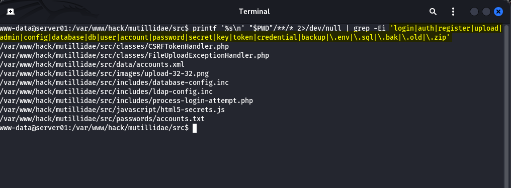
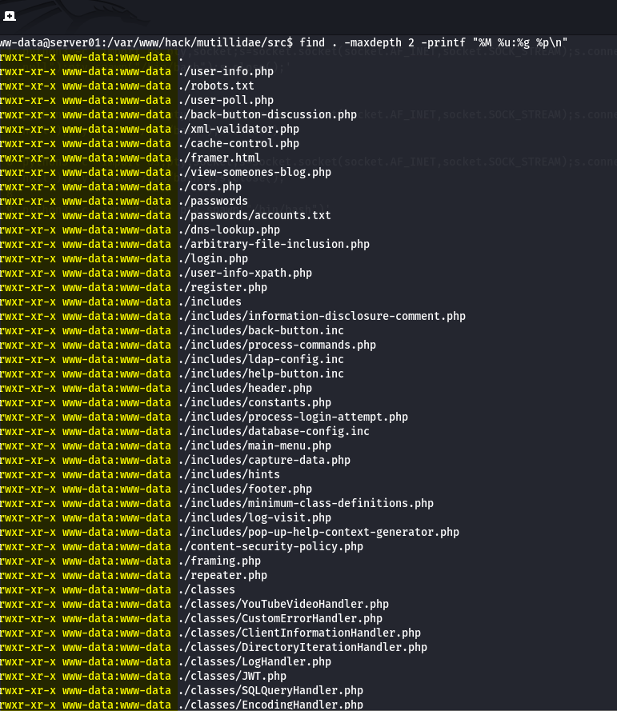

# Linux Post-Exploitation: File System Exploration

[🇬🇧 Read in English](post-exploitation-filesystemexplore-en.md)

Halo semuanya,

Pada artikel sebelumnya saya membahas **Linux Enumeration: Basic System Information**, yaitu proses mengumpulkan informasi dasar setelah berhasil memperoleh akses awal ke sistem melalui reverse shell.

Pada artikel kali ini kita melanjutkan ke tahap berikutnya, yaitu **File System Exploration**.

Fokus utama tahap ini **bukan melakukan privilege escalation**, melainkan memahami bagaimana aplikasi disusun, menemukan file penting, mengidentifikasi informasi sensitif, serta mengevaluasi permission sebelum melangkah ke proses enumerasi yang lebih mendalam.

---

# Apa itu File System Exploration?

File System Exploration adalah proses mengeksplorasi struktur direktori dan file setelah memperoleh akses awal ke sebuah sistem.

Tujuannya adalah memahami lingkungan target, mengenali struktur aplikasi, menemukan konfigurasi penting, serta mengidentifikasi informasi yang berguna untuk tahap assessment berikutnya.

Tahap ini berfokus pada **observasi**, bukan eksploitasi.

---

# Mengapa Tahap Ini Penting?

Sebagian besar informasi penting pada sebuah server tersimpan di dalam file system.

Contohnya meliputi:

* source code aplikasi
* file konfigurasi
* file upload
* backup
* database
* credential
* API key
* access token
* secret key
* permission file

Semakin baik memahami struktur aplikasi, semakin mudah menentukan langkah berikutnya tanpa harus bergantung sepenuhnya pada tools otomatis.

Enumerasi manual juga membantu memahami konteks aplikasi sehingga hasil assessment menjadi lebih akurat.

---

# Prasyarat

Artikel ini merupakan lanjutan dari tahap sebelumnya.

Pastikan:

* Reverse shell telah berhasil diperoleh.
* Basic Linux Enumeration telah dilakukan.

Posisi shell pada demonstrasi ini:

```text
www-data@server01:/var/www/hack/mutillidae/src$
```

---

# Alur Enumerasi

```text
Reverse Shell
      │
      ▼
Upgrade Interactive TTY
      │
      ▼
Basic Linux Enumeration
      │
      ▼
File System Exploration
      ├── Current Directory
      ├── Directory Structure
      ├── Application Files
      ├── Sensitive Information
      └── File Permissions
```

Tahapan di atas dilakukan secara bertahap agar proses enumerasi lebih terarah dan mengurangi kemungkinan melewatkan informasi penting.

---

# Demonstrasi

## 1. Upgrade Interactive TTY


Reverse shell biasanya hanya menyediakan shell sederhana sehingga banyak fitur terminal tidak dapat digunakan.

Sebelum memulai enumerasi, ubah shell menjadi **Interactive TTY** agar proses eksplorasi lebih nyaman.

```bash
python3 -c 'import pty; pty.spawn("/bin/bash")'

export TERM=xterm-256color

# Tekan Ctrl + Z

stty raw -echo && fg

reset

# Terminal lokal
stty size

# Kembali ke reverse shell
stty rows 44 columns 237
```

### Tujuan

Mengubah shell sederhana menjadi terminal yang lebih interaktif.

### Yang Diperoleh

* command history
* tab completion
* editor interaktif
* terminal yang lebih stabil
* output yang lebih rapi

Walaupun terlihat sederhana, langkah ini sangat membantu ketika proses enumerasi mulai menjadi kompleks.

---

## 2. Menentukan Direktori Saat Ini


Langkah pertama setelah memperoleh shell adalah mengetahui lokasi kerja saat ini.

```bash
pwd

ls -lah
```

### Tujuan

Mengetahui posisi reverse shell dan melihat isi direktori tempat aplikasi berjalan.

### Yang Diperoleh

Informasi mengenai:

* lokasi aplikasi
* file yang tersedia
* owner
* group
* permission
* ukuran file

Informasi ini menjadi titik awal sebelum mengeksplorasi direktori lainnya.

---

## 3. Memahami Struktur Direktori


Setelah mengetahui lokasi saat ini, langkah berikutnya adalah memahami struktur direktori di sekitar aplikasi.

```bash
find "$(pwd)" -mindepth 1 -maxdepth 2 -type d
```

### Tujuan

Memahami bagaimana aplikasi diorganisasi.

### Yang Diperoleh

Biasanya akan ditemukan direktori seperti:

* config
* modules
* uploads
* assets
* cache
* logs
* vendor
* libraries

Dengan memahami struktur direktori, proses pencarian file penting menjadi lebih cepat dan lebih terarah.

---

## 4. Mengidentifikasi File Penting



Setelah mengetahui struktur aplikasi, fokus berikutnya adalah mencari file yang berpotensi menyimpan konfigurasi maupun data penting.

```bash
printf '%s\n' "$PWD"/**/* 2>/dev/null | grep -Ei 'login|auth|register|upload|admin|config|database|db|user|account|password|secret|key|token|credential|backup|\.env|\.sql|\.bak|\.old|\.zip'
```

### Tujuan

Mempersempit area pencarian tanpa harus membuka seluruh file secara manual.

### Yang Diperoleh

Beberapa file yang sering menarik perhatian antara lain:

* `.env`
* configuration file
* database configuration
* backup
* upload directory
* authentication module

Perlu diingat, nama file hanyalah indikator awal. Validasi tetap dilakukan dengan membaca isi file yang relevan.

---

## 5. Mencari Informasi Sensitif


Setelah file penting ditemukan, langkah berikutnya adalah mencari informasi yang mungkin tersimpan di dalamnya.

```bash
find . -type f \( -iname "*.env" -o -iname "*.ini" -o -iname "*.conf" -o -iname "*.cnf" -o -iname "*.xml" -o -iname "*.sql" -o -iname "*.bak" -o -iname "*.old" -o -iname "*.txt" -o -iname "*.log" -o -iname "*.yml" -o -iname "*.yaml" \) -exec grep -HinE 'user(name)?|pass(word)?|host(name)?|database|db|token|secret|api[_-]?key|credential' {} + 2>/dev/null
```

### Tujuan

Mengidentifikasi konfigurasi atau informasi yang dapat membantu memahami hubungan aplikasi dengan layanan lain.

### Yang Diperoleh

Contohnya:

* username
* password
* database host
* API key
* access token
* secret
* credential lainnya

Tidak semua informasi sensitif dapat langsung dimanfaatkan. Namun, informasi tersebut sering kali memberikan gambaran mengenai arsitektur aplikasi dan layanan yang digunakan.

---

## 6. Memeriksa Permission File



Tahap terakhir adalah mengevaluasi permission file dan direktori.

```bash
find . -maxdepth 2 -printf "%M %u:%g %p\n"
```

### Tujuan

Memahami siapa yang memiliki hak untuk membaca, menulis, maupun mengeksekusi file.

### Yang Diperoleh

Dari hasil permission kita dapat mengidentifikasi:

* file yang dapat dimodifikasi
* direktori yang writable
* konfigurasi dengan permission yang terlalu longgar
* potensi kesalahan konfigurasi

Temuan pada tahap ini belum tentu merupakan celah keamanan, namun sering menjadi petunjuk penting untuk proses privilege enumeration berikutnya.

---

# Ringkasan

Pada tahap File System Exploration, fokus utama bukan mencari eksploitasi, melainkan membangun pemahaman mengenai lingkungan target.

Secara umum prosesnya meliputi:

1. Menentukan lokasi kerja.
2. Memahami struktur direktori.
3. Mengidentifikasi file penting.
4. Mencari informasi sensitif.
5. Mengevaluasi permission.

Pendekatan yang sistematis membuat proses assessment menjadi lebih efisien dan mengurangi kemungkinan melewatkan informasi penting.

---

# Tahap Selanjutnya

Setelah memahami struktur file system, proses berlanjut ke **Linux Privilege Enumeration**.

Fokusnya mulai bergeser dari aplikasi menuju sistem operasi, seperti:

* service
* scheduled task
* binary
* capability
* sudo configuration
* kernel information
* misconfiguration

Informasi tersebut menjadi dasar untuk mengevaluasi kemungkinan privilege escalation secara terstruktur.

---

# Kesimpulan

File System Exploration merupakan salah satu fondasi terpenting dalam proses post-exploitation.

Dengan memahami struktur aplikasi, mengenali file penting, mengidentifikasi informasi sensitif, dan mengevaluasi permission, kita dapat membangun gambaran menyeluruh mengenai lingkungan target sebelum melanjutkan ke tahap privilege enumeration.

Walaupun tersedia berbagai tools otomatis, kemampuan melakukan enumerasi secara manual tetap menjadi keterampilan yang sangat berharga karena memberikan pemahaman yang lebih dalam mengenai bagaimana aplikasi dan sistem benar-benar bekerja.

---

## Learning Path

- ✅ [Reverse Shell dengan One-Lin3r: Membuat Payload Reverse Shell dalam Satu Baris](https://imoon07.github.io/read.html?post=command-injection-reverse-shell)
- ✅ [Linux Enumeration: Basic System Information](https://imoon07.github.io/read.html?post=post-exploitation-enum)
- ➡️ **[Linux Post-Exploitation: File System Exploration](https://imoon07.github.io/read.html?post=post-exploitation-filesystemexplore)** *(artikel ini)*
- ✅ [Linux Privilege Enumeration](https://imoon07.github.io/read.html?post=post-exploitation-priv-enum)
- ✅ [Linux Privilege Escalation](https://imoon07.github.io/read.html?post=post-exploitation-priv-esca-copyfail)
- ✅ [Linux Persistence](https://imoon07.github.io/read.html?post=post-exploitation-persistence-panix)
- ✅ [Linux Pivoting](https://imoon07.github.io/read.html?post=post-exploitation-pivoting)
- ✅ [Linux Lateral Movement](https://imoon07.github.io/read.html?post=post-exploitation-lateral-movement)

---

## Related Reading

Melihat aktivitas Reverse Shell dari perspektif defender:

- 🔍 [Reverse Shell: Process, Log, and Network Analysis](https://imoon07.github.io/read.html?post=reverse-shell-server-side)

---

# Referensi

- GNU Coreutils Manual  
  https://www.gnu.org/software/coreutils/manual/

- GNU Findutils Manual  
  https://www.gnu.org/software/findutils/manual/

- Ropnop — Upgrading Simple Shells to Fully Interactive TTY  
  https://blog.ropnop.com/upgrading-simple-shells-to-fully-interactive-ttys/

- MITRE ATT&CK – T1083: File and Directory Discovery  
  https://attack.mitre.org/techniques/T1083/
