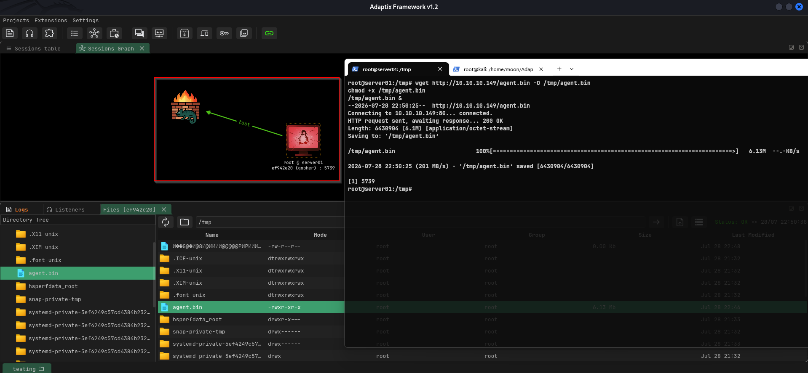
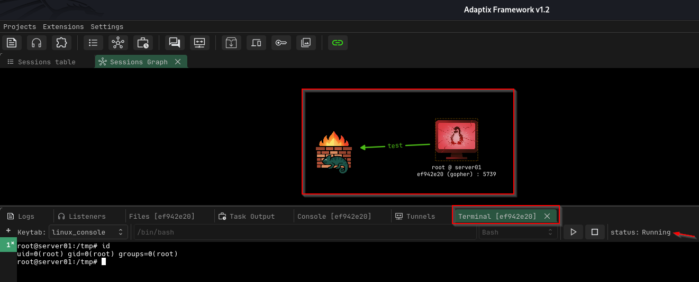

# Linux Foothold: Establishing a C2 Session with Adaptix Framework

[🇬🇧 Read in English](post-exploitation-foothold-en.md)

Halo semuanya,

Pada artikel sebelumnya saya telah membahas tahapan post-exploitation, mulai dari memperoleh **Reverse Shell**, melakukan **Enumeration**, **Privilege Escalation**, hingga mempertahankan akses menggunakan **Persistence**.

Setelah memiliki akses yang stabil, langkah berikutnya adalah membangun **foothold** menggunakan framework **Command and Control (C2)**. Berbeda dengan reverse shell biasa, C2 menyediakan mekanisme komunikasi yang lebih terstruktur sehingga sesi yang telah diperoleh dapat dikelola secara lebih efektif.

Pada eksperimen ini saya menggunakan **Adaptix Framework** untuk memahami bagaimana sebuah agent terhubung ke C2 server, membangun komunikasi dengan operator, serta menyediakan remote session yang lebih fleksibel dibandingkan reverse shell tradisional.

---

# Apa itu Foothold?

Foothold merupakan kondisi ketika attacker atau penetration tester telah memiliki akses yang stabil pada sistem target sehingga dapat melanjutkan aktivitas post-exploitation tanpa harus mengulangi proses eksploitasi dari awal.

Pada tahap ini fokusnya bukan memperoleh akses awal, melainkan membangun mekanisme komunikasi yang lebih terstruktur untuk mengelola host yang telah berhasil dikompromikan.

---

# Mengapa Menggunakan C2 Framework?

Reverse shell sangat berguna sebagai akses awal, namun memiliki banyak keterbatasan seperti sesi yang mudah terputus, fitur yang terbatas, dan sulit dikelola ketika jumlah target mulai bertambah.

Framework **Command and Control (C2)** mengatasi keterbatasan tersebut dengan menyediakan berbagai kemampuan seperti:

- Session management
- Remote command execution
- Host information
- File transfer
- Multiple session handling
- Interactive remote terminal

Karena alasan tersebut, banyak simulasi adversary maupun penetration testing modern memanfaatkan C2 Framework setelah memperoleh initial access.

---

# Lab Environment

```text
Kali Linux                  Ubuntu Linux                Adaptix Agent
10.10.10.149                10.10.10.2                  Callback
(AdaptixC2 + HTTP Server)   (Compromised Host)          to C2
        │                         │                         │
        │ Listener :9001          │ wget agent.bin          │
        └────────────────────────►────────────────────────►
```

Pada lab ini:

- **Kali Linux** menjalankan HTTP Server dan AdaptixC2 Server.
- **Ubuntu Linux** merupakan host yang sebelumnya telah berhasil dikompromikan.
- **Adaptix Agent** dijalankan pada host target dan melakukan callback menuju server C2.

---

# Experiment Flow

```text
Command Injection
        │
        ▼
Reverse Shell
        │
        ▼
Privilege Escalation
        │
        ▼
Persistence
        │
        ▼
Deploy Adaptix Agent
        │
        ▼
Agent Connects to C2
        │
        ▼
Interactive Remote Session
        │
        ▼
Foothold Established
```

Eksperimen ini merupakan kelanjutan dari tahapan sebelumnya hingga akhirnya terbentuk foothold menggunakan Adaptix Framework.

---

# 1. Deploy Adaptix Agent



Karena target telah memiliki persistence, saya tidak perlu mengulangi proses eksploitasi.

Langkah berikutnya adalah mengunduh dan menjalankan **Adaptix Agent** pada mesin Ubuntu yang telah berhasil dikompromikan.

Setelah dijalankan, agent secara otomatis melakukan callback menuju AdaptixC2 Server.

### Tujuan

Menghubungkan host target ke framework Command and Control.

### Hasil

- Agent berhasil berjalan.
- Callback menuju server berhasil dilakukan.
- Session baru muncul pada AdaptixC2.

Dengan demikian, akses yang sebelumnya hanya berupa reverse shell berubah menjadi session yang dapat dikelola melalui C2 Framework.

---

# 2. AdaptixC2 Console


Sebelum agent dijalankan, saya terlebih dahulu menjalankan HTTP Server pada Kali Linux untuk mendistribusikan file **agent.bin**.

Selanjutnya AdaptixC2 Server dijalankan sebagai endpoint komunikasi, kemudian Adaptix Client digunakan untuk mengelola seluruh session yang masuk.

Ketika agent berhasil dijalankan pada target, session langsung muncul pada console AdaptixC2 sehingga host dapat mulai dikelola melalui interface yang tersedia.

### Tujuan

Menyediakan pusat kendali (Command and Control) untuk seluruh host yang terhubung.

### Hasil

- Session aktif terdaftar.
- Informasi host berhasil dikumpulkan.
- Operator dapat mulai berinteraksi dengan target.

---

# 3. Listener Configuration


Listener merupakan endpoint komunikasi yang menerima callback dari agent.

Pada eksperimen ini saya menggunakan konfigurasi berikut.

```text
Callback Address

10.10.10.149:9001
```

Ketika agent dijalankan, koneksi akan dibuat menuju listener tersebut.

Secara konsep mekanisme ini mirip dengan reverse shell menggunakan Netcat, namun seluruh komunikasi dikelola oleh framework sehingga lebih stabil dan mudah dikontrol.

### Tujuan

Menerima koneksi dari agent yang berjalan pada host target.

### Hasil

- Callback berhasil diterima.
- Session otomatis dibuat.
- Komunikasi antara operator dan target berhasil dibangun.

---

# 4. Interactive Remote Terminal



Setelah session aktif, saya mencoba berinteraksi langsung dengan host melalui fitur **Remote Terminal**.

Berbeda dengan reverse shell tradisional yang sering memerlukan proses upgrade TTY, terminal pada Adaptix dapat langsung digunakan melalui interface C2.

### Tujuan

Mengelola host target menggunakan remote session yang lebih stabil.

### Hasil

Melalui session tersebut saya dapat:

- menjalankan command
- melakukan enumerasi
- mengelola file
- melakukan administrasi host

Seluruh aktivitas dilakukan melalui satu interface tanpa perlu membuat reverse shell baru.

---

# Ringkasan

Pada eksperimen ini saya mempelajari bagaimana sebuah akses yang telah diperoleh dapat dikembangkan menjadi **foothold** menggunakan Adaptix Framework.

Tahapan yang dilakukan meliputi:

1. Menjalankan Adaptix Agent.
2. Menghubungkan agent ke AdaptixC2 Server.
3. Memverifikasi callback melalui listener.
4. Mengelola session menggunakan Remote Terminal.

Pendekatan ini membuat proses post-exploitation menjadi lebih terstruktur dibandingkan hanya mengandalkan reverse shell.

---

# Tahap Selanjutnya

Setelah foothold berhasil dibangun, komunikasi dengan host menjadi lebih stabil sehingga proses berikutnya dapat berfokus pada eksplorasi jaringan internal.

Pada artikel selanjutnya saya akan menggunakan **SOCKS5 Tunnel** dan **Proxychains** melalui AdaptixC2 untuk mengakses jaringan yang sebelumnya tidak dapat dijangkau secara langsung.

---

# Kesimpulan

Foothold merupakan tahap penting setelah memperoleh akses awal pada sebuah sistem.

Reverse shell memberikan initial access, persistence mempertahankan akses, sedangkan Command and Control memungkinkan akses tersebut dikelola secara lebih terstruktur.

Melalui Adaptix Framework, saya dapat memahami bagaimana agent, listener, dan operator saling berkomunikasi untuk membangun remote session yang lebih stabil. Konsep ini menjadi dasar sebelum mempelajari teknik post-exploitation yang lebih kompleks seperti pivoting, lateral movement, maupun adversary simulation.

---

# Learning Path

- ✅ Reverse Shell
- ✅ Linux Enumeration
- ✅ File System Exploration
- ✅ Privilege Enumeration
- ✅ Privilege Escalation
- ✅ Persistence
- ➡️ **Linux Foothold: Getting Started with Adaptix Framework** *(artikel ini)*
- ✅ Linux Pivoting
- ✅ Linux Lateral Movement

---

# References

## Official Documentation

- Adaptix Framework Documentation  
  https://adaptix-framework.gitbook.io/adaptix-framework/

- AdaptixC2 GitHub Repository  
  https://github.com/Adaptix-Framework/AdaptixC2

## MITRE ATT&CK

- TA0011 – Command and Control  
  https://attack.mitre.org/tactics/TA0011/

- T1219 – Remote Access Software  
  https://attack.mitre.org/techniques/T1219/

- T1059 – Command and Scripting Interpreter  
  https://attack.mitre.org/techniques/T1059/
