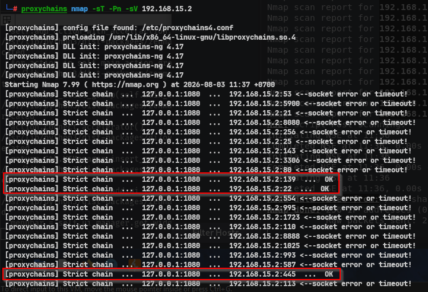
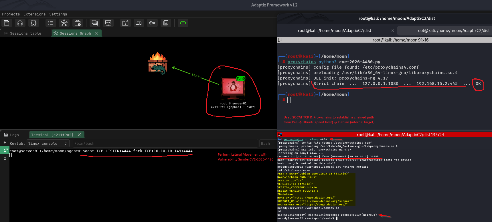

# Linux Lateral Movement: Internal Network Assessment and Samba CVE-2026-4480 Validation (Debian)

[🇮🇩 Baca dalam Bahasa Indonesia](post-exploitation-lateral-movement.md)

---

After obtaining an **initial foothold** on Ubuntu Server01 and establishing communication with the internal network through **pivoting**, the next phase is to perform a **lateral movement assessment**.

The primary objective at this stage is not to immediately exploit another host, but to understand the internal network environment, identify available services, and evaluate whether any of them could become a potential path for expanding access.

In this experiment, **Ubuntu Server01** acts as the **pivot host**, bridging the attacker's network and the internal network. Through this communication path, the assessment includes internal host discovery, service enumeration, software version identification, and finally the validation of **CVE-2026-4480** against **Samba 4.22.9** running on **Debian Server02**.

The entire environment used in this article is a **personal laboratory** built for educational purposes and security research.

The complete lab is available at:

> https://github.com/iMoon07/OWASP-Lab-Toolkit/tree/main/CVE-2026-4480

---

# What is Lateral Movement?

Lateral Movement is the process of moving from one compromised system to another within the same network.

In both penetration testing and incident response, this phase typically begins by understanding the internal network before validating any discovered services.

A typical assessment consists of:

* Internal network discovery
* Service enumeration
* Service version identification
* Vulnerability validation
* Security impact analysis

This structured approach ensures that security testing is driven by observation and evidence rather than attempting exploitation blindly.

---

# About CVE-2026-4480

**CVE-2026-4480** is a vulnerability affecting the **Samba Print Subsystem**, caused by **Improper Input Validation**.

Under specific configurations, the **`%J`** parameter used by the **print command** mechanism can be processed without sufficient input validation, potentially leading to **command execution**.

In general, the following conditions must be met before the vulnerability becomes exploitable:

* A vulnerable Samba version is installed.
* The print subsystem is enabled.
* The `print command` configuration uses the `%J` parameter.
* The SMB service is reachable from the internal network.

For this reason, conducting a proper assessment is an essential step to verify that all required preconditions are satisfied before performing vulnerability validation in a laboratory environment.

---

# Lab Environment

```text
+----------------+             +----------------------+             +----------------+
| Kali Linux     |             | Ubuntu Server01      |             | Debian Server02|
| 10.10.10.149   |             | Pivot Host           |             | 192.168.15.2   |
| Proxychains    | ----------> | AdaptixC2 Agent      | ----------> | Samba Service  |
|                |             | SOCKS5 Tunnel        |             | CVE Target     |
+----------------+             +----------------------+             +----------------+

          Attacker Network                        Internal Network

             10.10.10.0/24                         192.168.15.0/24
```

---

# Assessment Flow

```text
Initial Foothold
        │
        ▼
Pivoting
        │
        ▼
Internal Network Discovery
        │
        ▼
Service Enumeration
        │
        ▼
Version Identification
        │
        ▼
Vulnerability Validation
        │
        ▼
Lateral Movement Assessment
```

---

# Internal Network Discovery

The first step is identifying hosts that are reachable through the pivot path established earlier.

This discovery phase provides an overview of the internal attack surface before proceeding to service enumeration.

## Zenmap Discovery


The discovery results show a reachable host within the internal network through the established pivot.

---

## Service Enumeration



After identifying the target host, service enumeration is performed to identify running services and their software versions.

The scan identified the following:

```text
Target

192.168.15.2

Detected Service

SMB / Samba

Version

Samba 4.22.9
```

This information serves as the foundation for further assessment of the SMB service.

---

# SMB Service Assessment


Based on the enumeration results, the Samba service configuration was further assessed.

The assessment revealed that:

* The SMB service was running normally.
* The print subsystem was available.
* The service was accessible from the internal network.
* The Samba version was identified as **4.22.9**.

Based on these findings, the target met the initial conditions required to validate **CVE-2026-4480** within the laboratory environment.

---

# CVE-2026-4480 Validation



Once the assessment was complete and all required conditions were confirmed, the validation of **CVE-2026-4480** was performed within the laboratory environment.

Since the Samba service resided inside the internal network, the validation was not performed directly from the attacker's machine. Instead, all communication was routed through **Ubuntu Server01**, which functioned as the **pivot host**.

In this experiment, traffic to the SMB service was forwarded through **Proxychains** over a **SOCKS5 tunnel** established by AdaptixC2. After the payload was processed by the vulnerable Samba service, the reverse shell connection was relayed back through **SOCAT** on the pivot host before reaching the attacker's listener.

The communication flow can be illustrated as follows:

```text
Attacker
     │
     │ Proxychains (SOCKS5)
     ▼
Ubuntu Server01 (Pivot Host)
     │
     │ Forward Internal Traffic
     ▼
Debian Server02
     │
     │ Samba Print Subsystem
     ▼
CVE-2026-4480 Triggered
     │
     │ Reverse Connection
     ▼
Ubuntu Server01 (SOCAT Relay)
     │
     ▼
Attacker Listener
```

The validation successfully established a reverse shell from **Debian Server02**.

The shell revealed the following information:

* Debian GNU/Linux 13 (Trixie)
* Shell executed with **`nobody`** privileges

These results confirm that the vulnerability was successfully validated within the laboratory environment and demonstrate that the pivoting path functioned correctly to reach an otherwise inaccessible internal host.

It is important to note that the resulting shell executed under the **`nobody`** account. Therefore, the level of access depends on the privileges assigned to the Samba service itself. In other words, the successful validation demonstrates **remote command execution** against the vulnerable service, rather than automatically resulting in administrative or root-level access.

---

# Conclusion

This experiment demonstrates that successful **lateral movement** begins with understanding the internal environment through **network discovery**, **service enumeration**, and **service assessment** before validating any identified vulnerabilities.

Using Ubuntu Server01 as a pivot host, I successfully accessed the internal network, identified a Samba service running on Debian Server02, and validated **CVE-2026-4480** within a controlled laboratory environment.

For defenders, this experiment highlights the importance of:

* Updating Samba to a patched version.
* Disabling the print subsystem if it is not required.
* Implementing proper network segmentation.
* Restricting SMB communication between network segments.
* Monitoring unusual SMB and printer subsystem activity.

---

# Learning Path

* ✅ Initial Access
* ✅ Linux Enumeration
* ✅ Privilege Enumeration
* ✅ Privilege Escalation
* ✅ Persistence
* ✅ Pivoting
* ✅ Internal Network Discovery
* ✅ Service Enumeration
* ✅ Vulnerability Validation
* ➡️ Linux Lateral Movement

---

# References

## Security Advisory

* Samba Security Advisory — CVE-2026-4480
  https://www.samba.org/samba/security/CVE-2026-4480.html

* National Vulnerability Database (NVD)
  https://nvd.nist.gov/vuln/detail/CVE-2026-4480

## Official Documentation

* Adaptix Framework
  https://adaptix-framework.gitbook.io/adaptix-framework/

* Samba Documentation
  https://www.samba.org/samba/docs/

## MITRE ATT&CK

* TA0008 — Lateral Movement
  https://attack.mitre.org/tactics/TA0008/

* T1090 — Proxy
  https://attack.mitre.org/techniques/T1090/

* T1046 — Network Service Discovery
  https://attack.mitre.org/techniques/T1046/

---

Thank you for reading.

I hope this article helps you better understand how **pivoting**, **internal network discovery**, **service assessment**, and **vulnerability validation** can be performed step by step within a controlled laboratory environment.

Happy learning! 🔥
