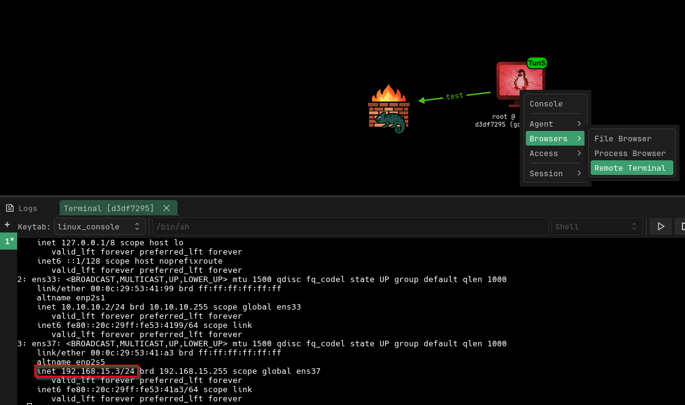
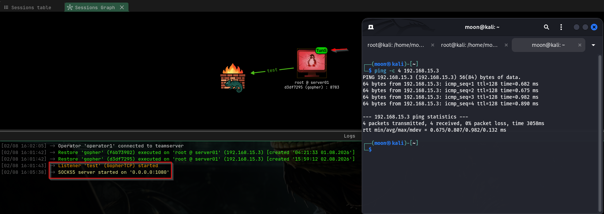
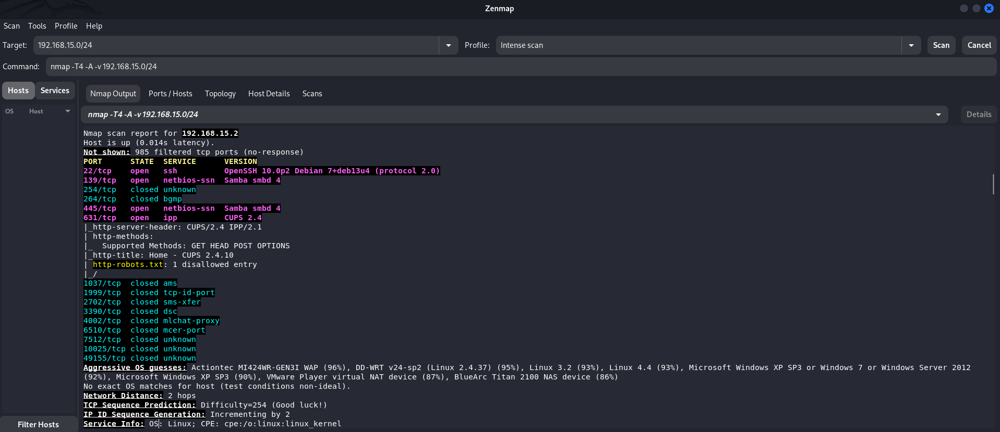

# Linux Pivoting: Internal Network Access with AdaptixC2

[🇮🇩 Read in Indonesian](post-exploitation-pivoting-id.md)

In this lab, I explored how a compromised host can be used as a bridge to reach another network that was not directly accessible from the attacker machine.

This technique is known as **pivoting**, where a host that already has access to multiple networks is used as a pathway to perform further exploration inside an internal environment.

Ubuntu Linux acts as a pivot host connecting the attacker network and the internal network. The goal is to understand how access to an internal network can be achieved through an AdaptixC2 Agent tunnel and perform discovery against available assets inside the network.

---

# Lab Environment

```text
                   10.10.10.0/24

+----------------+       +---------------------------+
| Kali Linux     |       | Ubuntu Linux              |
| 10.10.10.149   |<----->| AdaptixC2 Agent           |
| Attacker       |       | Pivot Host                |
+----------------+       | 10.10.10.2                |
                         | 192.168.15.3              |
                         +-------------+-------------+
                                       |
                                       |
                         Internal Network
                         192.168.15.0/24
                                       |
                                       |
                         +-------------+-------------+
                         | Debian Server02            |
                         | 192.168.15.2              |
                         | SSH / Samba / CUPS        |
                         +----------------------------+
````

---

# Attack Flow

```text
Kali
 |
 | Proxychains
 |
 SOCKS5 Tunnel
 |
AdaptixC2 Agent
 |
Ubuntu Pivot (server01)
 |
Internal Network
 |
Debian server02
```

---

# Network Segmentation Test


This is the internal network used to connect Server01 and Server02. Access to this network is restricted only to these two servers, while other hosts cannot communicate with it directly.

Initially, Kali Linux does not have direct access to this internal network.

Ubuntu Linux, which already has access through AdaptixC2, is connected to two different networks. This allows the host to act as a bridge between the attacker network and the internal network.

---

# Pivoting Connect


After confirming that Ubuntu has access to the internal network, I created a tunnel through the AdaptixC2 Agent running on that host.

This tunnel acts as a communication path between Kali Linux and the internal network through Ubuntu as the pivot host.


At this stage, I used the SOCKS5 tunnel provided by AdaptixC2. Through this tunnel, traffic from Kali Linux can be routed through Ubuntu, which has access to the internal network.



After establishing the connection, I checked the internal network information that could be reached through the pivot path.



Once the tunnel was successfully created, Kali Linux was able to communicate with the internal network without having a direct connection to that network.

---

# Internal Network Discovery



This stage was performed to identify available hosts and services that could be reached inside the internal network.

Enumeration Flow:

`Enumeration` → `Understanding Available Network` → `Identifying Reachable Network` → `Using Pivoting for Deeper Access`

Target:

```text
192.168.15.0/24
```

The scan discovered the following host:

```text
192.168.15.2
```

Detected services:

* [SSH (22/tcp) — OpenSSH on Debian](https://www.openssh.com/)
* [Samba (139/tcp, 445/tcp)](https://www.samba.org/)
* [CUPS (631/tcp)](https://openprinting.github.io/cups/)

From this result, I was able to enumerate the internal network through Ubuntu as the pivot host.

---

# Conclusion

AdaptixC2 simplifies the tunneling process by providing a built-in SOCKS5 tunnel capability. Through this tunnel, Kali Linux can route traffic through Ubuntu as a pivot host to access the internal network and gather information about the available Debian host.

---

# References

## Command and Control & Tunneling

* Adaptix Framework Documentation
  [https://adaptix-framework.gitbook.io/adaptix-framework/](https://adaptix-framework.gitbook.io/adaptix-framework/)

* AdaptixC2 — Tunnels and Forwarding
  [https://adaptix-framework.gitbook.io/adaptix-framework/adaptix-c2/tunnels-and-forwarding](https://adaptix-framework.gitbook.io/adaptix-framework/adaptix-c2/tunnels-and-forwarding)

* MITRE ATT&CK — Proxy (T1090)
  [https://attack.mitre.org/techniques/T1090/](https://attack.mitre.org/techniques/T1090/)

## Pivoting & Internal Network Access

* MITRE ATT&CK — Remote Services (T1021)
  [https://attack.mitre.org/techniques/T1021/](https://attack.mitre.org/techniques/T1021/)

* MITRE ATT&CK — Network Service Scanning (T1046)
  [https://attack.mitre.org/techniques/T1046/](https://attack.mitre.org/techniques/T1046/)

## SOCKS Proxy & Network Tunneling

* SOCKS Protocol Version 5 (RFC 1928)
  [https://datatracker.ietf.org/doc/html/rfc1928](https://datatracker.ietf.org/doc/html/rfc1928)

* Proxychains-ng Documentation
  [https://github.com/rofl0r/proxychains-ng](https://github.com/rofl0r/proxychains-ng)

## Network Enumeration

* Nmap Documentation
  [https://nmap.org/docs.html](https://nmap.org/docs.html)

Thank you for reading!

Happy learning! 🔥
