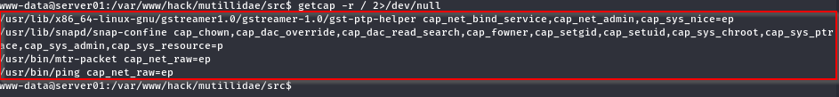
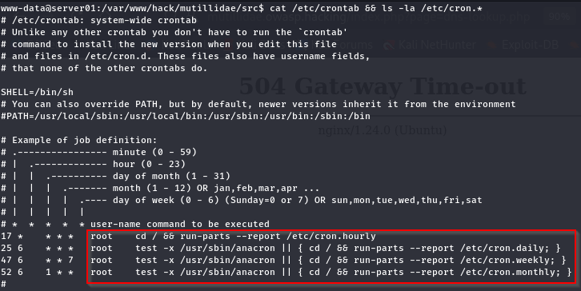
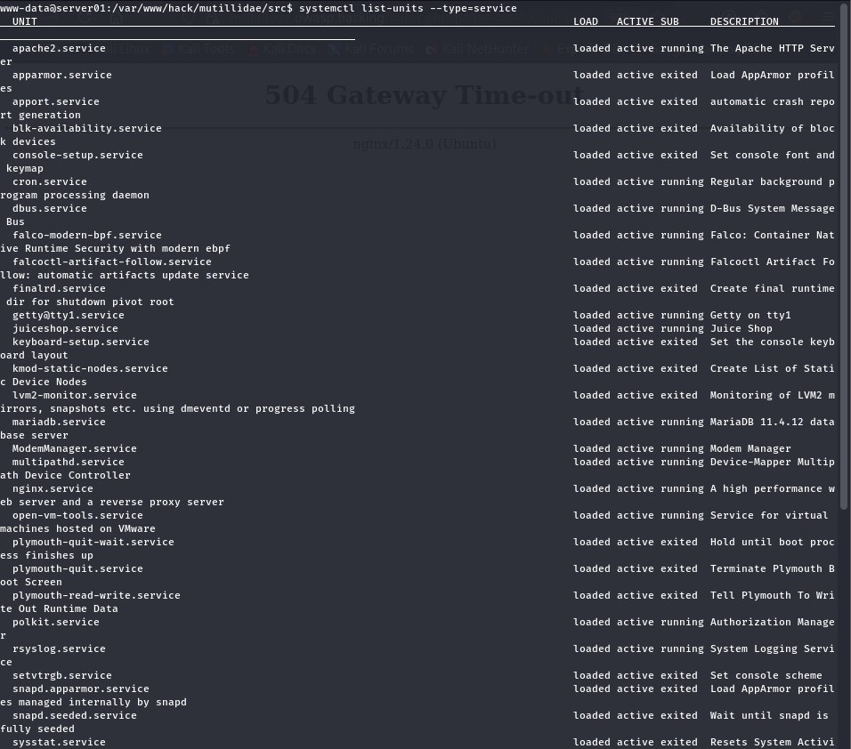
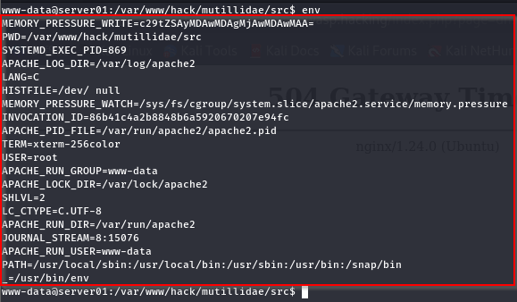

# Reverse Shell: Explorasi Privilege Enumeration

[🇬🇧 Read in English](post-exploitation-priv-enum-en.md)

Setelah selesai mengeksplorasi file system, saya mulai penasaran dengan privilege yang dimiliki oleh user hasil reverse shell. Apakah akses yang saya dapatkan memang terbatas sebagai www-data, atau ada konfigurasi tertentu yang dapat dimanfaatkan untuk memperoleh hak akses yang lebih tinggi.

Pada tahap ini saya hanya melakukan basic privilege enumeration, yaitu mengumpulkan informasi yang berkaitan dengan hak akses user dan konfigurasi sistem sebelum mencoba teknik privilege escalation.

---

## Alur Eksplorasi Privilege Enumeration

```text
Reverse Shell
      │
      ▼
Upgrade Interactive TTY
      │
      ▼
Basic Linux Enumeration
      │
      ▼
File System Exploration
      │
      ▼
Privilege Enumeration
      ├── User & Group
      ├── Sudo Configuration
      ├── SUID / SGID
      ├── Linux Capabilities
      ├── Scheduled Tasks (Cron)
      ├── Running Services
      ├── Writable Files & Directories
      ├── Environment Variables
      └── Kernel Information
```

---

# 1. Informasi User Saat Ini


```
id
```

Melihat user yang digunakan, group yang dimiliki, dan kemungkinan group tersebut memiliki hak akses tertentu.

---

# 2. Hak Akses sudo


```
sudo -l
```

Memeriksa apakah user mempunyai hak menjalankan command tertentu melalui sudo.

---

# 3. SUID Binary


```
find / -perm -4000 -type f 2>/dev/null
```

Mencari binary SUID yang berjalan dengan privilege owner (biasanya root).


---

# 4. Capability



```
getcap -r / 2>/dev/null
```

Melihat apakah ada binary yang memiliki Linux Capability.

---

# 5. Cron Job




```
cat /etc/crontab && ls -la /etc/cron.*
```

Melihat task otomatis yang berjalan sebagai root.

---

# 6. Service



```
systemctl lists-units --type=service
```

Melihat service yang aktif dan mungkin berjalan dengan hak akses tinggi.

---

# 7. Environment Variable



```
env
```

---

# 8. Writable Directory


```
find / -writable -type d 2>/dev/null
```

Melihat direktori yang dapat ditulis oleh user saat ini.

---

# 9. Home Directory


```
ls -lah /home
```

Melihat apakah ada home user lain yang dapat diakses.

---

# 10. Kernel


```
uname -r
```

Kernel yang dipakai nanti untuk mengecek apakah kemungkinan privilege escalation (pada sistem yang memang rentan atau belum dipatch)

---

## Kesimpulan

Privilege enumeration membantu saya memahami hak akses yang dimiliki oleh user hasil reverse shell sebelum mencoba teknik privilege escalation.

Dengan memeriksa informasi user, konfigurasi sudo, SUID/SGID, Linux Capabilities, cron job, service, permission direktori, environment variable, hingga informasi kernel, saya dapat mengidentifikasi kemungkinan jalur yang dapat dimanfaatkan untuk memperoleh hak akses yang lebih tinggi.

Pada tahap ini saya belum melakukan eksploitasi apa pun. Tujuannya adalah mengumpulkan informasi dan memahami konfigurasi sistem agar proses privilege escalation pada tahap berikutnya dilakukan berdasarkan hasil enumerasi, bukan sekadar mencoba berbagai teknik secara acak.

Pada artikel selanjutnya, saya akan mulai mengeksplorasi teknik privilege escalation berdasarkan hasil privilege enumeration yang telah diperoleh.

---

## Referensi

### Linux Documentation

- Linux man-pages Project
  https://www.kernel.org/doc/man-pages/

- GNU Coreutils Manual (`pwd`, `ls`)
  https://www.gnu.org/software/coreutils/manual/

- GNU Findutils Manual (`find`)
  https://www.gnu.org/software/findutils/manual/

- GNU Grep Manual (`grep`)
  https://www.gnu.org/software/grep/manual/

### Linux Enumeration

- Initial Linux Enumeration Practices & Techniques
  https://unclesp1d3r.github.io/posts/initial-linux-enumeration-practices-techniques-gathering-information-linux-system/

- GTFOBins
  https://gtfobins.github.io/

- Linux Enumeration Cheat Sheet for Privilege Escalation
  https://yunolay.com/linux-enumeration-cheatsheet/

### MITRE ATT&CK

- T1083 – File and Directory Discovery
  https://attack.mitre.org/techniques/T1083/

- T1005 – Data from Local System
  https://attack.mitre.org/techniques/T1005/

- T1082 – System Information Discovery
  https://attack.mitre.org/techniques/T1082/

Apabila ada pertanyaan, saran, atau ingin berdiskusi mengenai topik ini, silakan tinggalkan komentar. Saya akan dengan senang hati berdiskusi. 🔥
